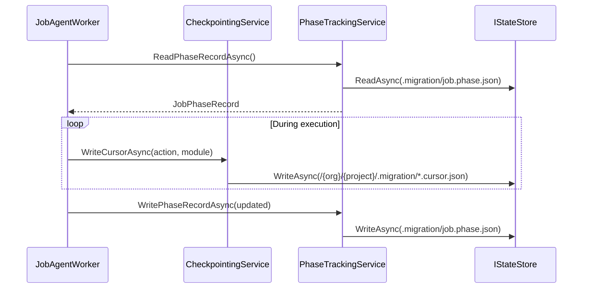

# Checkpoint and Phase Tracking Contract

Canonical contract for cursor writes and migrate phase tracking.

## Contract Surface

- `CheckpointingService`
- `CheckpointingServiceFactory`
- `ICheckpointingService`
- `PhaseTrackingService`
- `PhaseTrackingServiceFactory`
- `IPhaseTrackingService`

## Required Semantics

1. Persist module/action cursor records for deterministic resume.
2. Persist root migrate phase record (`job.phase.json`) for phase skip/resume behavior.
3. Force-fresh semantics reset phase/cursor progression while preserving durable mapping state where required by package rules.

## Sequence Diagram

