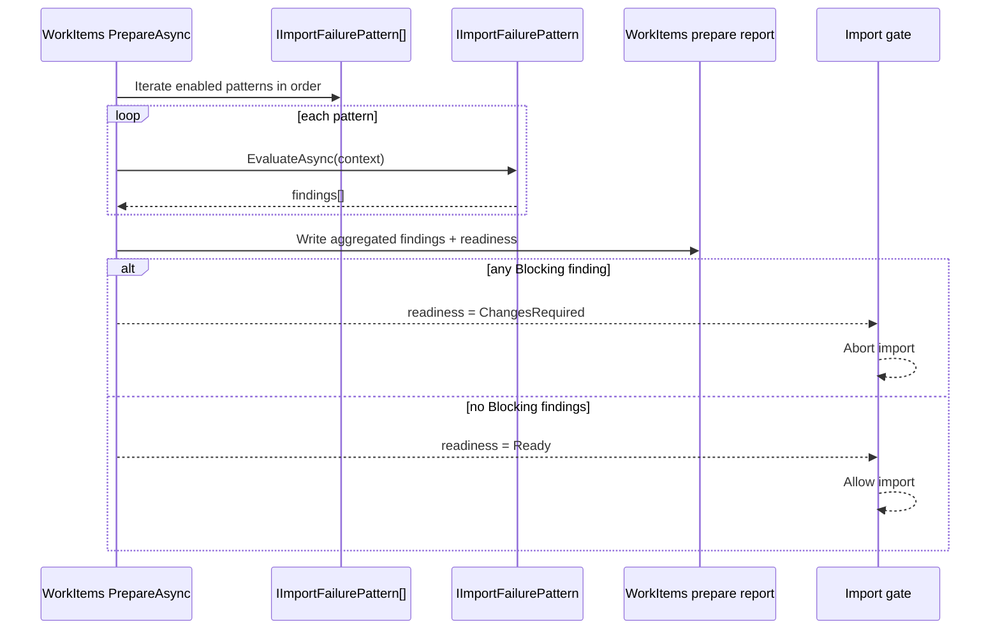

# Import Failure Pattern Contract

Canonical contract for composable Prepare-time import readiness checks.

## Contract Surface

- `IImportFailurePattern`
- `ImportFailurePatternContext`
- `ImportFailureFinding`
- `ImportFailureSeverity`
- `WorkItemsPrepareReadinessResult`

## Required Semantics

1. Import-capable `PrepareAsync` flows evaluate ordered `IImportFailurePattern` checks.
2. One pattern may emit many findings.
3. Aggregate readiness outcomes are exactly:
   - `Ready`
   - `ChangesRequired`
4. Any `Blocking` finding sets readiness to `ChangesRequired`.
5. `Warning` findings remain visible and non-blocking by default.
6. Findings include: `PatternCode`, `Severity`, `EvidenceKey`, `Message`, `SuggestedAction`.
7. Checks are deterministic, package-driven, idempotent, and observable.
8. New failure classes are added via new pattern implementations, not orchestration rewrites.

## Sequence Diagram

