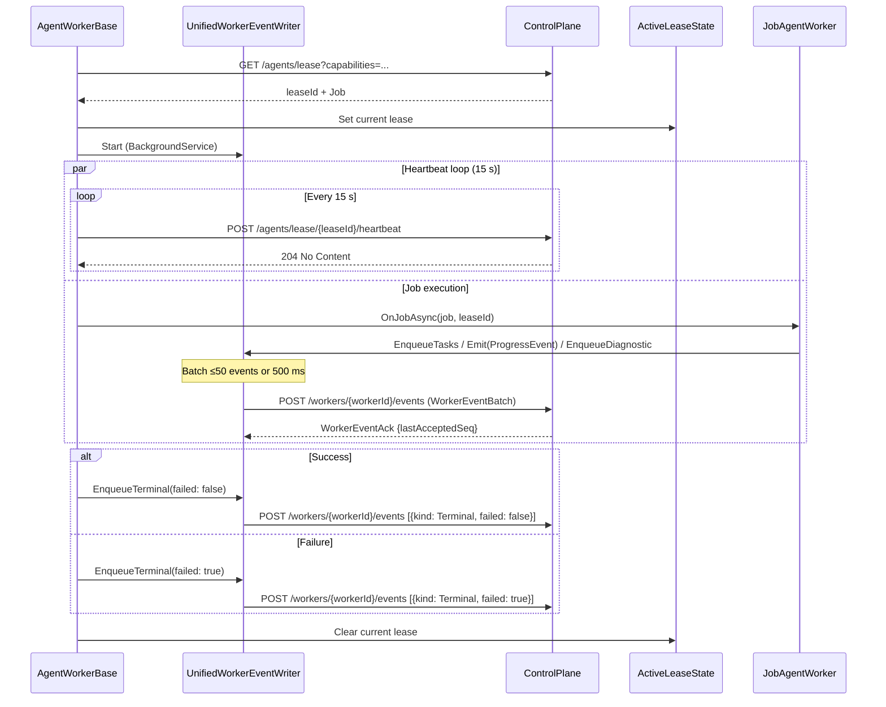

# Lease Coordination Contract

Canonical contract for lease polling, job dispatch, and terminal signaling.

## Contract Surface

- `AgentWorkerBase`
- `JobAgentWorker`
- `ModulePipelineWorkerBase`
- `AgentControlPlaneClientAdapter`
- `ActiveLeaseState`
- `ActivePackageState`

## Required Semantics

1. Worker polls control plane lease endpoint and dispatches leased jobs.
2. Lease state is set before dispatch and cleared after completion/failure.
3. Terminal signals (`Terminal` kind with `failed` flag) are sent through `UnifiedWorkerEventWriter` as part of the unified event batch channel — not as separate `/complete` or `/fail` HTTP calls.
4. A 15-second heartbeat runs in parallel with job execution via `POST /agents/lease/{leaseId}/heartbeat`. The CP uses this to distinguish "agent alive but quiet" from "agent dead".

## Sequence Diagram

