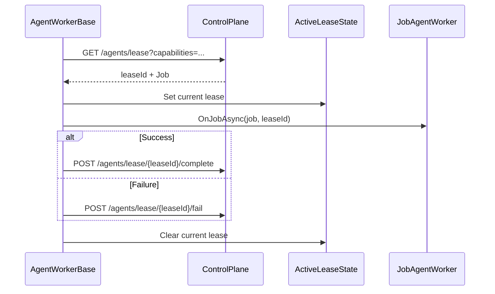

# Lease Coordination Contract

Canonical contract for lease polling, job dispatch, and terminal signaling.

## Contract Surface

- `AgentWorkerBase`
- `JobAgentWorker`
- `ModulePipelineWorkerBase`
- `AgentControlPlaneClientAdapter`
- `ActiveLeaseState`
- `ActivePackageState`

## Required Semantics

1. Worker polls control plane lease endpoint and dispatches leased jobs.
2. Lease state is set before dispatch and cleared after completion/failure.
3. Terminal lease status must be reported explicitly (`complete` or `fail`).

## Sequence Diagram

