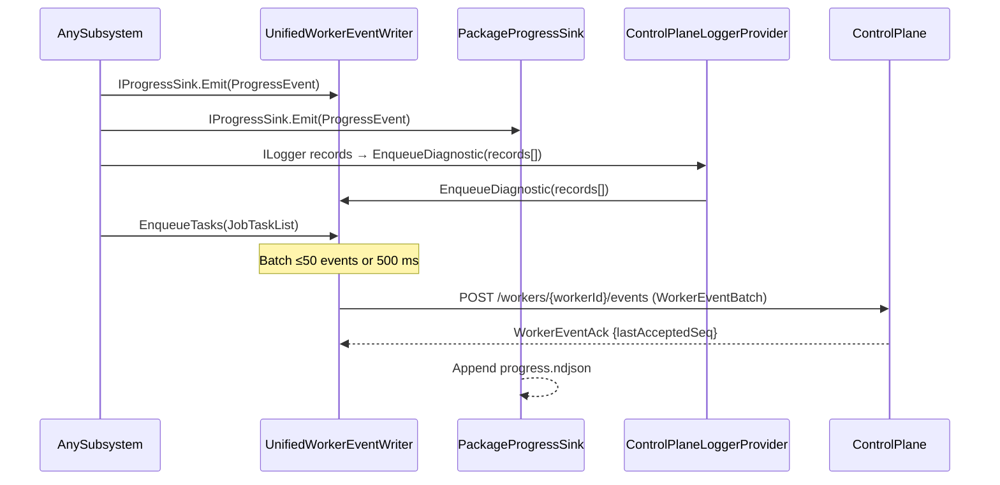

# Observability Transport Contract

Canonical contract for runtime observability transport channels.

## Contract Surface

- `IProgressSink`
- `CompositeProgressSink`
- `PackageProgressSink`
- `UnifiedWorkerEventWriter` ← **primary active CP transport (Phase C)**
- `ControlPlaneLoggerProvider` (routes through `UnifiedWorkerEventWriter` when registered)
- `PackageLoggerProvider`
- `PlatformMetrics`
- `WorkerEvent`, `WorkerEventBatch`, `WorkerEventAck` — wire DTOs
- ~~`ControlPlaneProgressSink`~~ — replaced by `UnifiedWorkerEventWriter`
- ~~`ControlPlaneTelemetryClient`~~ — call sites replaced by `UnifiedWorkerEventWriter.EnqueueTasks()`
- ~~`ControlPlaneTelemetryTimer`~~ — replaced by `UnifiedWorkerEventWriter`

## Required Semantics

1. Subsystems emit progress, diagnostics, traces, and metric snapshots through the canonical transport surfaces.
2. Progress is transported to both control-plane (via `UnifiedWorkerEventWriter`) and package run logs (via `PackageProgressSink`).
3. Diagnostics are enqueued through `ControlPlaneLoggerProvider` → `UnifiedWorkerEventWriter` → CP; and written to the package diagnostics log via `PackageLoggerProvider`.
4. Task lists and telemetry snapshots are enqueued through `UnifiedWorkerEventWriter.EnqueueTasks()` / future `EnqueueMetrics()`.
5. Transport contract is cross-cutting and must preserve O-1..O-5 requirements.
6. `UnifiedWorkerEventWriter` is the single acknowledged CP transport: retries batches on 429 (2 s) and other failures (exponential backoff, 5 attempts). No fire-and-forget silent loss.

## Sequence Diagram

