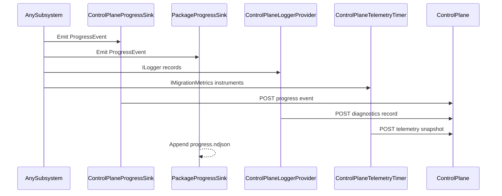

# Observability Transport Contract

Canonical contract for runtime observability transport channels.

## Contract Surface

- `IProgressSink`
- `CompositeProgressSink`
- `PackageProgressSink`
- `ControlPlaneProgressSink`
- `ControlPlaneTelemetryClient`
- `ControlPlaneTelemetryTimer`
- `ControlPlaneLoggerProvider`
- `PackageLoggerProvider`
- `PlatformMetrics`

## Required Semantics

1. Subsystems emit progress, diagnostics, traces, and metric snapshots through the canonical transport surfaces.
2. Progress is transported to both control-plane and package run logs.
3. Diagnostics are transported to control-plane diagnostics stream and package diagnostics log stream.
4. Telemetry snapshots are transported to control-plane telemetry endpoints.
5. Transport contract is cross-cutting and must preserve O-1..O-5 requirements.

## Sequence Diagram

