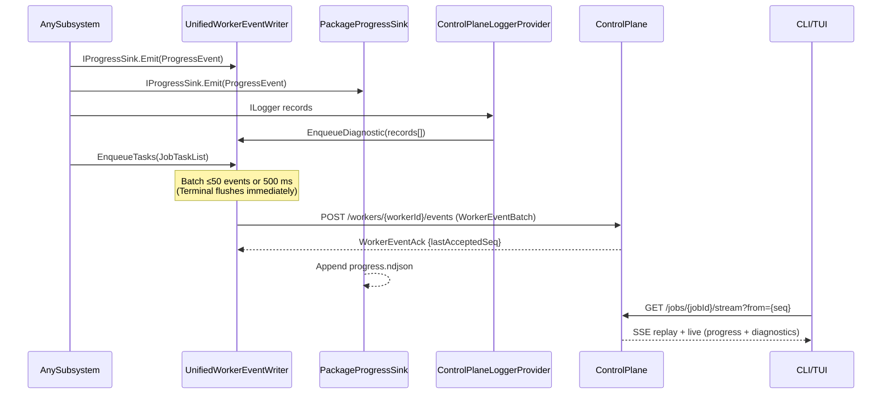

# Observability Transport Contract

Canonical contract for runtime observability transport channels.

## Contract Surface

- `IProgressSink`
- `CompositeProgressSink`
- `PackageProgressSink`
- `UnifiedWorkerEventWriter` ← **the only Agent → ControlPlane telemetry transport**
- `ControlPlaneLoggerProvider` (enqueues Diagnostic events through `UnifiedWorkerEventWriter`; it has no HTTP path of its own)
- `ControlPlaneTelemetryTimer` (samples metrics/snapshots and enqueues them through `UnifiedWorkerEventWriter`)
- `PackageLoggerProvider`
- `PlatformMetrics`
- `WorkerEvent`, `WorkerEventBatch`, `WorkerEventAck` — wire DTOs
- `WorkerEventsController` — sole CP ingestion endpoint (`POST /workers/{workerId}/events`)
- `JobStreamController` — unified CP → CLI SSE stream (`GET /jobs/{jobId}/stream?from={seq}`)

Removed (must not reappear): `ControlPlaneProgressSink`, `ControlPlaneTelemetryClient` / `IControlPlaneTelemetryClient`, the `ControlPlaneLoggerProvider` HTTP fallback, and the seven per-lease CP telemetry endpoints under `POST /agents/lease/{leaseId}/…` (progress, complete, fail, metrics, snapshot, tasks, diagnostics).

## Wire Schema

**Request** — `POST /workers/{workerId}/events`:

```json
WorkerEventBatch {
  "workerId": "string",
  "leaseId":  "string",
  "events": [
    WorkerEvent {
      "seq":         long,       // monotonic per worker
      "timestamp":   "ISO-8601",
      "kind":        "heartbeat" | "progress" | "diagnostic" | "metrics" | "snapshot" | "tasks" | "terminal",
      "payloadJson": "string"    // kind-specific payload, serialised JSON
    }
  ]
}
```

`kind` values are the `WorkerEventKind` enum members Heartbeat / Progress / Diagnostic / Metrics / Snapshot / Tasks / Terminal, serialized as camelCase strings.

**Ack** — the CP validates that the route `workerId` matches the batch, resolves the job via the lease, dispatches each event kind to its store, and responds:

```json
WorkerEventAck { "lastAcceptedSeq": long }
```

## Required Semantics

1. Subsystems emit progress, diagnostics, traces, and metric snapshots through the canonical transport surfaces.
2. Progress is transported to both control-plane (via `UnifiedWorkerEventWriter`) and package run logs (via `PackageProgressSink`).
3. Diagnostics are enqueued through `ControlPlaneLoggerProvider` → `UnifiedWorkerEventWriter` → CP; and written to the package diagnostics log via `PackageLoggerProvider`.
4. Task lists are enqueued through `UnifiedWorkerEventWriter.EnqueueTasks()`; metrics and snapshots via `ControlPlaneTelemetryTimer` → `UnifiedWorkerEventWriter`.
5. Terminal signals (job complete/fail) are enqueued via `AgentWorkerBase.SignalTerminalAsync` as `Terminal` events and are **flushed immediately** (batch timer bypassed).
6. Batching: a single unbounded channel drained by a background flush loop; a batch closes at ≤50 events or 500 ms, whichever first.
7. Delivery: acknowledged, not fire-and-forget. Failed batches retry with exponential backoff (up to 5 attempts); HTTP 429 is honoured (2 s back-off). No silent loss.
8. The only other agent-originated HTTP calls are `GET /agents/lease?capabilities=...` (lease acquisition long-poll) and `POST /agents/lease/{leaseId}/heartbeat` (15 s liveness).
9. CP storage is **append-only** per job (`JobProgressStore`, `DiagnosticLogStore`): events are never evicted; safety caps `MaxEventsPerJob` / `MaxRecordsPerJob` (default 50,000) discard further events with a warning once reached.
10. CP → CLI: `GET /jobs/{jobId}/stream?from={seq}` is the unified SSE stream — multiplexes progress + diagnostics, replays the full append-only log from `seq`, emits a heartbeat comment every 15 s, and closes with `event: job-ended` / `event: job-failed`. The CLI additionally polls `GET /jobs/{id}/bootstrap` for task lists and metrics.
11. Transport contract is cross-cutting and must preserve O-1..O-5 requirements.

## Sequence Diagram


