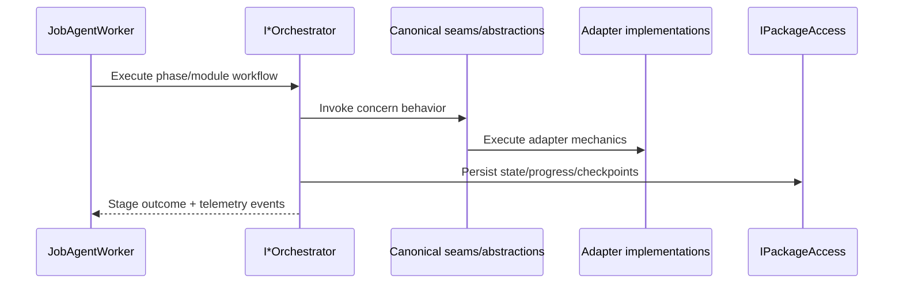

# Orchestrator Contract

Canonical contract for orchestrators as a first-class architecture element.

## Canonical Runtime Chain

`Module -> Orchestrator(s) -> Package + Adapter(s) + Strategy(s).`

## Contract Surface

- `IInventoryOrchestrator`
- `IWorkItemsImportOrchestrator`
- `IWorkItemsNodeReadinessOrchestrator`
- `IDependencyOrchestrator`
- `IIdentitiesOrchestrator`
- `INodesOrchestrator`
- `ITeamsOrchestrator`

## Required Semantics

1. Orchestrators own workflow sequencing, stage transitions, and composition only.
2. Orchestrators must consume canonical abstractions/seams for concern logic and must not reimplement concern engines.
3. Orchestrators must not execute adapter SDK mechanics directly; adapter implementations own external ADO/TFS/Simulated mechanics.
4. Orchestrator package-facing operations must go through `IPackageAccess` and package persistence abstractions, never ad-hoc filesystem paths.
5. Orchestrator progress and stage transitions must be observable through canonical telemetry channels (`ProgressEvent`, `JobMetrics`, OTel).
6. Orchestrator execution must preserve migration invariants: Source -> Files -> Target, streaming import/export, deterministic ordering, cursor-based resume.
7. Introducing alternate orchestration runtime entrypoints for an existing concern is forbidden unless approved as a contract-level change.
8. Module orchestrator abstractions must expose symmetric phase methods (`ExportAsync`, `PrepareAsync`, `ImportAsync`, `ValidateAsync`) in a single contract shape.
9. Compile-time phase method guards that remove Import/Export methods by runtime target are forbidden on orchestrator abstraction contracts.
10. Adapter support differences (ADO/TFS/Simulated) are implemented in adapter implementations and capability behavior, not by splitting orchestrator abstraction shapes.

## Responsibility Split

| Layer | Owns | Must not own |
| --- | --- | --- |
| Orchestrator | sequencing, gates, stage boundaries, dependency order | adapter SDK query/update mechanics, duplicate concern engines |
| Abstractions and seams | reusable concern behavior contracts | phase-specific orchestration policy |
| Adapter implementations | external system mechanics behind abstractions | orchestration sequencing decisions |

## Sequence Diagram

