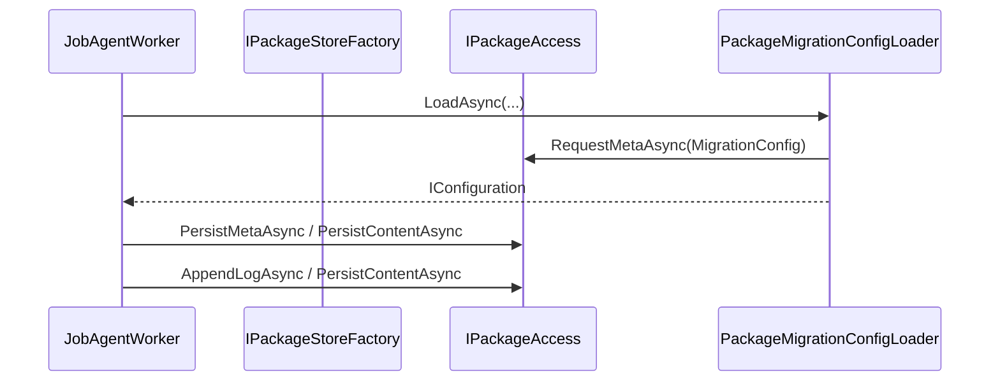

# Package Persistence Contract

Canonical contract for artefact/state persistence under the package boundary.

## Contract Surface

- `IArtefactStore`
- `IStateStore`
- `IPackageStoreFactory`
- `FileSystemArtefactStore`
- `AzureBlobArtefactStore`
- `FileSystemStateStore`
- `FileSystemPackageStoreFactory`
- `PackageMigrationConfigLoader`

## Required Semantics

1. Persist artefacts/state only via abstractions.
2. Runtime persistence covers config (`migration-config.json`), plan (`plan.json`), cursors, and package logs.
3. Connector/store implementation swaps must not require module or orchestrator code changes.

## Sequence Diagram

