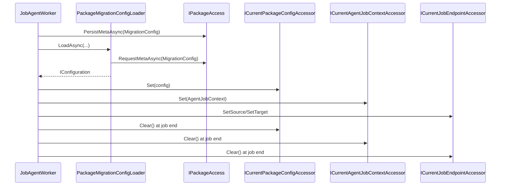

# Runtime Context Contract

Canonical contract for materializing `Job.ConfigPayload` and exposing active runtime context.

## Contract Surface

- `PackageMigrationConfigLoader`
- `ICurrentPackageConfigAccessor`
- `ICurrentAgentJobContextAccessor`
- `ICurrentJobEndpointAccessor`
- `AgentJobContext`
- `PackageConfigNotFoundException`

## Required Semantics

1. Job config payload is materialized to package config before module execution.
2. Current package config, job context, and endpoint accessors are set before execution and cleared at job end.
3. Missing package config is a fail-fast condition.

## Sequence Diagram

