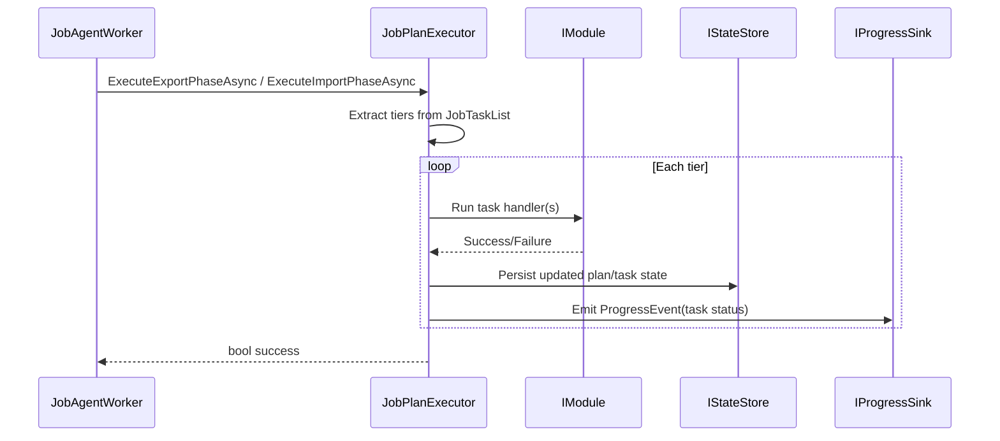

# Task Execution Contract

Canonical contract for executing `JobTaskList` tiers and enforcing dependency semantics.

## Contract Surface

- `JobPlanExecutor`
- `IJobPlanExecutor`
- `JobTaskStatus`

## Required Semantics

1. Execute tiers in order and persist task status transitions.
2. Enforce `DependsOn` before scheduling.
3. `Completed` dependencies are satisfied; `Skipped` and `Failed` are blockers.
4. Skip propagation must cascade to blocked pending downstream tasks.
5. Transient `Running` tasks are reset to `Pending` during crash recovery before resume.

## Sequence Diagram

