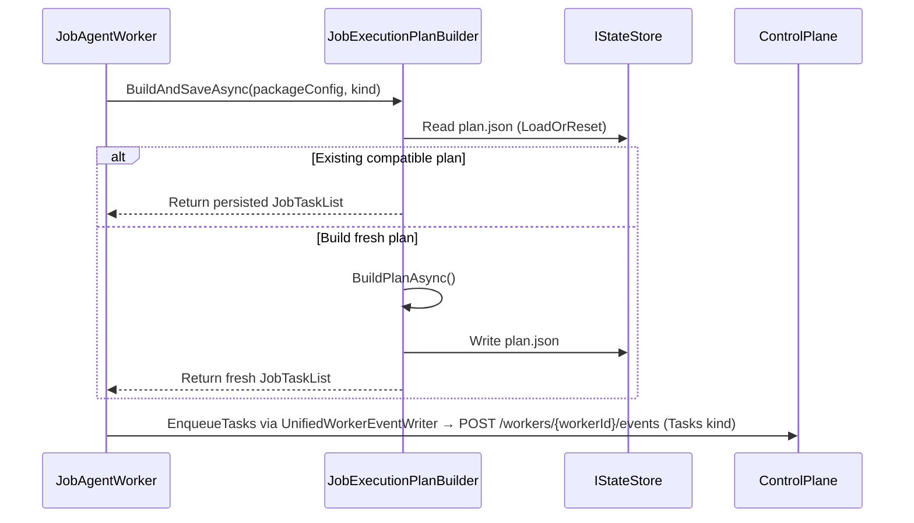

# Task Plan Contract

Canonical contract for building and persisting `JobTaskList` execution plans.

## Contract Surface

- `JobExecutionPlanBuilder`
- `IJobExecutionPlanBuilder`
- `JobTaskList`
- `JobTask`

## Required Semantics

1. Build ordered plans from job kind, enabled modules, and dependency graph.
2. Persist and reuse compatible `plan.json` for resume.
3. Expose both flat ordered task rows and phase summaries for canonical stage rendering.

## Sequence Diagram

