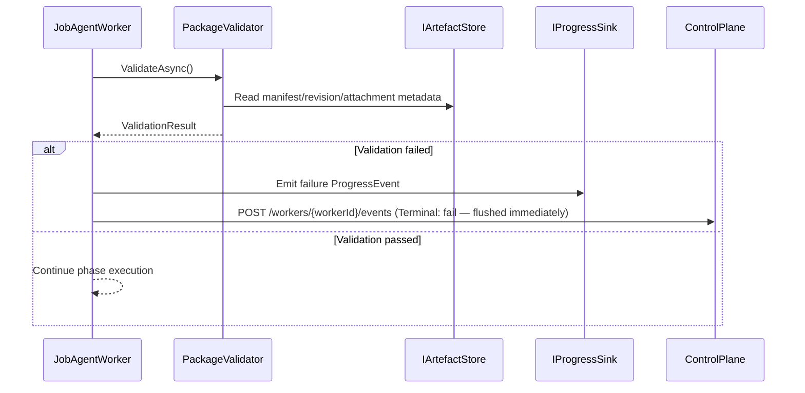

# Validation and Safety Contract

Canonical contract for package validation and fail-fast execution safety.

## Contract Surface

- `PackageValidator`
- `ValidationResult`
- `ValidationError`
- `PackageConfigNotFoundException`

## Required Semantics

1. Validate package invariants before/after execution transitions.
2. Validation failures are surfaced as explicit execution failure outcomes.
3. Invalid execution inputs are fail-fast and observable.

## Sequence Diagram

