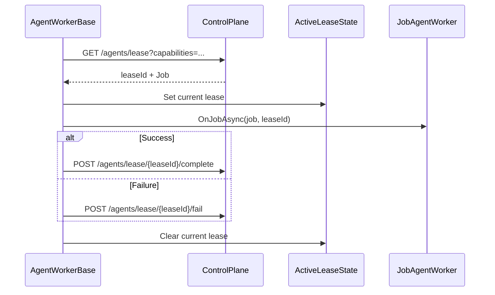

# agent_lease_coordination — Lease and Worker Coordination System

- Tag: `agent_lease_coordination`
- Responsibility: Poll control plane, acquire lease, dispatch jobs, and signal terminal states.

## Core Classes

- `AgentWorkerBase`
- `JobAgentWorker`
- `ModulePipelineWorkerBase`
- `AgentControlPlaneClientAdapter`
- `ActiveLeaseState`
- `ActivePackageState`

## Validating Tests

- `tests/DevOpsMigrationPlatform.Infrastructure.Agent.Tests/Context/JobAgentWorkerDispatchTests.cs`
- `tests/DevOpsMigrationPlatform.Infrastructure.Agent.Tests/Context/JobAgentWorkerInventoryTests.cs`
- `tests/DevOpsMigrationPlatform.TfsMigrationAgent.Tests/TfsJobAgentWorkerTests.cs`

## Sequence Diagram

