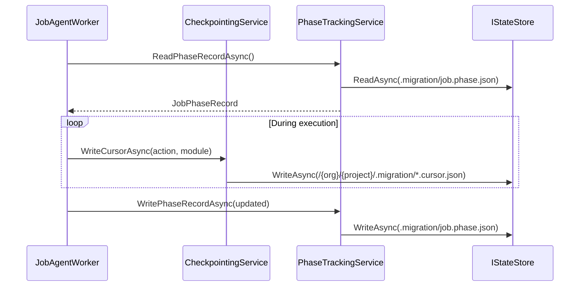

# agent_checkpoint_phase_tracking — Checkpoint and Phase Tracking System

- Tag: `agent_checkpoint_phase_tracking`
- Responsibility: Persist cursor and phase records (`job.phase.json`, module cursors) to enable deterministic resume and force-fresh semantics.

## Core Classes

- `CheckpointingService`
- `CheckpointingServiceFactory`
- `ICheckpointingService`
- `PhaseTrackingService`
- `PhaseTrackingServiceFactory`
- `IPhaseTrackingService`

## Validating Tests

- `tests/DevOpsMigrationPlatform.Infrastructure.Agent.Tests/Checkpointing/CheckpointingServiceTests.cs`
- `tests/DevOpsMigrationPlatform.Infrastructure.Agent.Tests/Context/JobAgentWorkerDispatchTests.cs`
- `tests/DevOpsMigrationPlatform.TfsMigrationAgent.Tests/TfsJobAgentWorkerTests.cs`

## Sequence Diagram

