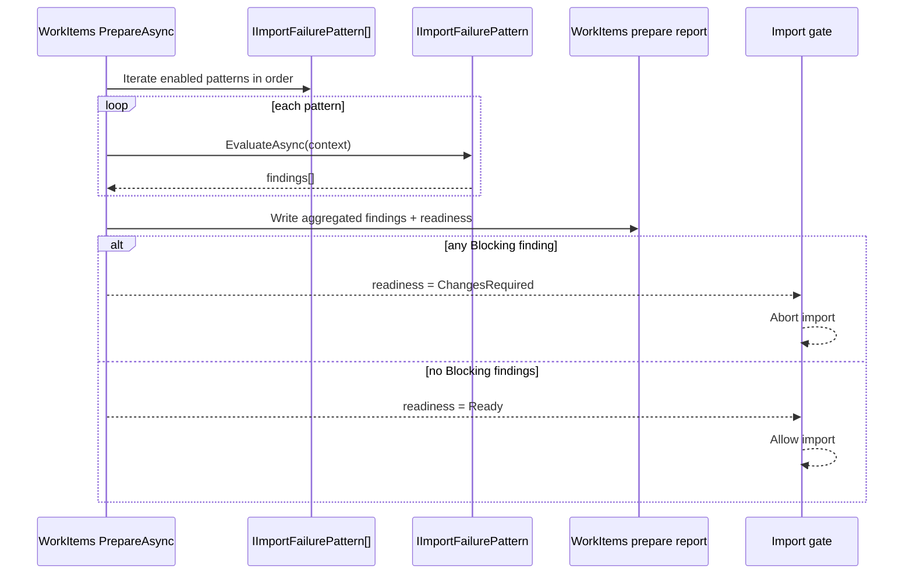

# agent_failure_pattern_checks - Prepare Failure Pattern Contract

- Tag: `agent_failure_pattern_checks`
- Responsibility: Define the composable Prepare-time contract for detecting known import failure classes and producing deterministic import readiness outcomes.

## Core Contract

- `IImportFailurePattern`
- `ImportFailurePatternContext`
- `ImportFailureFinding`
- `ImportFailureSeverity`
- `WorkItemsPrepareReadinessResult`

## Contract Semantics

- Import-capable module `PrepareAsync` flows evaluate an ordered list of `IImportFailurePattern` implementations.
- Each pattern checks one failure class and emits zero or more `ImportFailureFinding` entries.
- A single pattern evaluation can emit multiple findings. This is expected behavior and allows one check (for example, missing attachments) to report every failing instance in one pass.
- Findings are aggregated into module-local Prepare report artifacts (for WorkItems, under `WorkItems/`).
- Aggregate readiness is derived from all findings with two outcomes:
  - `Ready`
  - `ChangesRequired`
- Any `Blocking` finding sets aggregate readiness to `ChangesRequired`.
- `Warning` findings remain visible in reports and telemetry but do not block import by default.

## Required Finding Shape

Each finding must include:

- `PatternCode` (stable machine identifier)
- `Severity` (`Warning` or `Blocking`)
- `EvidenceKey` (stable locator for diffing reruns)
- `Message` (operator-readable reason)
- `SuggestedAction` (clear remediation)

## Invariants

- Deterministic: same package + same target state + same options => same findings.
- Package-driven: no source-system calls.
- Idempotent: rerunning Prepare overwrites report outputs with current truth.
- Extensible: new failure classes are added by adding new `IImportFailurePattern` implementations, not by changing orchestration flow.
- Observable: counts and blocking state are emitted via existing Prepare progress and telemetry channels.

## Scope Baseline for Work Item Import

Minimum failure classes expected as patterns:

- Missing revision folder for an in-scope work item reference
- Missing required target node path under current node policy
- Unsupported target work item type
- Field transform missing field or incompatible type
- Missing attachment binary when attachment replay is enabled
- Missing embedded image binary when embedded image replay is enabled

## Execution Placement

- Runs inside module `PrepareAsync`.
- Executes before Prepare completion is considered valid for Import gate use.
- Produces module-local reports for operator review and rerun comparison.
- Import gate semantics are unchanged: blocking findings abort import.

## Sequence Diagram

