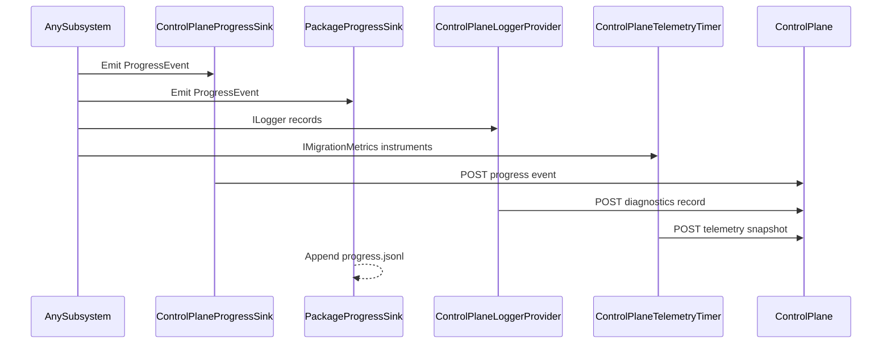

# agent_observability — Observability System (cross-cutting)

- Tag: `agent_observability`
- Responsibility: Emit and transport progress, diagnostics, traces, and metric snapshots for all subsystems.

## Core Classes

- `IProgressSink`
- `CompositeProgressSink`
- `PackageProgressSink`
- `ControlPlaneProgressSink`
- `ControlPlaneTelemetryClient`
- `ControlPlaneTelemetryTimer`
- `ControlPlaneLoggerProvider`
- `PackageLoggerProvider`
- `PlatformMetrics`

## Validating Tests

- `tests/DevOpsMigrationPlatform.Infrastructure.Agent.Tests/Telemetry/ControlPlaneProgressSinkSteps.cs`
- `tests/DevOpsMigrationPlatform.Infrastructure.Agent.Tests/Telemetry/ControlPlaneTelemetryClientTests.cs`
- `tests/DevOpsMigrationPlatform.Infrastructure.Agent.Tests/Telemetry/PackageLoggerProviderRotationTests.cs`
- `tests/DevOpsMigrationPlatform.Infrastructure.Agent.Tests/Telemetry/PlatformMetricsTests.cs`
- `tests/DevOpsMigrationPlatform.Infrastructure.Agent.Tests/Telemetry/DataClassificationLogProcessorTests.cs`

## Notes

- Observability is both a dedicated subsystem and a required property of all other subsystems (O-1 through O-4).

## Sequence Diagram

