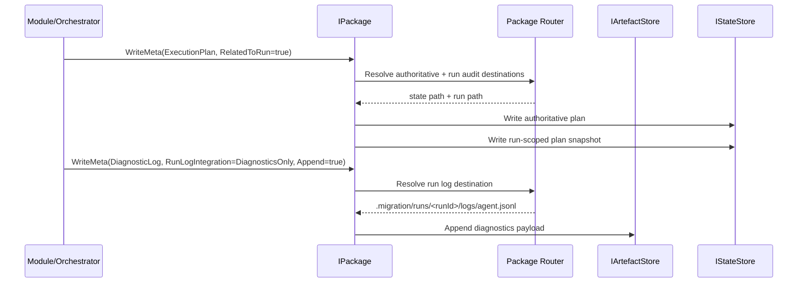

# agent_package_boundary — Typed Package Boundary System

**Subsystem implementation map:** package-domain boundary above raw persistence. This subsystem owns typed package access, authoritative metadata, run-audit mirroring, and run-log routing without exposing package paths to callers.

- Tag: `agent_package_boundary`
- Responsibility: Provide a single package-facing boundary so modules, orchestrators, and runtime services request or write package data and metadata by typed context rather than raw path strings.

## Scope

This file describes the intended package-boundary subsystem that sits above:

- `IArtefactStore` and `IStateStore` in [agent-package-persistence.md](agent-package-persistence.md)
- runtime config/context materialization in [agent-runtime-context.md](agent-runtime-context.md)
- checkpoint and phase semantics in [agent-checkpoint-phase-tracking.md](agent-checkpoint-phase-tracking.md)

The boundary exists to stop callers from deciding package layout. Callers provide typed intent and scope; the package boundary resolves the canonical authoritative path, any required run-scoped audit copy, and any run-log append target.

## Core Classes

- `IPackage`
- `PackageDataContext`
- `PackageMetaContext`
- `PackageDataPayload`
- `PackageMetaPayload`
- package path resolver/router implementation (name TBD)

## Contract Shape

The package boundary exposes four verbs:

- `RequestData(PackageDataContext, ...)`
- `RequestMeta(PackageMetaContext, ...)`
- `WriteData(PackageDataContext, ...)`
- `WriteMeta(PackageMetaContext, ...)`

The boundary must own both `IArtefactStore` and `IStateStore`. A wrapper over `IArtefactStore` alone is insufficient because authoritative package metadata spans both stores:

- artefact-backed files such as `migration-config.json`
- state-backed files such as `.migration/plan.json`, `.migration/inventory.complete.json`, project cursors, continuation tokens, and `job.phase.json`

## Rules

- Callers must never construct or pass package paths.
- Authoritative package state must remain under root `.migration/` and project `/{org}/{project}/.migration/`.
- Run-scoped copies under `.migration/runs/<runId>/` are audit evidence only and must never become the authoritative source for resume or phase-gate decisions.
- `RelatedToRun` on `PackageMetaContext` means: write authoritative metadata, then mirror a run-scoped copy when appropriate.
- Job log streaming is not modeled as ordinary package metadata. It is a run-log routing concern on the meta write path.
- The boundary must preserve lexicographic streaming semantics. Requesting collections must not reintroduce in-memory sorting or buffering that breaks import streaming.

## Metadata Categories

Only package concepts with concrete authoritative behavior should be first-class `PackageMetaKind` values. Current code-backed examples are:

- `MigrationConfig`
- `JobDescriptor`
- `ExecutionPlan`
- `PhaseRecord`
- `CheckpointCursor`
- `ContinuationToken`
- `InventoryCompletionMarker`
- `PrepareReport`

Progress logs and diagnostic logs are not normal metadata nouns. They are append-only run-log streams written to `.migration/runs/<runId>/logs/`.

## Integration Points

- `PackageConfigStore` becomes a focused implementation detail or collaborator of the package boundary.
- `JobExecutionPlanBuilder` and phase tracking continue to own plan and phase semantics, but path selection moves behind the package boundary.
- `PackageLoggerProvider` and `PackageProgressSink` should route append operations through the package boundary rather than choosing log paths directly.
- Module/orchestrator code should express package intent such as “write prepare report”, “write dependency capture”, or “read project inventory” without embedding folder layout knowledge.

## Sequence Diagram

