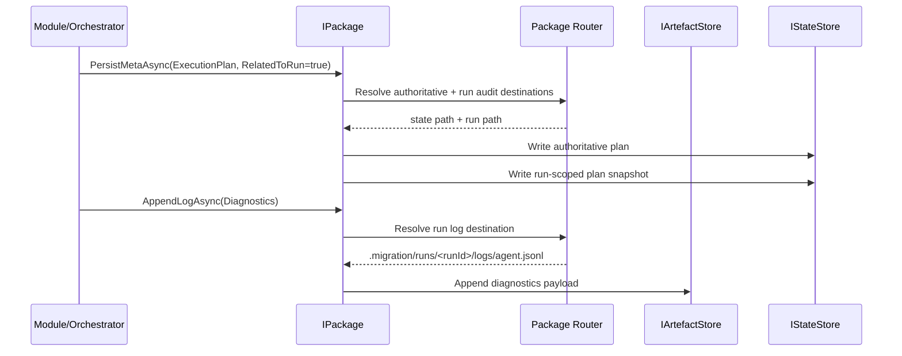

# agent_package_boundary — Typed Package Boundary System

**Subsystem implementation map:** package-domain boundary above raw persistence. This subsystem owns typed package access, authoritative metadata, run-audit mirroring, and run-log routing without exposing package paths to callers.

- Tag: `agent_package_boundary`
- Responsibility: Provide a single package-facing boundary so modules, orchestrators, and runtime services request or write package data and metadata by typed context rather than raw path strings.

## Scope

This file describes the intended package-boundary subsystem that sits above:

- `IArtefactStore` and `IStateStore` in [agent-package-persistence.md](agent-package-persistence.md)
- runtime config/context materialization in [agent-runtime-context.md](agent-runtime-context.md)
- checkpoint and phase semantics in [agent-checkpoint-phase-tracking.md](agent-checkpoint-phase-tracking.md)

The boundary exists to stop callers from deciding package layout. Callers provide typed intent and scope; the package boundary resolves the canonical authoritative path, any required run-scoped audit copy, and any run-log append target.

## Core Classes

- `IPackage`
- `IPackageAddress`
- `PackageContentContext`
- `PackageMetaContext`
- `PackageLogContext`
- `PackagePayload`
- `PackageMetaPayload`
- `PackageLogPayload`
- `PackageContentKind`
- `PackageMetaKind`
- `PackageLogStream`
- package path resolver/router implementation (name TBD)

## Contract Shape

The package boundary exposes four verbs:

- `RequestContentAsync(PackageContentContext, ...)`
- `ContentExistsAsync(PackageContentContext, ...)`
- `EnumerateContentAsync(PackageContentContext, ...)`
- `RequestContentBinaryAsync(PackageContentContext, ...)`
- `RequestMetaAsync(PackageMetaContext, ...)`
- `PersistContentAsync(PackageContentContext, ...)`
- `PersistContentStreamAsync(PackageContentContext, ...)`
- `PersistMetaAsync(PackageMetaContext, ...)`
- `AppendContentAsync(PackageContentContext, ...)`
- `AppendLogAsync(PackageLogContext, ...)`

It intentionally does not expose delete. Removal semantics are exceptional maintenance behavior, not the default caller-facing package contract.

## Contract Inventory

The intended boundary contracts are shown here as a concrete C# sketch so the design is explicit rather than name-only:

```csharp
public interface IPackage
{
  ValueTask<PackagePayload?> RequestContentAsync(
    PackageContentContext context,
    CancellationToken cancellationToken = default);

  ValueTask<bool> ContentExistsAsync(
    PackageContentContext context,
    CancellationToken cancellationToken = default);

  IAsyncEnumerable<string> EnumerateContentAsync(
    PackageContentContext context,
    CancellationToken cancellationToken = default);

  ValueTask<Stream?> RequestContentBinaryAsync(
    PackageContentContext context,
    CancellationToken cancellationToken = default);

  ValueTask<PackageMetaPayload?> RequestMetaAsync(
    PackageMetaContext context,
    CancellationToken cancellationToken = default);

  ValueTask PersistContentAsync(
    PackageContentContext context,
    PackagePayload payload,
    CancellationToken cancellationToken = default);

  ValueTask PersistContentStreamAsync(
    PackageContentContext context,
    Stream content,
    string? contentType = null,
    CancellationToken cancellationToken = default);

  ValueTask PersistMetaAsync(
    PackageMetaContext context,
    PackageMetaPayload payload,
    CancellationToken cancellationToken = default);

  ValueTask AppendContentAsync(
    PackageContentContext context,
    Stream content,
    string contentType = "application/x-ndjson",
    CancellationToken cancellationToken = default);

  ValueTask AppendLogAsync(
    PackageLogContext context,
    PackageLogPayload payload,
    CancellationToken cancellationToken = default);
}

public interface IPackageAddress
{
  string RelativePath { get; }
}

public sealed record PackageContentContext(
  PackageContentKind Kind,
  string? Organisation = null,
  string? Project = null,
  string? Module = null,
  IPackageAddress? Address = null,
  bool IsCollectionRequest = false);

public enum PackageContentKind
{
  Artefact = 0,
  Collection = 1,
  Manifest = 2
}

public sealed record PackageMetaContext(
  PackageMetaKind Kind,
  string? Organisation = null,
  string? Project = null,
  bool RelatedToRun = false);

public sealed record PackageLogContext(
  string RunId,
  PackageLogStream Stream,
  bool AllowRotation = true);

public sealed record PackagePayload(
  Stream Content,
  string? ContentType = null,
  string? ETag = null);

public sealed record PackageMetaPayload(
  Stream Content,
  string? ContentType = null,
  string? ETag = null);

public sealed record PackageLogPayload(
  Stream Content,
  string ContentType = "application/x-ndjson");

public enum PackageMetaKind
{
  MigrationConfig,
  JobDescriptor,
  ExecutionPlan,
  PhaseRecord,
  CheckpointCursor,
  ContinuationToken,
  InventoryCompletionMarker,
  PrepareReport
}

public enum PackageLogStream
{
  Progress,
  Diagnostics
}
```

### `IPackage`

Caller-facing package boundary with exactly four verbs:

- `RequestContentAsync(PackageContentContext, ...)`
- `ContentExistsAsync(PackageContentContext, ...)`
- `EnumerateContentAsync(PackageContentContext, ...)`
- `RequestContentBinaryAsync(PackageContentContext, ...)`
- `RequestMetaAsync(PackageMetaContext, ...)`
- `PersistContentAsync(PackageContentContext, ...)`
- `PersistContentStreamAsync(PackageContentContext, ...)`
- `PersistMetaAsync(PackageMetaContext, ...)`
- `AppendContentAsync(PackageContentContext, ...)`
- `AppendLogAsync(PackageLogContext, ...)`

`IPackage` does not include delete. Cleanup and force-fresh style removal should remain separate maintenance behavior rather than being folded into the routine caller-facing package boundary.

### `IPackageAddress`

Module-owned relative address contract for content beneath the module root. The module constructs this object and supplies it on `PackageContentContext.Address`. The package boundary reads it but does not invent it.

`IPackageAddress.RelativePath` is relative to the module root. It must not be absolute and it must not escape the module root.

### `PackageContentContext`

Typed routing context for package data. This contract should carry the package intent needed to resolve the canonical location for exported or prepared data without exposing raw paths. Expected concerns include:

- boundary-owned content kind
- package-owned scope such as org, project, and module
- optional module-owned address supplied as `IPackageAddress` when the caller needs a module-relative suffix
- read versus write intent parameters needed for collection or single-item resolution
- strict parameter-intent fidelity: no caller may pass text or path values to parameters whose intent is not to carry those values
- no slash-delimited package path fragments in `PackageContentContext` fields; path assembly belongs exclusively to package-boundary routing

The package boundary owns the package prefix. For module-owned content, the module owns the suffix under that prefix through `IPackageAddress.RelativePath`.

### `PackageMetaContext`

Typed routing context for package metadata. This is the contract that decides whether a metadata write is authoritative only or authoritative plus run audit. It should include:

- `PackageMetaKind`
- package scope such as root or project-local metadata ownership
- `RelatedToRun` to request authoritative write plus run-scoped audit mirroring where appropriate

### `PackageLogContext`

Typed routing context for append-only run logs. It should include:

- the `RunId` identifying the active run
- `PackageLogStream` to select the concrete log stream
- rotation intent when the stream supports segmented files

### `PackagePayload`

Payload contract for package data reads and writes. This represents the content associated with a data request independently of path selection.

### `PackageContentKind`

The content boundary is intentionally small:

- `Artefact` for single content artefacts resolved within package scope
- `Collection` for collection enumeration within package scope
- `Manifest` for package-owned manifest content

Concrete domain artefact types such as Work Item revisions are not encoded as top-level package content kinds. They are expressed by the caller through package scope plus a module-supplied `IPackageAddress`.

### `PackageMetaPayload`

Payload contract for package metadata reads and writes. This represents the content associated with a metadata request independently of path selection.

### `PackageLogPayload`

Payload contract for append-only run logs. In the current agent this maps naturally to NDJSON batches emitted by `PackageLoggerProvider` and `PackageProgressSink`.

### `PackageMetaKind`

First-class authoritative metadata categories discussed so far are:

- `MigrationConfig`: authoritative package configuration at package root
- `JobDescriptor`: job identity and submitted job contract materialization
- `ExecutionPlan`: authoritative task and phase planning state
- `PhaseRecord`: current phase state used by resume and phase gating
- `CheckpointCursor`: project or scope resume cursor state
- `ContinuationToken`: continuation state when a connector requires resumable pagination tokens
- `InventoryCompletionMarker`: authoritative gate proving inventory completed
- `PrepareReport`: prepare-phase report or validation outcome that is part of package state

These are included because they each map to concrete authoritative package behavior already present in code or clearly implied by current package semantics. They are not just convenient labels.

### `PackageLogStream`

Contract selecting the append-only run-log stream. Current code-backed examples are:

- progress-log emission
- diagnostics-log emission

This is separate from `PackageMetaKind` because logs are not metadata.

### Package Router or Resolver

Internal contract or collaborator that translates typed package intent into:

- authoritative state-store destinations
- authoritative artefact-store destinations
- run-scoped audit copy destinations
- run-log append destinations

The boundary must own both `IArtefactStore` and `IStateStore`. A wrapper over `IArtefactStore` alone is insufficient because authoritative package metadata spans both stores:

- artefact-backed files such as `migration-config.json`
- state-backed files such as `.migration/plan.json`, `.migration/inventory.complete.json`, project cursors, continuation tokens, and `job.phase.json`

## Rules

- Callers must never construct or pass package paths.
- The caller-facing content verbs are `PersistContentAsync`, `PersistContentStreamAsync`, and `AppendContentAsync`, while `WriteAsync` remains the lower-level store primitive. The boundary owns package semantics rather than raw file writes.
- The caller-facing run-log verb is `AppendLogAsync`; logs are not squeezed through metadata persistence.
- For module-owned content, callers must pass an `IPackageAddress`; the boundary must not infer module layout from DTO types or raw route segments.
- Manifest content is package-owned and may be resolved without a module-supplied address.
- Authoritative package state must remain under root `.migration/` and project `/{org}/{project}/.migration/`.
- Run-scoped copies under `.migration/runs/<runId>/` are audit evidence only and must never become the authoritative source for resume or phase-gate decisions.
- `RelatedToRun` on `PackageMetaContext` means: write authoritative metadata, then mirror a run-scoped copy when appropriate.
- Job log streaming is not modeled as ordinary package metadata. It uses `AppendLogAsync` with `PackageLogContext`.
- The boundary must preserve lexicographic streaming semantics. Requesting collections must not reintroduce in-memory sorting or buffering that breaks import streaming.

## Metadata Categories

Only package concepts with concrete authoritative behavior should be first-class `PackageMetaKind` values. Current code-backed examples are:

- `MigrationConfig` because package configuration is authoritative root metadata
- `JobDescriptor` because job submission materialization is package-owned metadata
- `ExecutionPlan` because task and phase planning is authoritative orchestration state
- `PhaseRecord` because current phase is authoritative resume and gating state
- `CheckpointCursor` because resumability depends on persisted cursor ownership
- `ContinuationToken` because resumable connector paging is package-owned state when present
- `InventoryCompletionMarker` because export and later phases gate on this authoritative marker
- `PrepareReport` because prepare output is package-owned validation metadata

Progress logs and diagnostic logs are not normal metadata nouns. They are append-only run-log streams written to `.migration/runs/<runId>/logs/`.

## Integration Points

- `PackageMigrationConfigLoader` becomes a focused implementation detail or collaborator of the package boundary.
- `JobExecutionPlanBuilder` and phase tracking continue to own plan and phase semantics, but path selection moves behind the package boundary.
- `PackageLoggerProvider` and `PackageProgressSink` should call `AppendLogAsync` rather than choosing log paths directly.
- Module/orchestrator code should express package intent such as “write prepare report”, “write dependency capture”, or “read project inventory” without embedding folder layout knowledge.

## Logging Integration

The current runtime already has the right batching and flush behavior. `PackageLoggerProvider` batches `DiagnosticLogRecord` lines and appends them to the run log, while `PackageProgressSink` batches `ProgressEvent` lines and appends them to `progress.jsonl`. With the package boundary in place, those services should keep their channels and flush lifecycle but replace the final `IArtefactStore.AppendAsync(...)` call with `IPackageAccess.AppendLogAsync(...)`.

Conceptually, the current diagnostics append becomes:

```csharp
await package.AppendLogAsync(
  new PackageLogContext(runId, PackageLogStream.Diagnostics),
  new PackageLogPayload(payloadStream),
  cancellationToken);
```

And progress becomes:

```csharp
await package.AppendLogAsync(
  new PackageLogContext(runId, PackageLogStream.Progress),
  new PackageLogPayload(payloadStream),
  cancellationToken);
```

The package boundary then owns the mapping from `PackageLogStream.Diagnostics` to `.migration/runs/<runId>/logs/agent.jsonl` and from `PackageLogStream.Progress` to `.migration/runs/<runId>/logs/progress.jsonl`, including segmentation or rotation policy.

## Sequence Diagram


