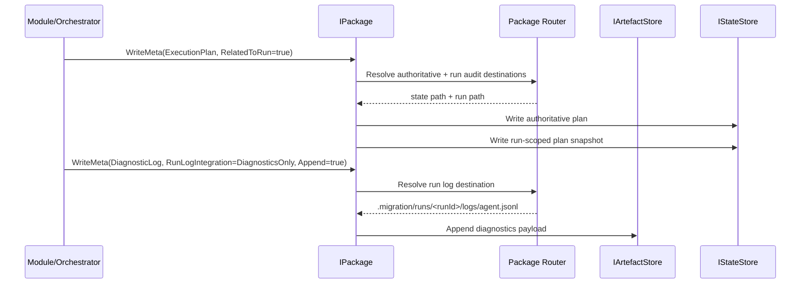

# agent_package_boundary — Typed Package Boundary System

**Subsystem implementation map:** package-domain boundary above raw persistence. This subsystem owns typed package access, authoritative metadata, run-audit mirroring, and run-log routing without exposing package paths to callers.

- Tag: `agent_package_boundary`
- Responsibility: Provide a single package-facing boundary so modules, orchestrators, and runtime services request or write package data and metadata by typed context rather than raw path strings.

## Scope

This file describes the intended package-boundary subsystem that sits above:

- `IArtefactStore` and `IStateStore` in [agent-package-persistence.md](agent-package-persistence.md)
- runtime config/context materialization in [agent-runtime-context.md](agent-runtime-context.md)
- checkpoint and phase semantics in [agent-checkpoint-phase-tracking.md](agent-checkpoint-phase-tracking.md)

The boundary exists to stop callers from deciding package layout. Callers provide typed intent and scope; the package boundary resolves the canonical authoritative path, any required run-scoped audit copy, and any run-log append target.

## Core Classes

- `IPackage`
- `PackageContext`
- `PackageMetaContext`
- `PackagePayload`
- `PackageMetaPayload`
- `PackageMetaKind`
- `RunLogIntegration`
- package path resolver/router implementation (name TBD)

## Contract Shape

The package boundary exposes four verbs:

- `RequestAsync(PackageContext, ...)`
- `RequestMetaAsync(PackageMetaContext, ...)`
- `PersistAsync(PackageContext, ...)`
- `PersistMetaAsync(PackageMetaContext, ...)`

It intentionally does not expose delete. Removal semantics are exceptional maintenance behavior, not the default caller-facing package contract.

## Contract Inventory

The intended boundary contracts are shown here as a concrete C# sketch so the design is explicit rather than name-only:

```csharp
public interface IPackage
{
  ValueTask<PackagePayload?> RequestAsync(
    PackageContext context,
    CancellationToken cancellationToken = default);

  ValueTask<PackageMetaPayload?> RequestMetaAsync(
    PackageMetaContext context,
    CancellationToken cancellationToken = default);

  ValueTask PersistAsync(
    PackageContext context,
    PackagePayload payload,
    CancellationToken cancellationToken = default);

  ValueTask PersistMetaAsync(
    PackageMetaContext context,
    PackageMetaPayload payload,
    CancellationToken cancellationToken = default);
}

public sealed record PackageContext(
  string ContentKind,
  string? Organisation = null,
  string? Project = null,
  string? Module = null,
  string? Scope = null,
  string? ItemKey = null,
  bool IsCollectionRequest = false);

public sealed record PackageMetaContext(
  PackageMetaKind Kind,
  string? Organisation = null,
  string? Project = null,
  string? RunId = null,
  bool RelatedToRun = false,
  RunLogIntegration RunLogIntegration = RunLogIntegration.None,
  bool Append = false);

public sealed record PackagePayload(
  Stream Content,
  string? ContentType = null,
  string? ETag = null);

public sealed record PackageMetaPayload(
  Stream Content,
  string? ContentType = null,
  string? ETag = null);

public enum PackageMetaKind
{
  MigrationConfig,
  JobDescriptor,
  ExecutionPlan,
  PhaseRecord,
  CheckpointCursor,
  ContinuationToken,
  InventoryCompletionMarker,
  PrepareReport
}

public enum RunLogIntegration
{
  None,
  Progress,
  Diagnostics
}
```

### `IPackage`

Caller-facing package boundary with exactly four verbs:

- `RequestAsync(PackageContext, ...)`
- `RequestMetaAsync(PackageMetaContext, ...)`
- `PersistAsync(PackageContext, ...)`
- `PersistMetaAsync(PackageMetaContext, ...)`

`IPackage` does not include delete. Cleanup and force-fresh style removal should remain separate maintenance behavior rather than being folded into the routine caller-facing package boundary.

### `PackageContext`

Typed routing context for package data. This contract should carry the package intent needed to resolve the canonical location for exported or prepared data without exposing raw paths. Expected concerns include:

- data subject or logical content kind
- scope such as org, project, module, or analysis area
- read versus write intent parameters needed for collection or single-item resolution
- enough identity to preserve lexicographic streaming rules where collection reads apply

### `PackageMetaContext`

Typed routing context for package metadata. This is the contract that decides whether a metadata write is authoritative only, authoritative plus run audit, or authoritative plus run-log integration. It should include:

- `PackageMetaKind`
- package scope such as root or project-local metadata ownership
- `RelatedToRun` to request authoritative write plus run-scoped audit mirroring where appropriate
- `RunLogIntegration` to control whether the write also emits to a run-log stream
- append or replace intent when the metadata kind supports append-style behavior

### `PackagePayload`

Payload contract for package data reads and writes. This represents the content associated with a data request independently of path selection.

### `PackageMetaPayload`

Payload contract for package metadata reads and writes. This represents the content associated with a metadata request independently of path selection.

### `PackageMetaKind`

First-class authoritative metadata categories discussed so far are:

- `MigrationConfig`: authoritative package configuration at package root
- `JobDescriptor`: job identity and submitted job contract materialization
- `ExecutionPlan`: authoritative task and phase planning state
- `PhaseRecord`: current phase state used by resume and phase gating
- `CheckpointCursor`: project or scope resume cursor state
- `ContinuationToken`: continuation state when a connector requires resumable pagination tokens
- `InventoryCompletionMarker`: authoritative gate proving inventory completed
- `PrepareReport`: prepare-phase report or validation outcome that is part of package state

These are included because they each map to concrete authoritative package behavior already present in code or clearly implied by current package semantics. They are not just convenient labels.

### `RunLogIntegration`

Contract controlling whether a metadata write also participates in job log streaming. This exists because logs are routing behavior, not a first-class metadata noun. Expected modes include:

- no run-log emission
- progress-log emission
- diagnostics-log emission

The exact enum values remain implementation detail, but the contract itself is part of the discussed design.

### Package Router or Resolver

Internal contract or collaborator that translates typed package intent into:

- authoritative state-store destinations
- authoritative artefact-store destinations
- run-scoped audit copy destinations
- run-log append destinations

The boundary must own both `IArtefactStore` and `IStateStore`. A wrapper over `IArtefactStore` alone is insufficient because authoritative package metadata spans both stores:

- artefact-backed files such as `migration-config.json`
- state-backed files such as `.migration/plan.json`, `.migration/inventory.complete.json`, project cursors, continuation tokens, and `job.phase.json`

## Rules

- Callers must never construct or pass package paths.
- The caller-facing verb is `PersistAsync`, while `WriteAsync` remains the lower-level store primitive. The boundary owns package semantics rather than raw file writes.
- Authoritative package state must remain under root `.migration/` and project `/{org}/{project}/.migration/`.
- Run-scoped copies under `.migration/runs/<runId>/` are audit evidence only and must never become the authoritative source for resume or phase-gate decisions.
- `RelatedToRun` on `PackageMetaContext` means: write authoritative metadata, then mirror a run-scoped copy when appropriate.
- Job log streaming is not modeled as ordinary package metadata. It is a run-log routing concern on the meta write path.
- The boundary must preserve lexicographic streaming semantics. Requesting collections must not reintroduce in-memory sorting or buffering that breaks import streaming.

## Metadata Categories

Only package concepts with concrete authoritative behavior should be first-class `PackageMetaKind` values. Current code-backed examples are:

- `MigrationConfig` because package configuration is authoritative root metadata
- `JobDescriptor` because job submission materialization is package-owned metadata
- `ExecutionPlan` because task and phase planning is authoritative orchestration state
- `PhaseRecord` because current phase is authoritative resume and gating state
- `CheckpointCursor` because resumability depends on persisted cursor ownership
- `ContinuationToken` because resumable connector paging is package-owned state when present
- `InventoryCompletionMarker` because export and later phases gate on this authoritative marker
- `PrepareReport` because prepare output is package-owned validation metadata

Progress logs and diagnostic logs are not normal metadata nouns. They are append-only run-log streams written to `.migration/runs/<runId>/logs/`.

## Integration Points

- `PackageConfigStore` becomes a focused implementation detail or collaborator of the package boundary.
- `JobExecutionPlanBuilder` and phase tracking continue to own plan and phase semantics, but path selection moves behind the package boundary.
- `PackageLoggerProvider` and `PackageProgressSink` should route append operations through the package boundary rather than choosing log paths directly.
- Module/orchestrator code should express package intent such as “write prepare report”, “write dependency capture”, or “read project inventory” without embedding folder layout knowledge.

## Sequence Diagram


