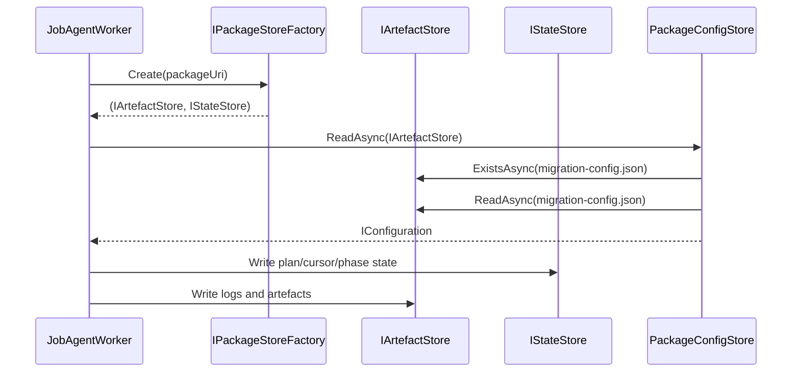

# agent_package_persistence — Package Persistence System

- Tag: `agent_package_persistence`
- Responsibility: Persist artefacts and state via abstractions only, including `migration-config.json`, `plan.json`, cursors, and package logs.

## Core Classes

- `IArtefactStore`
- `IStateStore`
- `IPackageStoreFactory`
- `FileSystemArtefactStore`
- `AzureBlobArtefactStore`
- `FileSystemStateStore`
- `FileSystemPackageStoreFactory`
- `PackageConfigStore`

## Validating Tests

- `tests/DevOpsMigrationPlatform.Infrastructure.Agent.Tests/Storage/FileSystemArtefactStoreTests.cs`
- `tests/DevOpsMigrationPlatform.Infrastructure.Agent.Tests/Checkpointing/FileSystemStateStoreTests.cs`
- `tests/DevOpsMigrationPlatform.Infrastructure.Agent.Tests/Storage/PackageConfigStoreTests.cs`
- `tests/DevOpsMigrationPlatform.TfsMigrationAgent.Tests/TfsJobAgentWorkerTests.cs`

## Notes

- `AzureBlobArtefactStore` currently has no dedicated unit test file; coverage is indirect through higher-level tests.

## Sequence Diagram

