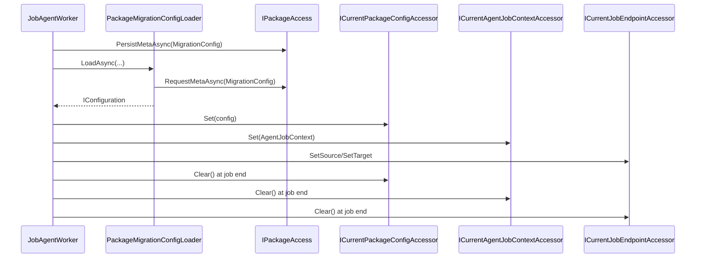

# agent_runtime_context — Runtime Configuration and Context Materialization System

- Tag: `agent_runtime_context`
- Responsibility: Materialize `Job.ConfigPayload` into package config and expose current job/package/source/target context accessors.

## Runtime Context Rules

- `AgentJobContext.PackagePath` must be absolute and is validated independent of the host OS so Windows drive-rooted paths, UNC paths, and Unix rooted paths are accepted consistently in agent tests and package materialisation.
- Current context accessors are singleton holders: `Set` publishes a non-null active value, `Clear` removes it at job completion, and source/target endpoint clearing can be performed independently.

## Core Classes

- `PackageMigrationConfigLoader`
- `ICurrentPackageConfigAccessor`
- `ICurrentAgentJobContextAccessor`
- `ICurrentJobEndpointAccessor`
- `AgentJobContext`
- `PackageConfigNotFoundException`

## Validating Tests

- `tests/DevOpsMigrationPlatform.Infrastructure.Agent.Tests/Storage/PackageMigrationConfigLoaderTests.cs`
- `tests/DevOpsMigrationPlatform.Infrastructure.Agent.Tests/Context/JobAgentWorkerDispatchTests.cs`
- `tests/DevOpsMigrationPlatform.TfsMigrationAgent.Tests/TfsJobAgentWorkerTests.cs`

## Sequence Diagram

