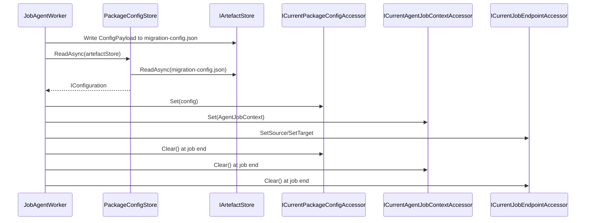

# agent_runtime_context — Runtime Configuration and Context Materialization System

- Tag: `agent_runtime_context`
- Responsibility: Materialize `Job.ConfigPayload` into package config and expose current job/package/source/target context accessors.

## Core Classes

- `PackageConfigStore`
- `ICurrentPackageConfigAccessor`
- `ICurrentAgentJobContextAccessor`
- `ICurrentJobEndpointAccessor`
- `AgentJobContext`
- `PackageConfigNotFoundException`

## Validating Tests

- `tests/DevOpsMigrationPlatform.Infrastructure.Agent.Tests/Storage/PackageConfigStoreTests.cs`
- `tests/DevOpsMigrationPlatform.Infrastructure.Agent.Tests/Context/JobAgentWorkerDispatchTests.cs`
- `tests/DevOpsMigrationPlatform.TfsMigrationAgent.Tests/TfsJobAgentWorkerTests.cs`

## Sequence Diagram

