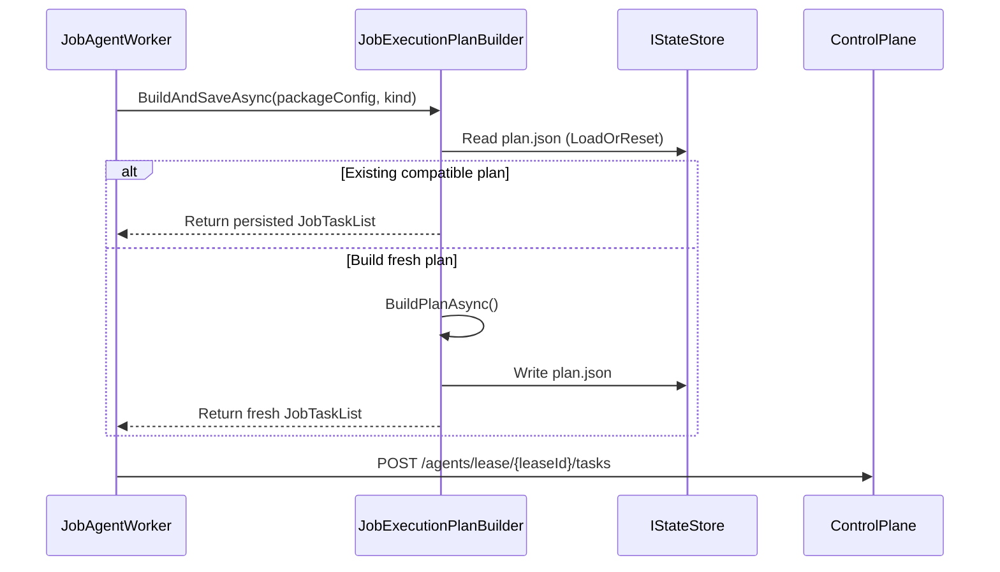

# agent_task_builder — Task Builder System

- Tag: `agent_task_builder`
- Responsibility: Build ordered `JobTaskList` plans from job kind, enabled modules, and dependency graph; persist `plan.json` for resume.
- Plan shape: `JobTaskList` preserves the flat ordered `Tasks` list used by execution and also exposes ordered phase summaries so consumers can render canonical stage groupings without reconstructing them from task rows.

## Core Classes

- `JobExecutionPlanBuilder`
- `IJobExecutionPlanBuilder`
- `JobTaskList`
- `JobTask`

## Validating Tests

- `tests/DevOpsMigrationPlatform.Infrastructure.Agent.Tests/Context/JobExecutionPlanBuilderTests.cs`
- `tests/DevOpsMigrationPlatform.Infrastructure.Agent.Tests/Context/JobExecutionPlanBuilderDependsOnTests.cs`
- `tests/DevOpsMigrationPlatform.Infrastructure.Agent.Tests/Context/JobExecutionPlanBuilderContextResolutionTests.cs`

## Sequence Diagram

