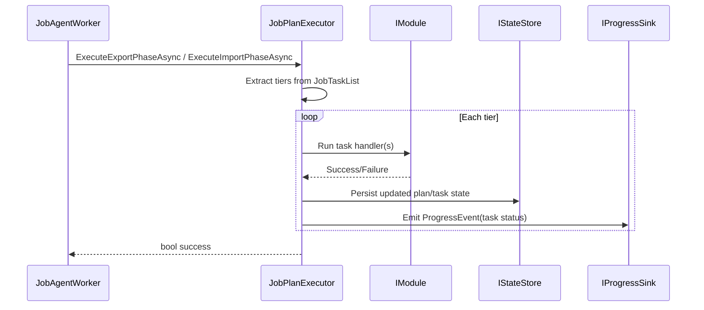

# agent_task_execution — Task Execution System

- Tag: `agent_task_execution`
- Responsibility: Execute plan tiers, enforce `DependsOn`, transition task states, persist status transitions, and emit task progress.

## Core Classes

- `JobPlanExecutor`
- `IJobPlanExecutor`
- `JobTaskStatus`

## Validating Tests

- `tests/DevOpsMigrationPlatform.Infrastructure.Agent.Tests/Context/JobPlanExecutorTests.cs`
- `tests/DevOpsMigrationPlatform.Infrastructure.Agent.Tests/Platform/PlanDrivenExecutionSteps.cs`

## Sequence Diagram

