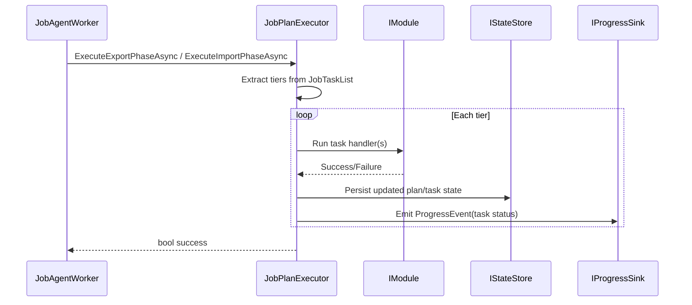

# agent_task_execution — Task Execution System

- Tag: `agent_task_execution`
- Responsibility: Execute plan tiers, enforce `DependsOn`, transition task states, persist status transitions, and emit task progress.

## Core Classes

- `JobPlanExecutor`
- `IJobPlanExecutor`
- `JobTaskStatus`

## Validating Tests

- `tests/DevOpsMigrationPlatform.Infrastructure.Agent.Tests/Context/JobPlanExecutorTests.cs`
- `tests/DevOpsMigrationPlatform.Infrastructure.Agent.Tests/Platform/PlanDrivenExecutionSteps.cs`

## Sequence Diagram

## Dependency and Resume Semantics

- Tasks execute only after their declared `DependsOn` task IDs are satisfied.
- `Completed` dependencies are satisfied, including when a persisted plan is resumed with downstream tasks still `Pending`.
- `Skipped` and `Failed` dependencies are blockers. The executor cascades `Skipped` to pending downstream tasks before tier extraction and persists the updated plan.
- Skip propagation applies to generic task execution, export/prerequisite execution, and import execution so control-plane progress and package state remain consistent across phases.
- `Running` tasks are transient; crash recovery resets them to `Pending` before execution resumes.
