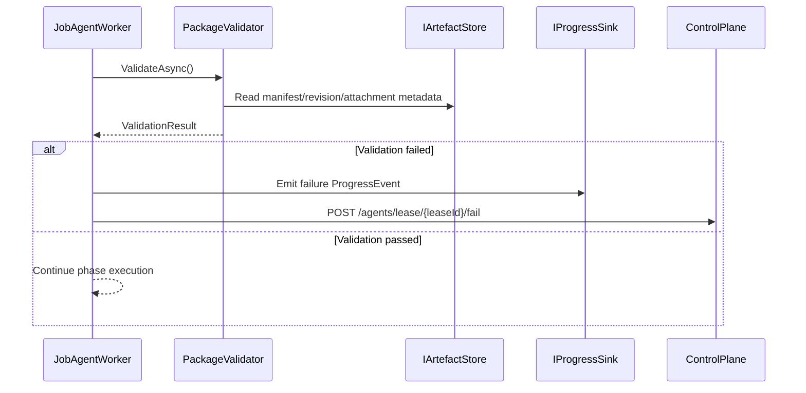

# agent_validation_safety — Validation and Safety System

- Tag: `agent_validation_safety`
- Responsibility: Validate package invariants before/after execution and enforce fail-fast behavior for invalid execution inputs.

## Core Classes

- `PackageValidator`
- `ValidationResult`
- `ValidationError`
- `PackageConfigNotFoundException`

## Validating Tests

- `tests/DevOpsMigrationPlatform.Infrastructure.Agent.Tests/Platform/PackageValidatorTests.cs`
- `tests/DevOpsMigrationPlatform.Infrastructure.Agent.Tests/Context/JobAgentWorkerDispatchTests.cs`
- `tests/DevOpsMigrationPlatform.TfsMigrationAgent.Tests/TfsJobAgentWorkerTests.cs`

## Sequence Diagram

