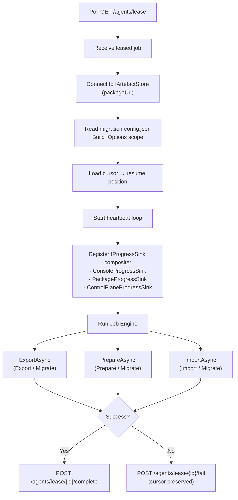
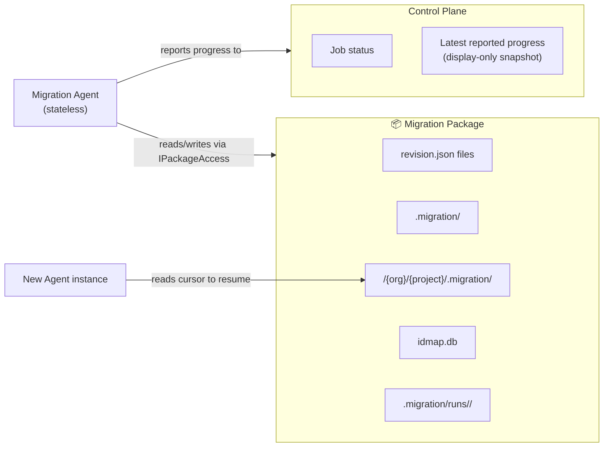

# Agent

## Purpose

The **Migration Agent** (`DevOpsMigrationPlatform.MigrationAgent`) is a stateless worker that executes migration jobs assigned by `ControlPlaneHost`. The Migration Agent runs the Job Engine — the same execution logic used across all deployment topologies — receiving a job definition under a time-bounded lease and reporting progress back via the lease API.

Migration Agent lifecycle is managed by `ControlPlaneHost` via `IAgentLauncher`. The same agent binary and container image are used across all topologies. Migration Agents are stateless by design — any agent instance can pick up any job and resume from the last cursor position.

The package contract, modules, and cursors are unchanged across all deployment topologies.

---

## Responsibilities

| Responsibility | Description |
|---|---|
| Poll for work | Call the control plane lease endpoint to receive a job. |
| Acquire lease | Hold a time-bounded lease on the assigned job. |
| Mount package store | Connect to the package URI from the job definition (filesystem or blob). See [.agents/context/package-manager.md](../.agents/context/package-manager.md). |
| Materialise config | Write `Job.ConfigPayload` → `.migration/migration-config.json` in the package through `IPackageAccess`. Build per-job `IConfiguration`, publish explicit current package/job/endpoint accessors, and create the per-job `IOptions<T>` DI scope. Fail fast with `PackageConfigNotFoundException` if no payload and no existing file. |
| Write run audit copies | Write run-scoped audit copies of `job.json`, `plan.json`, and `config.json` under `.migration/runs/<runId>/` through `IPackageAccess`. |
| Run orchestrator | Execute `ExportAsync`, `ImportAsync`, or both in sequence, exactly as in local mode. |
| Write cursors | Write project-scoped cursor files into `/{org}/{project}/.migration/` through `IPackageAccess` after each stage, as always. |
| Heartbeat | Signal liveness to the control plane at regular intervals. |
| Report progress | Emit `ProgressEvent` via `IProgressSink` after each stage. Three sinks run simultaneously: `ConsoleProgressSink` (terminal), `PackageProgressSink` (`.migration/runs/<runId>/logs/progress.jsonl`), and `ControlPlaneProgressSink` (POST to control plane ring buffer for live TUI streaming). |
| Record metrics | Record OTel metrics via `IMigrationMetrics` during job execution (execution counters, payload histograms, duration). Metric aggregates are pushed to the control plane via `ControlPlaneTelemetryTimer`. |
| Write package logs | Write structured logs to `.migration/runs/<runId>/logs/` in the package via `IPackageAccess`. |
| Signal completion or failure | Call the control plane's complete or fail endpoint when the job finishes. |

The Agent does **not** accept job submissions, manage other Agents, or store job state. All job coordination is `ControlPlaneHost`'s responsibility.

Package state is split into three scopes:

- root `.migration/` for authoritative package-wide operational state used across runs
- `/{org}/{project}/.migration/` for project-scoped cursor state
- `.migration/runs/<runId>/` for run-scoped audit copies and logs for one execution only

---

## Execution Flow

```
Poll /agents/lease
  └─ Receive leased job definition
       ├─ Extract credentials from job definition
       ├─ Connect to artefact store (packageUri)
       ├─ Read .migration/migration-config.json from package → bind MigrationOptions via IPackageConfigStore
    │    └─ If absent → POST /agents/lease/{id}/fail  (PackageConfigNotFoundException)
    │    └─ Publish per-job configuration, job-context, and endpoint accessors
    │    └─ Build per-job IConfiguration and IOptions<T> scope for tool modules
    ├─ Write run audit copies → `.migration/runs/<runId>/job.json`, `plan.json`, `config.json`
    ├─ Load cursor → determine resume position
       ├─ Start heartbeat loop (background)
       ├─ Register IProgressSink composite:
       │    ├─ ConsoleProgressSink     (NDJSON to terminal)
    │    ├─ PackageProgressSink     (.migration/runs/<runId>/logs/progress.jsonl in package)
       │    └─ ControlPlaneProgressSink (POST /agents/lease/{id}/progress)
       └─ Run Job Engine
            ├─ ExportAsync (if mode = Export or Migrate)
            │    └─ After each cursor write → Emit(ProgressEvent) via all sinks
            ├─ Validate package (if mode = Migrate)
            ├─ PrepareAsync (if mode = Prepare or Migrate)
            │    └─ After each module → check for blocking issues; abort if found
            └─ ImportAsync (if mode = Import or Migrate)
                 └─ After each cursor write → Emit(ProgressEvent) via all sinks
  ├─ Success → POST /agents/lease/{id}/complete
  └─ Failure → POST /agents/lease/{id}/fail  (cursor preserved for resume)
```



---

## Deployment and Zone Isolation

A single agent binary and container image supports all four modes (`Export`, `Prepare`, `Import`, `Migrate`) by reading `mode` from the job definition.

For network zone isolation — where source and target systems are in different network zones — `ControlPlaneHost` can deploy the same agent image to different target contexts via `ContainerAgentLauncher` configuration. One deployment runs in the source network zone (mode `Export`); another runs in the target network zone (mode `Prepare` or `Import`). Both use the same package URI in the shared artefact store. The `manifest.json` and cursor files written by the export-mode agent are read by the prepare/import-mode agent without modification.

---

## Stateless Design

Agents are stateless. All durable state lives either:

- In the migration package (`revision.json`, root `.migration/`, project cursors, `idmap.db`, run audit folders) via `IArtefactStore` and `IStateStore`.
- In the control plane (job status, latest reported progress).

An Agent may be stopped, rescheduled, or replaced at any point. The new Agent reads the authoritative root/project package state to determine where to resume. Run-scoped audit copies under `.migration/runs/<runId>/` are not used for resume. This makes Agents safe to run in auto-scaling container environments.



---

## Heartbeat and Lease Expiry

- Agents send a heartbeat to `POST /agents/lease/{leaseId}/heartbeat` every N seconds (configurable; default 30 s).
- The `ControlPlaneHost` lease TTL is set to 2× the expected heartbeat interval.
- If `ControlPlaneHost` does not receive a heartbeat within the TTL, it returns the job to `Queued`.
- The next Agent to acquire the lease resumes from the last cursor position in the package.

This means a crashed Agent loses no more than one stage of work.

---

## Pause and Cancel

- **Pause:** The control plane signals `Paused` on the job record. The Migration Agent reads this signal on the next heartbeat response. It finishes the current stage, writes the cursor, releases the lease, and exits cleanly.
- **Cancel:** The control plane signals `Cancelled`. The Migration Agent finishes the current stage, writes the cursor, and exits. The job is not resumable after cancellation (though the package remains on disk for inspection).

---

## Artefact Store Access

Migration Agents access the migration package exclusively through `IPackageAccess`. `IArtefactStore` and `IStateStore` are lower-level persistence primitives owned by the package boundary; runtime callers do not access the package through them directly. Agents never use raw filesystem calls or raw blob SDK calls inside module code. See [.agents/context/package-manager.md](../.agents/context/package-manager.md) for the package boundary direction and persistence implementations.

### Exclusive Write Access (Data Residency)

The Migration Agent (and TFS Export Agent for TFS sources) is the **only** component with write access to the working directory and package files. No other component — CLI, TUI, Control Plane, or ControlPlaneHost — may create, modify, or delete files in the package. This is a **data residency** requirement: customer data (work item content, attachments, identities) must remain under the exclusive control of the Agent, which runs in the operator's chosen infrastructure.

The CLI may perform **read-only** access to package files (e.g. reading `dependencies.csv` or `inventory.json`) for post-job display purposes. This does not violate data residency because it does not move or copy customer data outside the operator's infrastructure.

See [docs/architecture.md — Data Residency](architecture.md#data-residency--agent-only-write-access) for the full access matrix and rationale.

---

## Logging

Migration Agents write structured logs to both:

- `.migration/runs/<runId>/logs/` in the package (durable, included in zip).
- The control plane (pushed in real time via the lease API for TUI tailing).

The run folder also stores `job.json`, `plan.json`, and `config.json` as audit copies of what executed. Those files are for traceability only; they are not authoritative state for later runs. Both outputs use the same structured format (OpenTelemetry-compatible). No `Console.WriteLine` in module code.

---

## TFS Migration Agent

The **TFS Migration Agent** (`DevOpsMigrationPlatform.TfsMigrationAgent`) is a second agent — a structural peer of the .NET 10 `MigrationAgent` — that handles jobs where the source is Team Foundation Server. It communicates with the control plane using the same HTTP lease protocol, dispatches work through `IModule` implementations, and accesses the package through the same `IPackageAccess` boundary.

The TFS agent exists because the TFS Object Model is a .NET Framework 3.x/4.x SOAP library that cannot run in .NET 9/10. Isolating it in a dedicated net481 process is the only way to use the TFS OM while keeping the rest of the platform on .NET 10.

> **TFS is a source-only connector.** Team Foundation Server is always the migration *origin* — never the *destination*. As a consequence, `ITeamTarget`, `IWorkItemImportTarget`, and all other target-side interfaces are not implemented for TFS. This is an explicit architectural decision, not a gap.

### Agent Symmetry

The two agents use the same lease protocol, the same abstractions, and the same `IModule` dispatch pattern for export/import phases. The differences are runtime, capability constraints, and capture dispatch:

| Aspect | MigrationAgent | TfsMigrationAgent |
|---|---|---|
| Runtime | net10.0 | net481 |
| Capabilities | `ado`, `simulated` | `tfs` |
| Package store | `FileSystemArtefactStore` or `AzureBlobArtefactStore` | `FileSystemArtefactStore` only |
| Progress reporting | `ControlPlaneProgressSink` | `ControlPlaneProgressSink` (plain net481 `HttpClient`) |
| Checkpoint | `IStateStore` | `IStateStore` |
| Module dispatch (export/import) | `IEnumerable<IModule>` | `IEnumerable<IModule>` |
| Capture dispatch | `captureHandlersByName` (via `BuildCaptureHandlers`) | `captureHandlersByName` (modules only; no `DependencyCapture`) |
| Supported modes | Export, Prepare, Import, Migrate | Export only (for now) |
| Container support | Yes | No — Windows process only |

### IModule Dispatch

`TfsJobAgentWorker` accepts `IEnumerable<IModule>` exactly like `JobAgentWorker`. TFS-specific modules implement the same `IModule` contract:

- `ExportAsync` — performs the full TFS OM export via a TFS `IWorkItemRevisionSource` implementation and `WorkItemExportOrchestrator`.
- `PrepareAsync` — returns `Task.CompletedTask`. TFS is source-only; Prepare requires a target, which TFS is never used as.
- `ImportAsync` — returns `Task.CompletedTask`. Not yet implemented; will be populated when TFS import is added to the TFS agent.
- `ValidateAsync` — returns `Task.CompletedTask`. No-op until TFS import is implemented.

### Capture Dispatch (`TaskKind.Capture`)

All `capture.*` tasks (e.g. `capture.workitems.{org}.{project}`) are dispatched through a unified `captureHandlersByName: IReadOnlyDictionary<string, ICapture>` dictionary assembled by `BuildCaptureHandlers` in both agents:

1. Step 1 — all `IModule` instances where `SupportsInventory = true` are cast to `ICapture` and added, keyed by `ICapture.Name`.
2. Step 2 — pure `ICapture` registrations (not `IModule`) from DI are unioned in. Any duplicate `ICapture.Name` is a configuration error and must throw `ArgumentException` during handler assembly.

If a plan references an analyser, capture handler, module, or organisation endpoint that is not registered or resolved for that task, `JobPlanExecutor` fails the task/job explicitly. Silent skip-on-misconfiguration is forbidden.

**TFS agent constraint:** `AddDependencyCapture` is NOT called from `TfsMigrationAgentServiceExtensions`. The TFS plan builder must not emit `capture.dependencies.*` tasks for TFS-sourced jobs; if it does, the executor treats that as a plan/configuration error and fails the task.

### Multi-Targeting

`DevOpsMigrationPlatform.Abstractions` and `DevOpsMigrationPlatform.Infrastructure` target both `net481` and `net10.0`. This allows the TFS agent to use the same interface definitions, models, and artefact store implementations as the .NET 10 `MigrationAgent` without any shared runtime binary.

`IAsyncEnumerable<T>` (used by `IArtefactStore`) is satisfied on net481 via `Microsoft.Bcl.AsyncInterfaces`.

The `DevOpsMigrationPlatform.TfsMigrationAgent` project MUST NOT be referenced by any .NET 10 project. It is built and deployed as a separate binary, peer to `MigrationAgent/` in the output layout.

### Permanent Constraints

- **Windows-only.** The TFS Object Model is .NET Framework, Windows-only. The TFS agent cannot run in Linux containers, Windows Nano Server, Azure Container Apps, or any container orchestrator.
- **Filesystem package store only.** The Azure Blob SDK dependency chain is problematic on net481. TFS exports always run on a Windows machine with filesystem access, so `FileSystemArtefactStore` is the only supported store. A job with `source.type: TeamFoundationServer` and a blob package URI must be rejected at Tier 0 validation by the CLI.
- **No `IHttpClientFactory` / Polly.** The net481 HTTP client is a plain `System.Net.Http.HttpClient`. The control plane is always on the same machine or LAN for TFS topologies; a simple retry loop is sufficient.

### Lifecycle

`AgentLifecycleService` in `ControlPlaneHost` spawns the TFS agent binary on Windows alongside the MigrationAgent. On Linux/macOS and in cloud container deployments, the TFS agent binary is absent and skipped — a log note is written, no error is raised. The TFS agent polls `GET /agents/lease?capabilities=tfs` and only acquires jobs with `source.type: TeamFoundationServer`.
