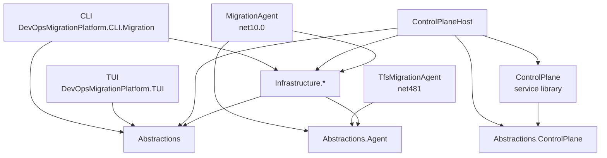
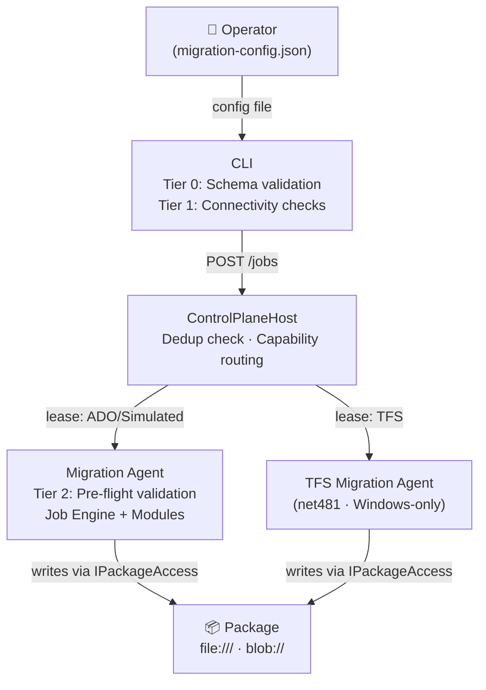
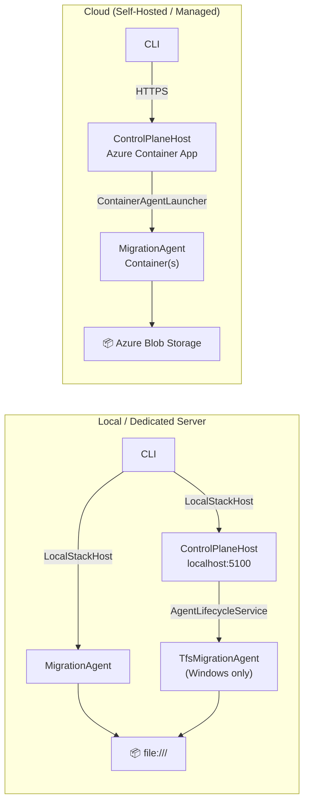

# Architecture Overview

> This document defines architectural intent and is the primary human reference.
> In any conflict between this document and `/.agents/20-guardrails/*.md` guardrails, **the guardrails win**.
> See [.agents/20-guardrails/core/architecture-boundaries.md](../.agents/20-guardrails/core/architecture-boundaries.md) for the enforced rules.
> See [agents.md](../agents.md) for the agent entry point that binds docs to guardrails.

## 1. System Purpose

Build a migration package platform, not just a migration tool.

The system supports five pipeline phases, each of which can be run independently or chained together:

**Inventory → Export → Prepare → Import → Validate**

1. **Inventory** — Count and catalogue everything in scope before export/import begins. Connects to the source system and enumerates work items, revisions, and related artefacts per project. Results are written to the package (inventory artefacts). Inventory may have been performed previously via `devopsmigration queue` with `Mode: Inventory`, but running it as a pipeline phase ensures results are recorded in the package and visible to downstream phases. Only the `source` connection is required.
2. **Export** — Azure DevOps Services → Files, or TeamFoundationServer (via .NET 4 OM exporter) → Files, or Simulated → Files (for testing and development). Reads the source system and writes all in-scope data to the package via `IPackageAccess`. **Inventory gate**: if root `.migration/inventory.complete.json` is absent, Export auto-runs Inventory first.
3. **Prepare** — Files + Target → Validation artefacts. Reads the exported package and connects to the target to cross-validate before import. Each module's `PrepareAsync` analyses the exported data against the target (e.g. identity mapping, node existence, field compatibility) and writes validation artefacts into the package for operator review. Any unresolved issue is blocking unless the operator adds an explicit skip. Prepare is idempotent and re-runnable; it overwrites its own output but never touches operator-edited mapping files.
4. **Import** — Files → Azure DevOps Services, or Files → TeamFoundationServer (via .NET 4.8 TFS Migration Agent — not yet implemented; the TFS agent currently handles Export only), or Files → Simulated (for testing and development). If Prepare has not been run (no root `.migration/prepare.complete.json` marker), Import auto-runs Prepare first and aborts with a report if any blocking issues are found.
5. **Validate** — Post-import verification. Compares the import results against the exported package to identify missing or mismatched items. Runs Tier 3 post-flight checks (work item count parity, link integrity, attachment integrity, identity resolution completeness) and writes a comprehensive `validation-report.json`. Can be run independently after import to re-check at any time. Only the `target` connection and the package are required.

Additionally, a convenience mode chains all five phases:

- **Migrate** — Inventory → Export → Prepare → Import → Validate in a single orchestrated run. Aborts after Prepare if any blocking issues are found. Both `source` and `target` connections are required.

The Files layer is first-class. It is:

- Portable
- Auditable
- Zip-friendly
- Resumable
- Stream-importable
- Human-readable

The package uses three state scopes:

- Root `.migration/` for authoritative package-wide operational state used across runs.
- `/{org}/{project}/.migration/` for project-scoped cursors and resume state.
- `.migration/runs/<runId>/` for run-scoped audit copies and logs from one specific execution.

Run-scoped files are evidence of what executed; they are not the authoritative source for resume or phase-gate decisions.

### JobKind → Phase Dispatch

| JobKind | Phases executed (in order) |
|---|---|
| `Inventory` | `inventory` (all `IModule` with `SupportsInventory`) → `analyse` (all `IAnalyser` with satisfied `DependsOn`) |
| `Export` | `inventory` → `export` |
| `Prepare` | `analyse` (where required by module dependencies) → `prepare` |
| `Import` | `import` |
| `Migrate` | `inventory` → `export` → `prepare` → `import` → `validate` |
| `Dependencies` | `inventory` (work-item inventory only) → `analyse` (dependency analysis) |

---

## 2. Execution Model

The platform separates **job coordination** (control plane) from **job execution** (migration agent).

### Components and Responsibilities

| Component | Role |
|---|---|
| **CLI** | Operator interface. When `Environment.Type` is `Standalone` (the default), uses `LocalStackHost` to start `ControlPlaneHost` and `MigrationAgent` as separate child processes (`ChildProcessHost`) via plain `System.Diagnostics.Process` — no Aspire at runtime. When `Environment.Type` is `Hosted`, connects directly to `ControlPlane.BaseUrl` from config. Always communicates with the control plane via HTTP. Submits jobs, queries status, and manages job lifecycle. Contains no migration execution logic. |
| **TUI** | Connects to any control plane endpoint — on the same machine, a dedicated server, or in the cloud — and renders live job state. Never submits jobs. |
| **ControlPlane** | Service library (`DevOpsMigrationPlatform.ControlPlane`). Contains the HTTP API controllers, job state machine, lease protocol, and progress tracking. Currently all stores are in-memory; durable EF Core / PostgreSQL persistence is planned for a later phase. Has no entry point — it is referenced and hosted by `ControlPlaneHost`. |
| **ControlPlaneHost** | Deployable ASP.NET Core host (`DevOpsMigrationPlatform.ControlPlaneHost`). References the `ControlPlane` service library and adds: process entry point and `AgentLifecycleService` (currently monitors TFS agent on Windows). In Standalone mode the CLI (`LocalStackHost`) manages agent process lifecycle directly; in Cloud mode `ContainerAgentLauncher` deploys and scales agent containers to a configurable ACA environment. Always reachable over HTTP. |
| **Migration Agent** | (`DevOpsMigrationPlatform.MigrationAgent`) Stateless worker that executes migration jobs. Polls `ControlPlaneHost` for assigned jobs under a time-bounded lease, runs modules via the Job Engine, writes to the package, reports progress back. In Standalone mode its lifecycle is managed by `LocalStackHost` in the CLI; in Cloud mode by `ContainerAgentLauncher` in `ControlPlaneHost`. A single binary and container image supports all modes (`Inventory`, `Export`, `Prepare`, `Import`, `Validate`, `Migrate`). |
| **TFS Migration Agent** | (`DevOpsMigrationPlatform.TfsMigrationAgent`) A .NET 4.8 polling agent — structural peer of the `MigrationAgent` — that handles jobs with `source.type: TeamFoundationServer`. Polls `GET /agents/lease?capabilities=tfs`, acquires TFS jobs, runs `IModule` dispatch (`TfsJobAgentWorker` accepts `IEnumerable<IModule>`), connects to TFS via the TFS Object Model, accesses the package through `IPackageAccess` (backed by `FileSystemArtefactStore` on net481), maintains checkpoints and phase metadata through that same boundary, and reports progress via `ControlPlaneProgressSink`. Currently supports Export mode only; Import support will be added to the same binary. Windows-only — TFS OM cannot run in containers. `AgentLifecycleService` spawns it on Windows and skips it elsewhere. See [docs/agent-hosting.md — TFS Migration Agent](agent-hosting.md#tfs-migration-agent). |

### Tools

A **Tool** is a shared, cross-cutting service declared once at the `MigrationPlatform` config root (under `Tools.*`). Tools are pure transformations or lookup services — they perform no I/O and hold no mutable state. The `FieldTransformTool` is the canonical example: it receives a `WorkItemRevision` value object, applies a declared sequence of transform rules, and returns a transformed copy without touching any store or external API. The `NodeTranslationTool` translates area/iteration path strings against configured mappings.

Available tools: `FieldTransform`, `NodeTranslation`, `IdentityLookup`.

Extension points in the execution engine are `IModule` (phase methods) and `IAnalyser` (`AnalyseAsync` for cross-cutting analysis artefacts).

### Capability Seam Ethos

The platform uses a seam-first ethos for every concern (not only tools):

1. one canonical business seam per concern
2. one public reusable contract surface for runtime consumers
3. thin module/extension adapters for phase and policy behavior
4. centralized concern logic behind the seam

This prevents concern logic from being duplicated across modules, orchestrators, extensions, and analysers while still allowing slice-specific policy decisions. If internals need to evolve, they evolve behind the seam rather than adding parallel runtime entry points.

This ethos is codified as [ADR-0017](adr/0017-capability-seam-ethos-and-tdd-architecture-governance.md).

### Project Boundary Rules

Project references are compiler-enforced (no cyclic references allowed). Each layer may only reference the layers below it:

| Layer | Project(s) | May reference |
|---|---|---|
| CLI | `DevOpsMigrationPlatform.CLI.Migration` | `Abstractions`, `Infrastructure` |
| TUI | `DevOpsMigrationPlatform.TUI` | `Abstractions` |
| Control Plane Host | `DevOpsMigrationPlatform.ControlPlaneHost` | `Abstractions`, `Abstractions.ControlPlane`, `Infrastructure`, `ControlPlane` |
| Control Plane Library | `DevOpsMigrationPlatform.ControlPlane` | `Abstractions.ControlPlane` |
| Migration Agent | `DevOpsMigrationPlatform.MigrationAgent` | `Abstractions.Agent`, `Infrastructure.Agent`, `Infrastructure` |
| TFS Migration Agent | `DevOpsMigrationPlatform.TfsMigrationAgent` | `Abstractions.Agent`, `Infrastructure.Agent`, `Infrastructure.TfsObjectModel` |
| Infrastructure | `DevOpsMigrationPlatform.Infrastructure.*` | `Abstractions`, `Abstractions.Agent` (where needed) |
| Abstractions | `DevOpsMigrationPlatform.Abstractions`, `Abstractions.Agent`, `Abstractions.ControlPlane` | Nothing (leaf nodes) |

The CLI must **not** reference `Abstractions.Agent` or `Abstractions.ControlPlane`. Agent projects must **not** reference `ControlPlane`. `TfsMigrationAgent` must **not** be referenced from any .NET 10 project.



### Flow

```
Operator
  │  (config file — migration.json)
  ▼
CLI
  │  Tier 0: JSON Schema validation (local, no network — against migration.schema.json)
  │  Tier 1: connectivity + permission checks (network)
  │  → creates Job (assigns jobId, normalises URI, serialises config into Job.ConfigPayload)
  │
  ▼
ControlPlaneHost (CLI-managed child process or remote — same HTTP interface)
  │  deduplication check (jobId)
  │  assigns to available agent by Job.Connectors capability matching
  │
  ▼
Agent
  │  writes Job.ConfigPayload → migration-config.json at package root
  │  Tier 2: pre-flight validation (package structure, before import)
  │  runs job engine + modules
  │  writes to package
  │  Tier 3: post-flight validation (counts, links, attachments)
  ▼
Package (file:/// or https://<account>.blob.core.windows.net/...)
```

> **TFS source:** The `TfsMigrationAgent` participates in this same flow. The control plane routes jobs with `source.type: TeamFoundationServer` to the TFS agent via capability matching (`?capabilities=tfs`). From the CLI's perspective, TFS and ADO exports are submitted identically — `POST /jobs` — and the appropriate agent picks up the work.



### `Job` is the Internal Contract

The `ControlPlaneHost` receives a `Job` from the CLI. It is the fully serialisable dispatch token that `ControlPlaneHost` passes to an Agent under a lease. The class was named `MigrationJob` until feature 025.1-fold-to-job unified the class hierarchy (replacing both `MigrationJob` and `DiscoveryJob`). All job kinds now use the same `Job` wire format with a `Kind` discriminator (`JobKind` enum). The config file is never sent to the Agent directly — it travels as `Job.ConfigPayload` (raw JSON) and the Agent writes it to `migration-config.json` at the package root before any module executes.

See [.agents/30-context/domains/job-lifecycle.md](../.agents/30-context/domains/job-lifecycle.md).

### ControlPlaneHost is Always an HTTP Service

`ControlPlaneHost` is always reachable over HTTP. The CLI always communicates with it via `ControlPlaneClient`. The difference between topologies is only where `ControlPlaneHost` is running:

- **Local / Dedicated Server**: CLI uses `LocalStackHost` to start `ControlPlaneHost` as a child process, listening on `http://localhost:5100`. Any machine with network access to that endpoint can connect a TUI and monitor the migration.
- **Cloud (Self-Hosted / Managed)**: an HTTPS URL to the Azure-hosted `ControlPlaneHost`.

Switching from local to cloud requires only a config change. No code changes.

### All Stores are URI-Based

The package location is expressed as a URI in the `Job`. The Migration Agent resolves the URI to an `IArtefactStore` implementation:

| URI pattern | Implementation |
|---|---|
| `file:///` | `FileSystemArtefactStore` |
| `https://*.blob.core.windows.net/...` | `AzureBlobArtefactStore` |

Module code never references a concrete store implementation.

### OrganisationEndpoint — Canonical Connection Context

`OrganisationEndpoint` (in `DevOpsMigrationPlatform.Abstractions`) is the immutable connection context type used by all service interfaces. It bundles `ResolvedUrl`, `Type`, `Authentication` (`OrganisationEndpointAuthentication`), and optional `ApiVersion` into a single parameter, replacing separate `(string url, string pat)` arguments. `ScopedOrganisationEndpoint` pairs an `OrganisationEndpoint` with a project list for job-level scoping.

**Consumers**: `IWorkItemFetchService.FetchAsync`, `IAzureDevOpsClientFactory.CreateWorkItemClientAsync`, `IWorkItemQueryWindowStrategy.EnumerateWindowsAsync`, `IWorkItemDiscoveryService`, and discovery/dependency analysis services all accept `OrganisationEndpoint` as their connection context.

**Concurrent Write Protection**: Packages are protected from simultaneous writes by a lease-based protocol. Only one agent may hold a lease on a package at any time. See [docs/concurrent-write-detection.md](concurrent-write-detection.md) for the lease mechanism and data integrity guarantees.

> **Single-job-per-package constraint**: Only one job runs against a given package at a time. Root `.migration/` remains package-scoped for orchestration state, while project item-progress cursors are scoped by org, project, action, and module under `/{org}/{project}/.migration/{action}.{module}.cursor.json`. The lease protocol still prevents concurrent writers against the same package.

### Cross-Environment Package Handoff

Because the package is a first-class artefact identified by URI, export and import can run in completely different environments:

| Scenario | Export runs on | Import runs on | Handoff |
|---|---|---|---|
| Local / Server → Cloud | Local CLI-hosted control plane | Cloud (Self-Hosted/Managed) | Operator zips package, uploads to blob, resubmits import config pointing at `https://<account>.blob.core.windows.net/<container>/<prefix>` URL |
| Cloud → Air-gapped | Cloud | Local CLI-hosted control plane | Operator downloads package or zip, resubmits import config pointing at `file:///` URI |
| Migrate, same environment | Same control plane for both phases | — | Control plane chains export → prepare → import internally |

The package format is identical in all cases. See [docs/package-format-reference.md](package-format-reference.md) for the zip transfer mechanism.

### Progress is Event-Driven

The Migration Agent emits structured `ProgressEvent` records through `IProgressSink`. Three sinks run simultaneously:

- `ConsoleProgressSink` — writes NDJSON to the CLI terminal (local run output)
- `PackageProgressSink` — appends to `.migration/runs/<runId>/logs/progress.ndjson` in the package (always written; durable)
- `ControlPlaneProgressSink` — POSTs each event to the control plane ring buffer for live TUI streaming

The TUI subscribes to `GET /jobs/{jobId}/progress?follow=true` (Server-Sent Events) for live progress, and polls `GET /jobs/{jobId}/telemetry` for metric counters. Both are independent. The package log is always written regardless of whether the TUI or CLI is connected.

A separate **diagnostics channel** carries structured diagnostic log records (ILogger output). The agent writes diagnostic records to `.migration/runs/<runId>/logs/diagnostics.ndjson` in the package and, when connected to a control plane, streams them via `POST /agents/lease/{leaseId}/diagnostics`. The control plane buffers and exposes these on `GET /jobs/{jobId}/diagnostics?follow=true` (SSE). The diagnostics channel is independent of the progress channel — progress tracks migration cursor state, diagnostics track operational log messages.

The job engine has no knowledge of where progress is rendered.

### Tiered Observability Levels

The platform uses a three-tier model for diagnostic log levels. Each tier independently controls its minimum severity:

| Tier | Controls | Configured by |
|---|---|---|
| **Agent** | Minimum level of diagnostic records the agent writes to `.migration/runs/<runId>/logs/diagnostics.ndjson` and streams to the control plane. | `--level` option on `export` / `import` / `migrate` commands (default: `Information`). |
| **Control Plane** | Minimum level the control plane accepts for buffering, SSE streaming, and storage. Records below this floor are dropped on receipt. | Deployment configuration (`Diagnostics:MinimumLevel`, default: `Information`). |
| **App Insights / OTLP** | Exported telemetry level. | Standard OpenTelemetry / Azure Monitor configuration. |

The agent's `--level` and the control plane's floor are independent. Setting `--level Debug` on the agent does not force the control plane to buffer debug records — the control plane applies its own floor before writing to the ring buffer or forwarding to subscribers.

### Data Sovereignty

Customer-identifiable data (field values, project names, org URLs, attachment paths) must not leave the operator's infrastructure via the Azure Monitor / OTLP telemetry pipeline. The platform enforces this through a `DataClassification` scope mechanism:

1. **`DataClassification` enum** (`Abstractions/Telemetry/DataClassification.cs`): `System` (default, safe for export), `Customer` (blocked from Azure Monitor), `Derived` (aggregates, safe for export).
2. **`DataClassificationScope`** (`Abstractions/Telemetry/DataClassificationScope.cs`): `AsyncLocal`-backed ambient scope. Set via `DataClassificationScope.Begin(classification)` or the `ILogger.BeginDataScope(classification)` extension method.
3. **`DataClassificationLogging.AddDataClassificationFilter()`** (`Infrastructure/Telemetry/DataClassificationLogProcessor.cs`): Provider-level filter registered on `OpenTelemetryLoggerProvider` in each host's logging pipeline. Reads `DataClassificationScope.Current` and prevents `Customer`-classified records from reaching Azure Monitor.

The filter applies **only** to the OTel log export pipeline. `PackageLoggerProvider` (writes to run-scoped `diagnostics.ndjson`) and `ControlPlaneLoggerProvider` (streams to control plane) receive all log records regardless of classification. This ensures full diagnostic data is always available in the migration package and control plane while preventing customer data from reaching external telemetry services.

Unclassified logs default to `System` — they are safe for Azure Monitor. This safe-by-default design allows gradual rollout: existing log statements work without change, and new customer-data log statements are wrapped in classification scopes as they are identified.

See [docs/configuration-reference.md — Data Classification](configuration-reference.md#data-classification) for the usage pattern and classification table.

### Data Residency — Agent-Only Write Access

The working directory (`Package.WorkingDirectory`) and all package files are write-accessible **exclusively** by the Migration Agent (or TFS Migration Agent for TFS sources). This is a non-negotiable data residency guarantee.

| Component | Package Write | Package Read | Rationale |
|---|---|---|---|
| **Migration Agent** | ✅ Yes (via `IArtefactStore` / `IStateStore`) | ✅ Yes | Execution boundary — the only component that processes customer data. |
| **TFS Migration Agent** | ✅ Yes (via `IArtefactStore` / `IStateStore`) | ✅ Yes | Same execution boundary for TFS sources; runs as a Windows polling agent. |
| **CLI** | ❌ No | ❌ No | Reads job config (scenario JSON) before queuing; receives all results via the control plane API. Never accesses the package directory. |
| **TUI** | ❌ No | ❌ No (reads via control plane API) | Pure progress viewer; all data arrives via SSE from the control plane. |
| **Control Plane / ControlPlaneHost** | ❌ No | ❌ No | Coordinates jobs, manages leases, buffers progress events. Never accesses the package directly. |

**Why this matters:** Customer data — work item content, field values, attachments, identities, project structure — resides in the migration package. By restricting write access to the Agent alone, the platform guarantees that customer data never leaves the operator's chosen execution infrastructure (local machine, dedicated server, or customer-controlled Azure subscription). The CLI, TUI, and control plane operate purely on metadata (job definitions, progress events, telemetry aggregates) and never handle or store customer data.

This constraint also ensures that the lease-based concurrent write protection (see [docs/concurrent-write-detection.md](concurrent-write-detection.md)) is the single point of write serialisation — there are no side-channel writes from other components to protect against.

## 13. What This System Is

> A versioned migration package platform with streaming chronological replay.

Operators can run export, prepare, and import as separate steps, or as a single end-to-end operation (`Migrate` mode). Either way, the migration package is always the intermediary — providing a complete, auditable, resumable record of every change. The package is a first-class artefact, not an internal implementation detail.

The platform has a single architecture across all hosting topologies. The same control plane, agent, and job engine run in every environment. The only variable is where the components are hosted.

| Topology | Control Plane host | Agent host | Package store | DB |
|---|---|---|---|---|
| **Local** | CLI-managed child process (`LocalStackHost`) on the operator's machine | CLI-managed child process on the same machine | `file:///` | In-memory (no persistent DB) |
| **Dedicated Server** | CLI-managed child process (`LocalStackHost`) on a server | CLI-managed child process on the same server | `file:///` | In-memory (no persistent DB) |
| **Cloud (Self-Hosted)** | Azure Container App (customer subscription) | Azure Container App(s) | Azure Blob Storage | Azure PostgreSQL Flexible Server |
| **Cloud (Managed)** | Azure Container App (NKD Agility subscription) | Azure Container App(s) | Azure Blob Storage | Azure PostgreSQL Flexible Server |

In the Local and Dedicated Server topologies, the CLI uses `LocalStackHost` to start `ControlPlaneHost` and `MigrationAgent` as child processes (`ChildProcessHost` — plain `System.Diagnostics.Process`, no Aspire). The control plane uses in-memory stores for this topology; durable PostgreSQL persistence is planned for a later phase. The TUI can connect to the control plane from any machine with network access to the server.

In Cloud topologies, the CLI connects to a pre-existing HTTPS `ControlPlaneHost` endpoint. `ControlPlaneHost` uses `ContainerAgentLauncher` to deploy and scale agent containers. The target container environment is configurable — either the managed Azure Container Apps environment co-located with the control plane, or a user-specified environment for network zone isolation (different VNet, ACA environment, or AKS namespace).



All topologies use the same orchestrator engine, the same modules, and the same cursor-based checkpoints. The package contract is identical. See [docs/cli-guide.md](cli-guide.md), [docs/tui-guide.md](tui-guide.md), [docs/control-plane.md](control-plane.md), and [docs/agent-hosting.md](agent-hosting.md).

Key properties:

- Deterministic
- Resumable
- Portable
- Auditable
- Extensible
- Pluggable
- Scalable
- Memory-safe for large datasets

## 14. Implementation Priority

### Phase 1 — Local-first

1. `Job` model + schema
2. Control plane API (job submission, lease, status, logs) — embedded in CLI for local execution
3. Migration Agent worker service (poll, execute, heartbeat, report) — spawned as child process by CLI
4. Job Engine (orchestrator + modules contract + cursors)
5. `IArtefactStore` + `FileSystemArtefactStore` (`file:///` URI)
6. `IStateStore` / `PackageCheckpointStateStore` (root `.migration/` for package state, `/{org}/{project}/.migration/` for project cursors, and `.migration/runs/<runId>/` for run audit output)
7. `IProgressSink` with `ConsoleProgressSink` + `PackageProgressSink` ✅
8. `ControlPlaneClient` (CLI always uses this to talk to the in-process or remote control plane)
9. WorkItems module (REST)
10. Identity module
11. Legacy TFS export adapter
12. Teams / Permissions / Builds modules
13. TUI commands (`prepare`, `export`, `import`, `both`, `validate`, `pack`, `unpack`, `tui`, `status`, `logs`)
14. ServiceDefaults project (shared observability for control plane + agents)

### Phase 2 — Cloud-ready

15. `AzureBlobArtefactStore` (standard Azure Blob Storage HTTPS URLs) with Azurite local emulator support
16. Aspire AppHost for CI/CD integration testing
17. `ControlPlaneProgressSink` (Agent → Control Plane progress event streaming) ✅
18. `JobProgressStore` ring buffer + `GET /jobs/{jobId}/progress` + `GET /jobs/{jobId}/progress?follow=true` SSE endpoint ✅
19. `manage progress` CLI command (snapshot to stdout, NDJSON format) ✅ — diagnostics channel (`/diagnostics`, `/diagnostics?follow=true`, `manage diagnostics`) added in spec 007
20. CLI-level OpenTelemetry (`ActivitySource` in `Program.cs`, Azure Monitor exporter). All migration metrics use the `migration.*` dot-separated convention defined in `WellKnownMetricNames` under the consolidated `DevOpsMigrationPlatform.Migration` meter.
21. `azd` deployment templates for Azure Container Apps

### Phase 3 — Operational hardening

13. Multi-tenant isolation
14. Rate limiting per job
15. Agent scale-out rules
16. Artefact retention policies

---

## 15. Assembly Reference

| Assembly | Target | Purpose |
|---|---|---|
| `DevOpsMigrationPlatform.Abstractions` | `net481;net10.0` | Shared contracts used across all components: `OrganisationEndpoint`, `MigrationEndpointOptions`, `IProgressSink`, job contract types (`Job`, `JobKind`), control plane API types (job submission, inventory and dependency responses), configuration `Options` types, telemetry constants and shared interfaces (`IJobMetricsStore`, `IJobSnapshotStore`) |
| `DevOpsMigrationPlatform.Abstractions.ControlPlane` | `net10.0` | Control-plane-only contracts: `IJobLifecycleMetrics` (agent-reported lifecycle events for in-flight jobs) |
| `DevOpsMigrationPlatform.Abstractions.Agent` | `net481;net10.0` | Agent contracts: module interfaces (`IModule`, `IDiscoveryModule`), storage (`IArtefactStore`, `IStateStore`, `IPackageLockService`), checkpointing (`ICheckpointingService`, `IPhaseTrackingService`), export orchestration (`IWorkItemRevisionSource`, `IWorkItemRevisionSourceFactory`, `IWorkItemFetchService`), import orchestration (`IWorkItemImportTarget`, `IWorkItemImportTargetFactory`), attachments (`IAttachmentBinarySource`), identity (`IIdentityMappingService`), discovery (`ICatalogService`, `IInventoryService`, `IDependencyDiscoveryService`), telemetry metrics interfaces |
| `DevOpsMigrationPlatform.Infrastructure` | `net481;net10.0` | Shared infrastructure used by multiple components: `EndpointOptionsTypeRegistry`, polymorphic JSON converters (`PolymorphicEndpointOptionsConverter`), `ConfigurationService`, `InMemoryJobMetricsStore`, `InMemoryJobSnapshotStore`, telemetry data-classification filter |
| `DevOpsMigrationPlatform.Infrastructure.ControlPlane` | `net10.0` | Control plane infrastructure: `JobLifecycleMetrics` (OTel implementation of `IJobLifecycleMetrics`), `SnapshotMetricExporter`, telemetry DI registration |
| `DevOpsMigrationPlatform.Infrastructure.Agent` | `net481;net10.0` | Agent infrastructure: `FileSystemArtefactStore`, `AzureBlobArtefactStore`, `CheckpointingService`, `PhaseTrackingService`, module implementations (`WorkItemsModule`, `InventoryDiscoveryModule`, `DependencyDiscoveryModule`), export/import orchestrators, identity mapping, progress sinks (`AnsiProgressSink`, `PackageProgressSink`, `ControlPlaneProgressSink`), connector factory registration, telemetry |
| `DevOpsMigrationPlatform.Infrastructure.AzureDevOps` | `net10.0` | ADO connector: `AzureDevOpsEndpointOptions`, `AzureDevOpsWorkItemRevisionSource` (first concrete `IWorkItemRevisionSource`), `AzureDevOpsAttachmentBinarySource` (streaming `IStreamingAttachmentBinarySource`), `AzureDevOpsWorkItemImportTarget`, ADO SDK services |
| `DevOpsMigrationPlatform.Infrastructure.TfsObjectModel` | `net481` | TFS connector: `TeamFoundationServerEndpointOptions`, TFS Object Model services |
| `DevOpsMigrationPlatform.Infrastructure.Simulated` | `net10.0` | Simulated connector: Config-driven synthetic connector for offline testing. Implements all source and target interfaces with deterministic generated data. No credentials required. |
| `DevOpsMigrationPlatform.ControlPlane` | `net10.0` | Control plane service library: HTTP API, job state machine, lease protocol, EF Core data model |
| `DevOpsMigrationPlatform.ControlPlaneHost` | `net10.0` | Deployable ASP.NET Core host for the control plane |
| `DevOpsMigrationPlatform.MigrationAgent` | `net10.0` | Stateless migration worker: job engine, module executor |
| `DevOpsMigrationPlatform.CLI.Migration` | `net10.0` | Operator CLI (`devopsmigration`) |
| `DevOpsMigrationPlatform.TfsMigrationAgent` | `net481` | TFS Migration Agent (polling agent) |

## Full Reference Set

| Section | Document |
|---|---|
| 2. Package structure & manifest | [.agents/30-context/domains/migration-package-concept.md](../.agents/30-context/domains/migration-package-concept.md) |
| 3. WorkItems on-disk layout | [.agents/30-context/domains/workitems-format-summary.md](../.agents/30-context/domains/workitems-format-summary.md) |
| 4. Streaming import model | [.agents/30-context/domains/import-streaming.md](../.agents/30-context/domains/import-streaming.md) |
| 5. Cursor-based checkpointing | [.agents/30-context/domains/checkpointing-summary.md](../.agents/30-context/domains/checkpointing-summary.md) |
| 6. Module architecture | [docs/module-development-guide.md](module-development-guide.md) |
| 7. Identity & mapping | [.agents/30-context/domains/identity-and-mapping.md](../.agents/30-context/domains/identity-and-mapping.md) |
| 8. Source types | [docs/capabilities-guide.md](capabilities-guide.md) |
| 9. Configuration model | [docs/configuration-reference.md](configuration-reference.md) |
| 10. Orchestration | [docs/migration-process-guide.md](migration-process-guide.md) |
| 11. Zip packaging | [docs/package-format-reference.md](package-format-reference.md) |
| 12. Validation (pre-flight & post-flight) | [docs/validation.md](validation.md) |
| 13. Package manager and persistence | [docs/package-boundary-reference.md](package-boundary-reference.md) |
| 14. Job contract | [.agents/30-context/domains/job-lifecycle.md](../.agents/30-context/domains/job-lifecycle.md) |
| 15. Control plane | [docs/control-plane.md](control-plane.md) |
| 16. Migration Agent (worker) | [docs/agent-hosting.md](agent-hosting.md) |
| 17. CLI | [docs/cli-guide.md](cli-guide.md) |
| 18. TUI (Terminal UI) | [docs/tui-guide.md](tui-guide.md) |

## Agent Guardrails

| Topic | Document |
|---|---|
| Hard architectural constraints (authoritative) | [.agents/20-guardrails/core/architecture-boundaries.md](../.agents/20-guardrails/core/architecture-boundaries.md) |
| WorkItems-specific rules | [.agents/20-guardrails/domains/workitems-rules.md](../.agents/20-guardrails/domains/workitems-rules.md) |
| Migration behaviour invariants | [.agents/20-guardrails/domains/migration-rules.md](../.agents/20-guardrails/domains/migration-rules.md) |
| Coding standards | [.agents/20-guardrails/core/coding-standards.md](../.agents/20-guardrails/core/coding-standards.md) |
| New module checklist | [.agents/20-guardrails/domains/module-rules.md](../.agents/20-guardrails/domains/module-rules.md) |

