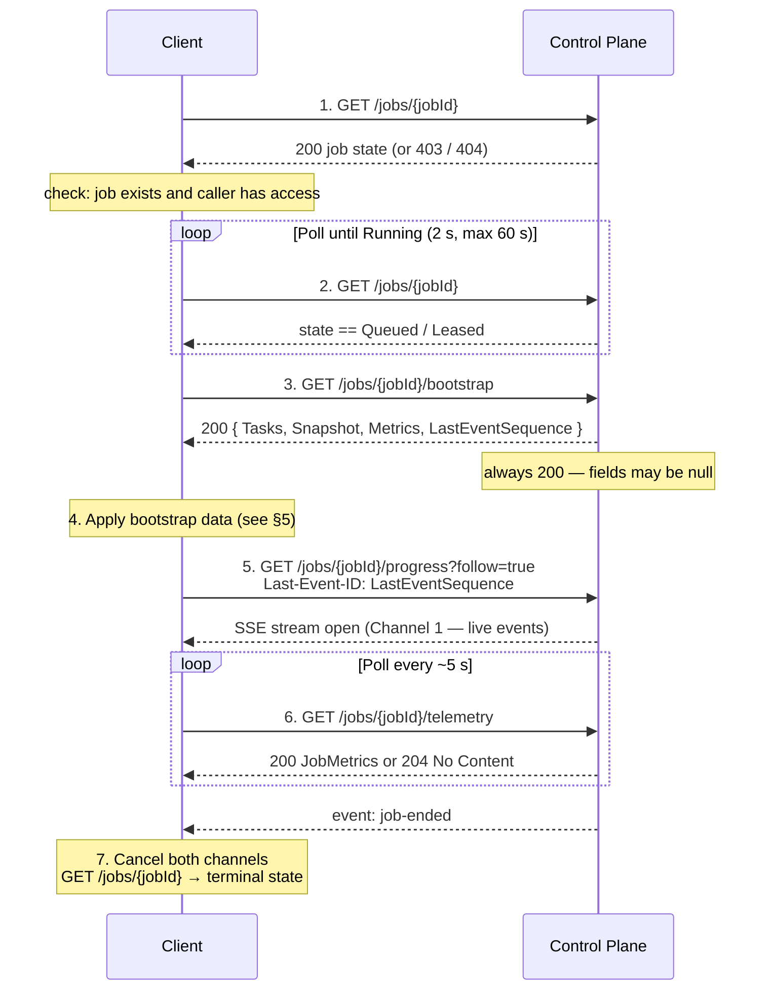
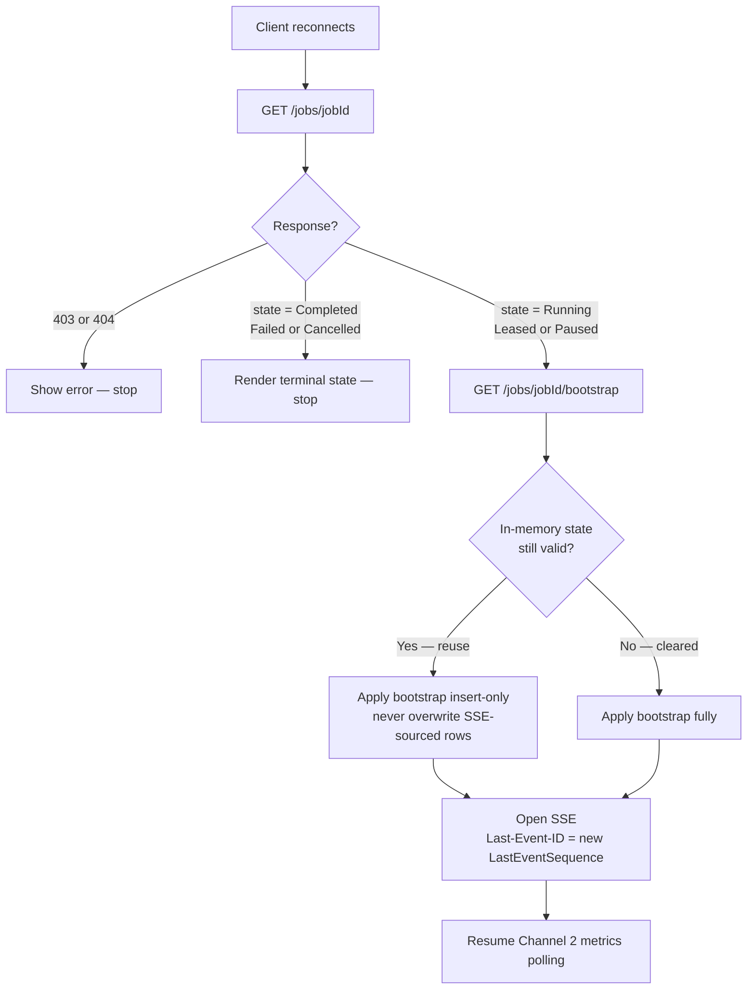
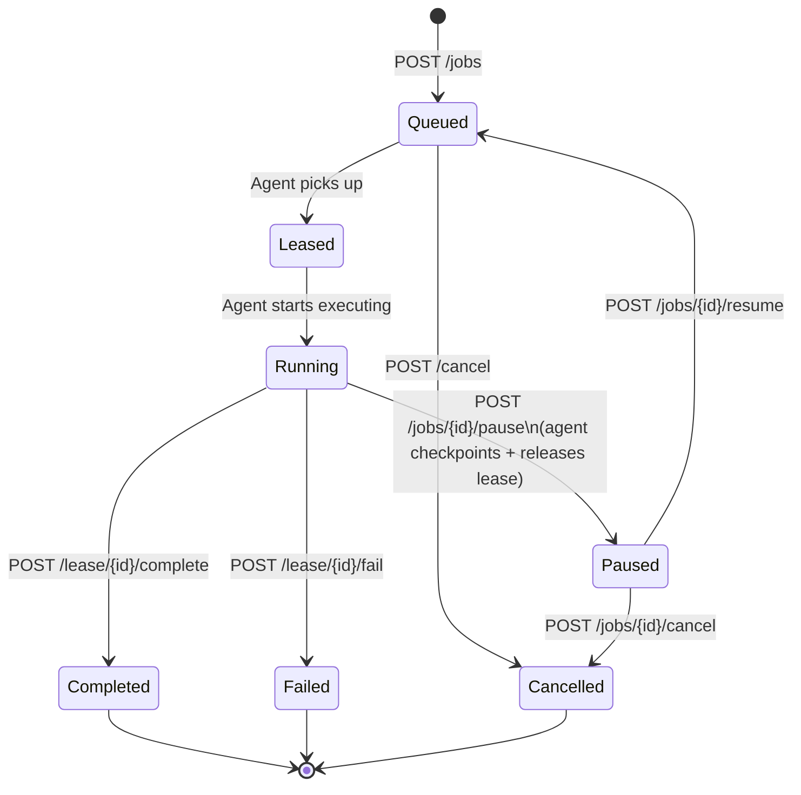

# Client Integration Guide

> **For AI agents:** This file is the authoritative client-side API contract. Read it fully before generating any client code, UI, or integration. All MUST/MUST NOT rules are hard constraints. Reject conditions in [§12](#12-reject-conditions) are build-blocking violations — treat them the same as the rules in `/.agents/guardrails/`.
>
> **For humans:** This guide covers everything you need to build a new interface to the migration platform — a web dashboard, a VS Code extension, a CI/CD integration, or any other client that submits jobs and monitors their progress.

All client communication uses the **Control Plane HTTP API** exclusively. There is no SDK, no shared-memory bus, and no direct file-system access. The control plane is always the single source of truth.

---

## Hard Guardrails

- The connection flow in [§3](#3-startup-and-connection-flow) is the **only permitted startup sequence**. Any other order produces stale or empty UI state.
- The three-channel model in [§6](#6-three-live-data-channels) is the **only permitted live-data architecture**. No new channels may be invented.
- `ProgressEvent.Metrics` MUST NOT be read for counter display in any client. See [§6 Channel 1](#channel-1--sse-event-stream-real-time-events) for the mandatory explanation.
- Bootstrap MUST be fetched before subscribing to SSE. `LastEventSequence` from bootstrap MUST be passed as `Last-Event-ID` on every SSE subscription.
- Any change to the data flow MUST map to an existing section of this document. If it cannot, raise a guardrail challenge before implementing.

---

## Table of Contents

1. [Prerequisites](#1-prerequisites)
2. [Authentication](#2-authentication)
3. [Startup and Connection Flow](#3-startup-and-connection-flow)
4. [Submitting a Job](#4-submitting-a-job)
5. [Bootstrap: Loading Initial State](#5-bootstrap-loading-initial-state)
6. [Three Live Data Channels](#6-three-live-data-channels)
7. [Reconnect Protocol](#7-reconnect-protocol)
8. [Job Lifecycle and Management](#8-job-lifecycle-and-management)
9. [Data Schemas](#9-data-schemas)
10. [Complete Example Flows](#10-complete-example-flows)
11. [Error Handling](#11-error-handling)
12. [Reject Conditions](#12-reject-conditions)

---

## 1. Prerequisites

### Control Plane Base URL

Every request targets the Control Plane. There is no `/api/v1` prefix.

| Deployment | Base URL |
|---|---|
| Standalone (zip install, single machine) | `http://localhost:5100` |
| Dev / source build (Aspire-managed) | `http://localhost:5100` |
| Cloud | Your deployment's HTTPS endpoint |

### Required Request Headers

| Header | Required | Value |
|---|---|---|
| `Authorization` | Yes (Entra ID) | `Bearer <token>` |
| `Accept` | No | Default `application/json`; use `text/event-stream` for SSE |
| `Last-Event-ID` | Conditional | Required on SSE reconnect — see §7 |

---

## 2. Authentication

Two schemes are supported. Which is active is a deployment configuration choice (`Auth:Scheme`); the client cannot choose.

### 2a. Entra ID (cloud and Entra-joined environments)

Rules:
- MUST acquire a Bearer token scoped to the control plane's Entra App Registration (`Auth:ClientId`).
- MUST include `Authorization: Bearer <token>` on every request.
- MUST refresh the token before expiry. Tokens expire after ~1 hour.
- MUST NOT cache tokens across users.

Supported OAuth 2.0 flows: device code, authorization code, client credentials, managed identity.

### 2b. Windows Integrated Auth (on-premises Active Directory)

Rules:
- MUST enable `Negotiate` (Kerberos/NTLM) on the HTTP client (`UseDefaultCredentials = true`).
- MUST NOT send an `Authorization` header manually.
- The client machine MUST be domain-joined.

### Auth Claims Used by the Control Plane

The control plane derives identity from validated token claims. These drive job visibility — a client never sends a filter for its own identity.

| Scheme | `tenant_id` | User identity |
|---|---|---|
| Entra ID | `tid` claim (GUID) | `oid` claim (object ID) |
| Windows AD | AD domain FQDN | AD SID |

### Job Visibility Rules (enforced server-side)

```
IF caller is ControlPlaneAdmin:
    return all jobs
    (optional: filter by ?tenantId=)
ELSE:
    return jobs WHERE tenant_id = caller.tid
               AND  (visibility = 'Tenant'
                     OR submitted_by_oid = caller.oid)
```

A job that exists but is not visible to the caller returns `403 Forbidden` — not `404`. Do not treat `403` as "not found".

---

## 3. Startup and Connection Flow

> **For AI agents:** This sequence is mandatory. Every step MUST execute in this order for every job view. Skipping or reordering steps produces incorrect UI state.



### Step detail

**Step 1 — Verify access**

```
GET /jobs/{jobId}
```

- `200` → proceed to step 2
- `403` → show "access denied"; stop
- `404` → show "job not found"; stop

**Step 2 — Wait for Running**

Poll `GET /jobs/{jobId}` with 2 s interval, max 60 s, until `state` is `Running`. If the job reaches a terminal state (`Completed`, `Failed`, `Cancelled`) without entering `Running`, render terminal state immediately.

**Step 3 — Fetch bootstrap (mandatory)**

```
GET /jobs/{jobId}/bootstrap
```

Always returns `200`. Fields inside the response body are nullable — see §5 for how to handle each. This call MUST happen before opening the SSE stream.

**Step 4 — Apply bootstrap data (mandatory before SSE)**

Populate task list, project table, and counter display from the bootstrap response. See §5.

**Step 5 — Open SSE stream**

```
GET /jobs/{jobId}/progress?follow=true
Accept: text/event-stream
Last-Event-ID: <bootstrap.LastEventSequence>
```

The `Last-Event-ID` header causes the control plane to replay all ring-buffered events with sequence > `LastEventSequence`, then stream new ones. This fills any gap between the bootstrap fetch and the SSE connect. MUST be included on every initial connect, not only on reconnect.

**Step 6 — Begin metrics polling**

```
GET /jobs/{jobId}/telemetry
```

Poll every ~5 s. `204 No Content` = metrics not yet available; display zeros and retry. Stop polling when SSE emits `event: job-ended`.

**Step 7 — Handle terminal state**

On `event: job-ended`: cancel Channel 1 (SSE) and Channel 2 (polling), call `GET /jobs/{jobId}` once to read the final `state`, and render the terminal view.

---

## 4. Submitting a Job

### 4a. Build the Job definition

```json
{
  "jobId": "550e8400-e29b-41d4-a716-446655440000",
  "configVersion": "2.0",
  "kind": "Inventory",
  "connectors": ["AzureDevOps"],
  "package": {
    "packageUri": "file:///D:/exports/run-001",
    "createPackage": false
  },
  "diagnostics": {
    "minimumLevel": "Information"
  },
  "resume": {
    "mode": "Auto"
  },
  "configPayload": "{ ...raw JSON of migration-config.json... }"
}
```

| Field | Type | Required | Notes |
|---|---|---|---|
| `jobId` | UUID v4 | Yes | Generated by the client. Must be globally unique. |
| `configVersion` | string | Yes | Always `"2.0"` for new jobs. |
| `kind` | enum | Yes | `Inventory`, `Export`, `Prepare`, `Import`, `Migrate`, `Dependencies` |
| `connectors` | string[] | Yes | `AzureDevOps`, `TeamFoundationServer`, `Simulated`. Empty array = any agent. |
| `package.packageUri` | URI string | Yes | Local: `file:///D:/path`. Cloud: `https://<account>.blob.core.windows.net/...`. MUST be a URI — bare paths are rejected. |
| `package.createPackage` | bool | No | `true` = pack after export / unpack before import. Default `false`. |
| `diagnostics.minimumLevel` | string | No | `Trace`, `Debug`, `Information`, `Warning`, `Error`, `Critical`. Default `Information`. |
| `resume.mode` | enum | No | `Auto` (default) = resume from cursor. `ForceFresh` = delete module cursors and restart. |
| `configPayload` | string | No | Raw JSON of `migration-config.json`. Carries all source/target endpoints and credentials. |

**`kind` semantics:**

| Kind | Requires Source | Requires Target | Package Access |
|---|---|---|---|
| `Inventory` | Yes | No | Writes to |
| `Export` | Yes | No | Writes to |
| `Prepare` | No | Yes | Reads from, writes validation artefacts |
| `Import` | No | Yes | Reads from |
| `Migrate` | Yes | Yes | Writes then reads |
| `Dependencies` | Yes | No | Writes to |

### 4b. Submit the job

```
POST /jobs
Content-Type: application/json
Authorization: Bearer <token>

{ ...job body... }
```

Response: `201 Created`, `Location: /jobs/{jobId}`.

The job enters `Queued` state immediately. An available Migration Agent picks it up within seconds.

### 4c. Proceed to connection flow

After receiving `201`, execute the startup flow in §3.

---

## 5. Bootstrap: Loading Initial State

The bootstrap response is the single most important call for correctly initialising a live view. It provides a consistent atomic snapshot that prevents empty tables and zero counters on first render — including for jobs that are resuming from a previous run.

### Response shape

```json
{
  "tasks": {
    "tasks": [ ...JobTask[] ... ],
    "pushedAt": "2026-05-06T10:00:00Z",
    "forKind": "Inventory"
  },
  "snapshot": {
    "timestamp": "2026-05-06T10:05:00Z",
    "organisations": [
      {
        "url": "https://dev.azure.com/myorg",
        "name": "myorg",
        "projects": [
          {
            "name": "ProjectA",
            "status": "Completed",
            "discovery": {
              "inventory": {
                "workItemsTotal": 1500,
                "revisionsTotal": 12000,
                "repositoriesTotal": 3
              }
            },
            "migration": null
          }
        ]
      }
    ]
  },
  "metrics": {
    "timestamp": "2026-05-06T10:05:00Z",
    "scope": { "elapsedMs": 300000 },
    "discovery": {
      "inventory": {
        "workItemsTotal": 1500,
        "revisionsTotal": 12000,
        "repositoriesTotal": 3,
        "checkpointsSaved": 47
      }
    },
    "migration": null
  },
  "lastEventSequence": 4823
}
```

### Rules for applying each field

| Field | Rule |
|---|---|
| `tasks` | MUST populate the task/module list. Use `status`, `knownTotal`, `completedCount` for initial progress state. If `null`: wait for the first SSE event that carries `taskId + taskStatus`. |
| `snapshot` | MUST pre-populate per-project rows (org → project → counters + status). MUST be applied as **insert-only** — never overwrite a row already updated by a live SSE event. If `snapshot` is `null` or `snapshot.Organisations` is empty: leave the project table empty; rows appear as SSE events arrive. |
| `metrics` | MUST seed aggregate counters. Treat as "last known" until the first successful Channel 2 poll. If `null`: display zeros. |
| `lastEventSequence` | MUST pass as `Last-Event-ID` on the SSE subscription. If `0` or absent: open SSE with no `Last-Event-ID` (stream starts from current position). MUST NOT pass a stale value from a previous session. |

### When fields are null

Any bootstrap field may be `null` under these conditions:

| Condition | Likely null fields |
|---|---|
| Job is `Queued` or `Leased` (agent not yet running) | `tasks`, `snapshot`, `metrics`, `lastEventSequence` = 0 |
| Agent started but has not yet completed the plan build | `tasks`, `snapshot`, `metrics` |
| Agent started but no project has completed yet | `snapshot` |
| Control plane restarted (in-memory state cleared) | `tasks`, `snapshot`, `metrics` |

`null` means "data not yet available". Treat it as empty initial state and wait for SSE events to fill in the gaps. MUST NOT treat `null` as an error.

---

## 6. Three Live Data Channels

Maintain these channels for the lifetime of a job view. They are independent and MUST run concurrently.

| Channel | Endpoint | Mechanism | What it carries |
|---|---|---|---|
| **Channel 1** | `GET /jobs/{jobId}/progress?follow=true` | SSE push | Real-time `ProgressEvent` records — stage transitions, cursor positions, task status updates |
| **Channel 2** | `GET /jobs/{jobId}/telemetry` | HTTP polling (~5 s) | Aggregate `JobMetrics` — all counter values shown in the UI |
| **Channel 3** | `GET /jobs/{jobId}/snapshot` | HTTP polling (~5 min) or on-demand | Per-org/project `JobSnapshot` — high-cardinality breakdown |

Channel 3 is optional. The bootstrap response already contains the latest snapshot; only use Channel 3 if your UI maintains a persistent per-project table that needs periodic refresh.

---

### Channel 1 — SSE Event Stream (real-time events)

```
GET /jobs/{jobId}/progress?follow=true
Accept: text/event-stream
Last-Event-ID: <lastEventSequence>
```

#### SSE wire format

```
id: 4824
data: {"module":"WorkItems","stage":"ExportRevisions","message":"Exported 312/1500","timestamp":"2026-05-06T10:05:01Z","eventSequence":4824,"taskId":"capture.workitems.myorg.projecta","taskStatus":"Running","completedCount":312,"lastCheckpointAt":"2026-05-06T10:04:55Z","metrics":null}

```

```
: heartbeat

```

```
event: job-ended
data: {"state":"Completed"}

```

#### Parsing rules

- `id:` line = `eventSequence`. MUST store as the new `lastEventSequence` on every received event.
- `: heartbeat` lines have no `id:` or `data:`. MUST be discarded silently. Do not treat as an error or reset the reconnect timer.
- `event: job-ended` = terminal state signal. Parse `data` as `{"state":"<value>"}`. Cancel both channels and do a final `GET /jobs/{jobId}`.
- All other events are data-only (no explicit `event:` field). Deserialise `data` as `ProgressEvent`.

#### What to do with each `ProgressEvent` field

| Field | UI action |
|---|---|
| `module` + `stage` | Update the module row's stage label |
| `taskId` + `taskStatus` | Update the matching task's status indicator |
| `completedCount` | Update task progress bar (`completedCount / task.knownTotal`) |
| `lastCheckpointAt` | Show "last saved" timestamp |
| `message` | Append to the live log / diagnostic panel |
| `metrics` | **See critical note below — MUST NOT use for counter display** |

#### ⚠️ Critical: do not use `ProgressEvent.Metrics` for counters

`ProgressEvent.Metrics` is only populated by the TFS subprocess (.NET 4.8.1). For all .NET 10 jobs it is always `null`. Reading counters from this field silently displays zeros for every .NET 10 job. MUST use Channel 2 (`GET /jobs/{jobId}/telemetry`) for all counter values.

---

### Channel 2 — Metrics Polling (aggregate counters)

```
GET /jobs/{jobId}/telemetry
```

- `200 + JobMetrics` → update all counter displays
- `204 No Content` → display zeros, retry on next poll cycle; MUST NOT treat as an error

Poll every ~5 seconds. Stop when Channel 1 emits `event: job-ended`.

---

### Channel 3 — Snapshot Polling (per-project detail, optional)

```
GET /jobs/{jobId}/snapshot
```

- `200 + JobSnapshot` → refresh per-project rows
- `204 No Content` → no snapshot yet; retain existing rows

Poll every ~5 minutes, or on-demand when a user navigates to a project detail view. MUST apply as insert-or-update (not delete-and-replace) to avoid flickering.

---

## 7. Reconnect Protocol

> **For AI agents:** The reconnect sequence is identical to the startup sequence in §3 with one difference: apply bootstrap as insert-only if any in-memory state is being reused.

When a client reconnects (browser tab returns, network resumes, explicit user action):

**Decision tree:**



### SSE `Last-Event-ID` on reconnect

The `Last-Event-ID` tells the control plane the highest sequence the client has already processed. The control plane replays all ring-buffered events with sequence > `Last-Event-ID`. This fills the gap that occurred during disconnection.

**Ring buffer capacity:** 1000 events. If the client was disconnected long enough for the buffer to have wrapped, some events are permanently gone from the stream. The bootstrap snapshot provides the current authoritative state regardless.

### Exponential back-off

```
delay = min(1s × 2^attempt, 30s)
```

Reset `attempt` to 0 when a reconnect succeeds and the first event or heartbeat is received.

---

## 8. Job Lifecycle and Management

### Job state machine



### State meanings for client UIs

| State | Channels needed | Suggested UI |
|---|---|---|
| `Queued` | None (poll `/jobs/{jobId}`) | Spinner — waiting for agent |
| `Leased` | None (poll `/jobs/{jobId}`) | Spinner — agent starting |
| `Running` | Channel 1 + Channel 2 | Live progress table and counters |
| `Paused` | None | Static view + Resume button |
| `Completed` | None | Final counters; Download logs button |
| `Failed` | None | Error detail from `GET /jobs/{jobId}` |
| `Cancelled` | None | Cancelled message |

### Management endpoints

| Action | Method | Path | Auth |
|---|---|---|---|
| List jobs | `GET` | `/jobs` | Caller's jobs + Tenant-visible jobs |
| Get job | `GET` | `/jobs/{jobId}` | Submitter or admin |
| Pause | `POST` | `/jobs/{jobId}/pause` | Submitter or admin |
| Resume | `POST` | `/jobs/{jobId}/resume` | Submitter or admin |
| Cancel | `POST` | `/jobs/{jobId}/cancel` | Submitter or admin |
| Download logs | `GET` | `/jobs/{jobId}/logs/download` | Submitter or admin |
| Diagnostics (snapshot) | `GET` | `/jobs/{jobId}/diagnostics` | Submitter or admin |
| Diagnostics (stream) | `GET` | `/jobs/{jobId}/diagnostics?follow=true` | Submitter or admin |

`GET /jobs` accepts optional query parameters:
- `?tenantId=<guid>` — admin-only, filter by tenant
- `?state=<value>` — filter by job state

---

## 9. Data Schemas

### `ProgressEvent` (Channel 1 payload)

```typescript
{
  module:           string            // Module name, e.g. "WorkItems"
  stage:            string            // Stage label, e.g. "ExportRevisions"
  message:          string | null     // Human-readable status
  timestamp:        ISO8601           // UTC event time
  eventSequence:    long              // Monotonic sequence; use as Last-Event-ID
  lastCheckpointAt: ISO8601 | null    // UTC time of last checkpoint save
  nextCheckpointDueAt: ISO8601 | null // Estimated next checkpoint time; null = per-item (always safe)
  taskId:           string | null     // JobTask.Id this event is attributed to
  taskStatus:       JobTaskStatus | null  // New task status; null if not a task-lifecycle event
  completedCount:   long | null       // Running completed count for the task
  metrics:          JobMetrics | null // ⚠️ MUST NOT use for display — see §6 Channel 1
}
```

### `JobMetrics` (Channel 2 polling response)

```typescript
{
  timestamp:  ISO8601
  scope: {
    elapsedMs: long               // Elapsed job time in milliseconds
  }
  discovery: {                    // Non-null for Inventory / Dependencies jobs
    inventory: {
      workItemsTotal:    long
      revisionsTotal:    long
      repositoriesTotal: long
      checkpointsSaved:  long
    } | null
  } | null
  migration: {                    // Non-null for Export / Import / Migrate jobs
    workItems: { ... } | null
    attachments: { ... } | null
    // ... other migration counters
  } | null
}
```

Exactly one of `discovery` or `migration` is non-null per job.

### `JobSnapshot` (bootstrap field / Channel 3 response)

```typescript
{
  timestamp: ISO8601
  organisations: OrgSnapshot[]
}

OrgSnapshot {
  url:      string            // e.g. "https://dev.azure.com/myorg"
  name:     string            // Display name
  projects: ProjectSnapshot[]
}

ProjectSnapshot {
  name:      string
  status:    "Pending" | "InProgress" | "Completed" | "Failed"
  discovery: DiscoveryCounters | null   // Non-null for discovery jobs
  migration: MigrationCounters | null   // Non-null for migration jobs
}
```

### `JobBootstrap` (bootstrap endpoint response)

```typescript
{
  tasks:             JobTaskList | null    // null until agent pushes plan
  snapshot:          JobSnapshot | null   // null until agent pushes first snapshot
  metrics:           JobMetrics | null    // null until agent pushes first metrics
  lastEventSequence: long                 // 0 if no events yet; pass as Last-Event-ID
}
```

### `JobTaskList`

```typescript
{
  tasks:    JobTask[]
  pushedAt: ISO8601
  forKind:  "Inventory" | "Export" | "Prepare" | "Import" | "Migrate" | "Dependencies" | null
}
```

### `JobTask`

```typescript
{
  id:              string              // "capture.workitems.myorg.projecta"
  name:            string              // "WorkItems Inventory"
  taskKind:        TaskKind
  phase:           string | null       // Display hint: "export", "import", etc.
  organisationUrl: string | null
  projectName:     string | null
  order:           int                 // 0-based execution order
  status:          JobTaskStatus
  knownTotal:      long | null         // Total items if known at plan time
  completedCount:  long | null         // Running count; updated via SSE events
  startedAt:       ISO8601 | null
  completedAt:     ISO8601 | null
  skipReason:      string | null       // Non-null only when status = Skipped
  dependsOn:       string[] | null     // Task IDs that must complete first
}
```

**`TaskKind` values:** `Capture`, `Analyse`, `Export`, `Prepare`, `Import`, `Validate`

**`JobTaskStatus` values:** `Pending`, `Running`, `Completed`, `Failed`, `Skipped`

---

## 10. Complete Example Flows

### Flow A — Submit and watch a new Inventory job

```
1. Build Job: kind=Inventory, connectors=[AzureDevOps], jobId=<new UUID>
2. POST /jobs                               → 201 Created
3. Poll GET /jobs/{jobId} every 2 s        → wait until state==Running (max 60 s)
4. GET /jobs/{jobId}/bootstrap             → tasks=null, snapshot=null, metrics=null,
                                              lastEventSequence=0 (agent just starting)
5. Open SSE: GET /jobs/{jobId}/progress?follow=true  (Last-Event-ID: 0)
6. Begin polling GET /jobs/{jobId}/telemetry every 5 s
7. First SSE events: taskId set, taskStatus=Running, stage advancing
8. Channel 2 returns non-null JobMetrics as agent pushes first metrics burst
9. SSE event: job-ended → cancel channels → GET /jobs/{jobId} → state==Completed
```

### Flow B — Reconnect to a long-running job after 10 minutes away

```
1. GET /jobs/{jobId}                        → state==Running
2. GET /jobs/{jobId}/bootstrap             → tasks (updated statuses), snapshot (latest per-project
                                              state), metrics (latest counters), lastEventSequence=9201
3. Rebuild project table from snapshot (insert-only), update task list, seed counters from metrics
4. Open SSE: Last-Event-ID: 9201
   → control plane replays buffered events 9202..9300 (if still in ring buffer), then live stream
5. Resume Channel 2 polling
```

### Flow C — Attach to a resumed job (was paused, now running again)

```
1. GET /jobs/{jobId}                        → state==Running
2. GET /jobs/{jobId}/bootstrap             → snapshot shows projects completed before pause,
                                              tasks show pre-pause statuses,
                                              lastEventSequence=4823 (no new events yet since resume)
3. Apply bootstrap — project table pre-populated from snapshot (no blank rows)
4. Open SSE: Last-Event-ID: 4823
   → new events (4824+) stream in as agent continues from cursor
5. Begin Channel 2 polling
```

---

## 11. Error Handling

| HTTP status | Meaning | Required client action |
|---|---|---|
| `400 Bad Request` | Invalid `jobId` format or malformed request body | Fix the request; do not retry |
| `401 Unauthorized` | Missing or expired token | Refresh token; retry once |
| `403 Forbidden` | Job exists but caller cannot see it | Show "access denied"; stop; MUST NOT retry with different credentials silently |
| `404 Not Found` | Job does not exist | Show "not found"; stop |
| `204 No Content` | Telemetry / snapshot not yet available | Not an error — display zeros; retry on next poll cycle |
| `503 Service Unavailable` | Control plane starting up | Retry with exponential back-off (start 1 s) |
| SSE connection drop | Network blip | Reconnect with exponential back-off; pass `Last-Event-ID` — see §7 |
| Heartbeat only, no events for >60 s | Job is Queued or Leased, no activity yet | Normal; do not reconnect |

### Diagnostics stream

For human-readable diagnostic logs (not structured counters), subscribe to:

```
GET /jobs/{jobId}/diagnostics?follow=true
Accept: text/event-stream
```

Accepts `?level=` filter: `Trace`, `Debug`, `Information`, `Warning`, `Error`, `Critical`. Default: `Information`. This is independent of Channel 1 — a separate SSE stream carrying unstructured log records. The TUI uses this stream for its Log Panel. It is optional for other clients.

---

## 12. Reject Conditions

> **For AI agents:** Any client code that violates a condition below MUST be rejected and rewritten. These are not style guidelines — they are architectural correctness requirements.

A client implementation MUST be rejected if it:

- Opens the SSE stream **before** calling `GET /jobs/{jobId}/bootstrap`
- Omits `Last-Event-ID` on the initial SSE subscription
- Reads counter values from `ProgressEvent.Metrics` instead of `GET /jobs/{jobId}/telemetry`
- Treats `204 No Content` from `/telemetry` or `/snapshot` as an error condition
- Treats `403 Forbidden` as `404 Not Found`
- Polls `GET /jobs/{jobId}` indefinitely without a timeout or terminal-state check
- Overwrites live SSE-sourced rows in the project table with a later bootstrap fetch (insert-only rule)
- Invents a fourth data channel or new endpoint not listed in this document
- Connects directly to an `IProgressSink` or in-process event bus — no such connection exists outside the Migration Agent process
- Reads from the migration package file system directly — clients MUST use the Control Plane API only
- Uses `ProgressEvent.Metrics` as the primary counter source (silently zeros .NET 10 jobs)
- Stores `lastEventSequence` from a previous session and passes it without first calling bootstrap
- Displays `JobMetrics.migration` fields for a discovery job or `JobMetrics.discovery` fields for a migration job (exactly one is non-null per job)

---

## Related Documents

| Document | Purpose |
|---|---|
| [docs/control-plane.md](control-plane.md) | Full API surface, authentication, data store, and authorisation rules |
| [docs/cli-guide.md](cli.md) | CLI implementation — reference client using this flow |
| [docs/tui-guide.md](tui.md) | TUI implementation — reference client using this flow |
| [.agents/context/job-lifecycle.md](../.agents/context/job-lifecycle.md) | Job definition schema and field semantics |
| [.agents/context/telemetry-model.md](../.agents/context/telemetry-model.md) | Three-channel model — agent-side contract |
