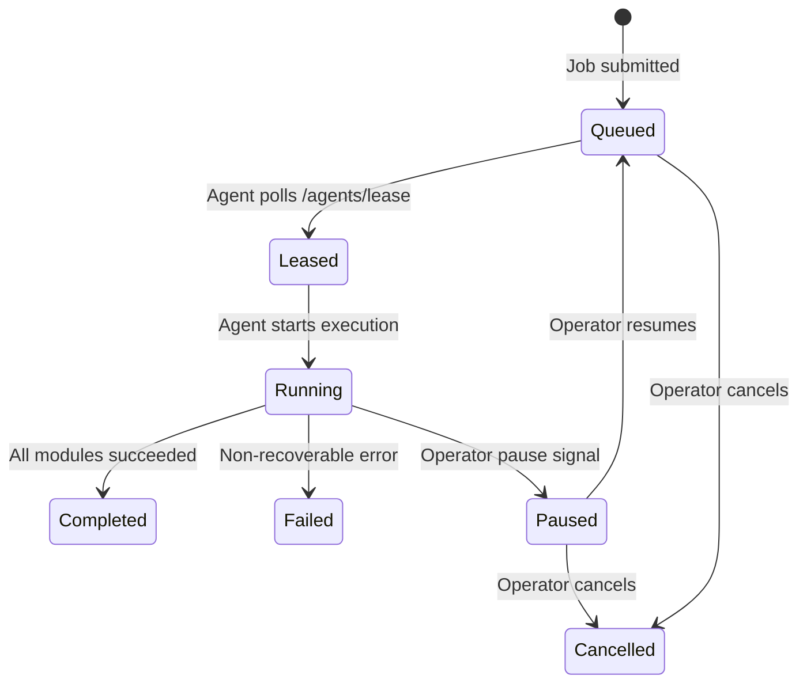
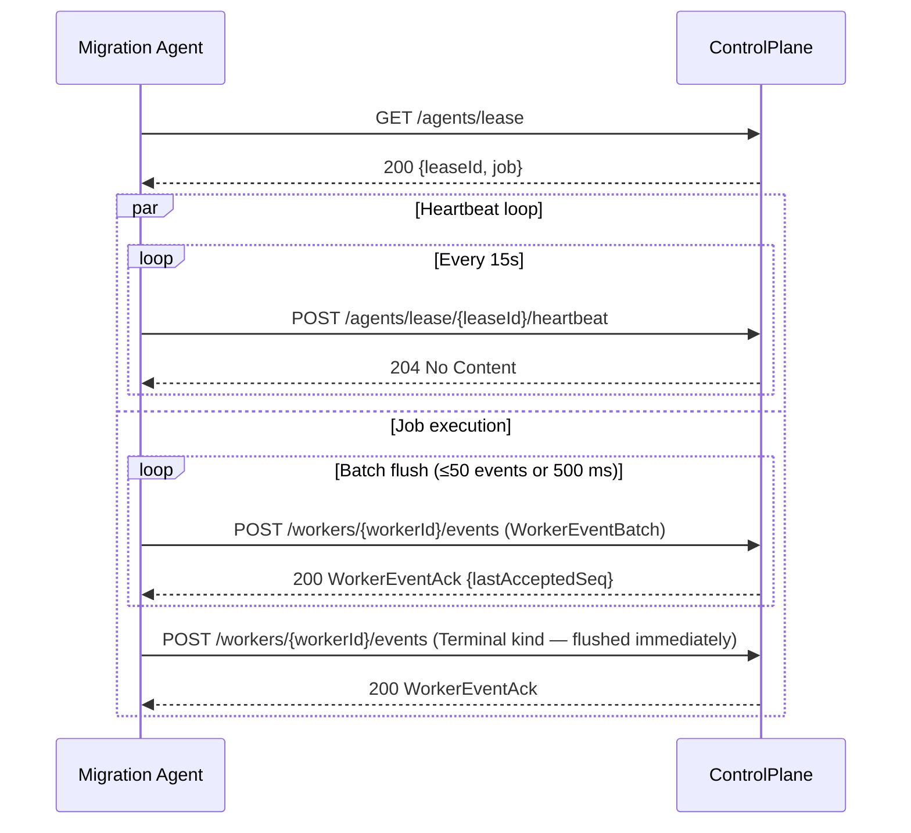

# Control Plane

## Purpose

The `ControlPlane` project (`DevOpsMigrationPlatform.ControlPlane`) is a **service library** that implements the HTTP API, job state machine, lease protocol, and PostgreSQL data model for coordinating migration jobs. It has no entry point of its own — it is referenced and hosted by `ControlPlaneHost` (`DevOpsMigrationPlatform.ControlPlaneHost`).

`ControlPlaneHost` is the deployable ASP.NET Core host. It configures and runs the `ControlPlane` service and adds **agent lifecycle management** via `AgentLifecycleService`:

- **Standalone mode** (packaged zip install, no Aspire): `AgentLifecycleService` auto-spawns the sibling `MigrationAgent` binary from `../MigrationAgent/` relative to `AppContext.BaseDirectory`. If the agent exits unexpectedly it is restarted with exponential back-off (1 s → 2 s → 4 s → max 60 s). The back-off resets if the agent ran for more than 10 seconds. Set `AgentLifecycle:AutoSpawn=false` in `appsettings.json` to manage the agent manually.
- **Aspire-managed mode** (local dev, `build.ps1 -Mode Start`): Aspire spawns and manages the agent. `AgentLifecycleService` detects `DOTNET_RUNNING_UNDER_DOTNET_ASPIRE` and idles.
- **Cloud mode** (Azure Container Apps): ACA/KEDA manages agent containers. The sibling binary is absent; `AgentLifecycleService` logs a warning and idles.

In future phases, `IAgentLauncher` implementations will provide:

- `LocalProcessAgentLauncher` — spawns and monitors agent processes on the same machine (local and server topologies).
- `ContainerAgentLauncher` — deploys and scales agent containers to a configurable target context: either the managed ACA environment co-located with the control plane, or a user-specified environment (for network zone isolation across VNets, ACA environments, or AKS namespaces). The agent image source is configured separately from the target context — the official `ghcr.io/nkdagility/migration-agent:{version}` image by default, or a customer's private ACR mirror.

The control plane's role is to accept, validate, track, and assign work — not to perform it. Execution always happens inside an Agent.

---

## Responsibilities

| Responsibility | Description |
|---|---|
| Agent lifecycle management | Deploy and manage Migration Agents via `IAgentLauncher`. Spawn processes locally (`LocalProcessAgentLauncher`) or deploy containers to a configurable target context (`ContainerAgentLauncher`). Monitor liveness and reassign leases on failure. |
| Job submission | Accept job definitions from the CLI or API clients. Validate config schema before accepting. |
| Job storage | Persist job definitions and status. |
| Lease management | Assign jobs to available Migration Agents via time-bounded leases. Reassign if a Migration Agent stops heartbeating. |
| Progress tracking | Record per-module, per-cursor, per-stage progress as reported by Migration Agents. |
| Status and logs API | Expose job status, progress, and logs to the TUI and other clients. |
| Pause / resume / cancel | Allow operators to signal state changes to Migration Agents via the job record. |
| Artefact URLs | Provide Migration Agents with the package URI (`packageUri`) for the job. |

The control plane does **not** run the Job Engine, call source or target APIs, or read or write the migration package directly. `ControlPlaneHost` adds agent lifecycle management but must not contain job execution logic.

---

## API Surface

### Job Lifecycle

| Method | Path | Description |
|---|---|---|
| `POST` | `/jobs` | Submit a new job. Body is a job definition (see [.agents/30-context/domains/job-lifecycle.md](../.agents/30-context/domains/job-lifecycle.md)). Returns `jobId`. |
| `GET` | `/jobs` | List jobs visible to the caller. Filtered server-side by auth context. Accepts `?tenantId=` (admins only) and `?state=` filters. |
| `GET` | `/jobs/{jobId}` | Get job status and metadata. Returns 403 if the caller lacks visibility. |
| `GET` | `/jobs/{jobId}/progress` | Get per-module, per-stage progress as last reported by the Migration Agent. |
| `POST` | `/jobs/{jobId}/cancel` | Cancel a running or queued job. Only the submitter or an admin may cancel. |
| `POST` | `/jobs/{jobId}/pause` | Pause a running job. Only the submitter or an admin may pause. |
| `POST` | `/jobs/{jobId}/resume` | Resume a paused job. Only the submitter or an admin may resume. |
| `GET` | `/jobs/{jobId}/progress` | Return buffered `ProgressEvent` records as a JSON array (snapshot). Requires same auth as `GET /jobs/{jobId}`. |
| `GET` | `/jobs/{jobId}/progress?follow=true` | **SSE stream**: push `ProgressEvent` records in real time as they arrive; heartbeat comment every 15 s. Sends `event: job-ended` when the job reaches a terminal state. Requires same auth as `GET /jobs/{jobId}`. |
| `GET` | `/jobs/{jobId}/diagnostics` | Return buffered diagnostic log records as a JSON array (snapshot). Accepts `?level=` filter (`Trace`, `Debug`, `Information`, `Warning`, `Error`, `Critical`). Requires same auth as `GET /jobs/{jobId}`. |
| `GET` | `/jobs/{jobId}/diagnostics?follow=true` | **SSE stream**: push diagnostic log records in real time. Accepts `?level=` filter. Heartbeat comment every 15 s. Requires same auth as `GET /jobs/{jobId}`. |
| `GET` | `/jobs/{jobId}/telemetry` | Return the latest `MetricSnapshot` for the job. `204 No Content` when no snapshot has been pushed yet by the Migration Agent. `MetricSnapshot` is a versioned DTO whose fields correspond to registered OTel instruments — see `WellKnownMetricNames` for the canonical reference. Requires same auth as `GET /jobs/{jobId}`. |
| `GET` | `/jobs/{jobId}/stream` | **Unified SSE stream.** Multiplexes progress events and diagnostic records into one connection. Replays all stored events with `seq > from` on connect (append-only log, full history), then switches to live subscriber channels. Heartbeat comment every 15 s. Closes with `event: job-ended` or `event: job-failed`. Use `?from={seq}` to resume from a known sequence number. |
| `GET` | `/jobs/{jobId}/logs/download` | Download the package log files for a completed job. Current packages use run-scoped `.migration/runs/<runId>/logs/progress.ndjson` and `.migration/runs/<runId>/logs/diagnostics.ndjson`, with legacy fallback for older flat `.migration/Logs/progress.jsonl` and `.migration/Logs/agent.jsonl` packages. Requires same auth as `GET /jobs/{jobId}`. |

### Migration Agent Protocol

| Method | Path | Description |
|---|---|---|
| `GET` | `/agents/lease` | Migration Agent polls for available work. Returns a leased job if one is available. |
| `POST` | `/agents/lease/{leaseId}/heartbeat` | Migration Agent signals it is alive. Lease expiry is extended on each heartbeat. |
| `POST` | `/workers/{workerId}/events` | **Primary telemetry channel.** Migration Agent POSTs a `WorkerEventBatch` containing up to 50 typed events (Progress, Diagnostic, Metrics, Snapshot, Tasks, Heartbeat, Terminal). Replaces the separate `/progress`, `/diagnostics`, `/complete`, and `/fail` endpoints as the active path. Returns `WorkerEventAck { LastAcceptedSeq }`. |
| `POST` | `/agents/lease/{leaseId}/progress` | _(Legacy shim)_ Still accepted for backward compatibility with older agent binaries. Calls the same `JobProgressStore.Append()` internally. |
| `POST` | `/agents/lease/{leaseId}/complete` | _(Legacy shim)_ Still accepted. Use `Terminal` kind in `/workers/{workerId}/events` for new agents. |
| `POST` | `/agents/lease/{leaseId}/fail` | _(Legacy shim)_ Still accepted. Use `Terminal` kind in `/workers/{workerId}/events` for new agents. |
| `POST` | `/agents/lease/{leaseId}/release` | Migration Agent releases lease without completing (e.g. on pause). |

---

## Job States

| State | Description |
|---|---|
| `Queued` | Waiting for an agent to pick up. |
| `Leased` | Assigned to an agent but not yet executing. |
| `Running` | Agent is actively executing. |
| `Paused` | Agent has checkpointed and released the lease. Job is resumable. |
| `Completed` | All modules completed successfully. |
| `Failed` | A non-recoverable error occurred. Cursor state is preserved for investigation. |
| `Cancelled` | Operator cancelled the job. |



---

## Lease Protocol

1. Migration Agent calls `GET /agents/lease` (long-poll or short-poll).
2. Control plane returns a lease containing the job definition and a `leaseId`.
3. Migration Agent sends `POST /agents/lease/{leaseId}/heartbeat` on a configurable interval (default: every 15 seconds).
4. If the control plane does not receive a heartbeat within `leaseExpiry` (default: 2× heartbeat interval), the job is returned to `Queued` and another Migration Agent may pick it up.
5. The cursor in the package ensures the new Migration Agent resumes from where the previous one stopped.



---

## Progress Reporting

Migration Agents push a `ProgressEvent` after each stage. Task lifecycle events also carry task-scoped patch data so the Control Plane can update the already-pushed `JobTaskList` without re-pushing the full plan:

```json
{
  "module": "WorkItems",
    "stage": "Export.Complete",
    "taskId": "export.workitems.myorg.projecta",
    "taskStatus": "Completed",
    "knownTotal": 1500,
    "completedCount": 1500,
  "workItemId": 12345,
  "timestamp": "2026-02-25T18:12:34Z"
}
```

The control plane stores each event in an **append-only log** (`List<ProgressEvent>` protected by `ReaderWriterLockSlim`, per job). The log:

- Powers `GET /jobs/{jobId}/progress` (snapshot of all stored events)
- Powers `GET /jobs/{jobId}/stream` (full replay from `fromSeq`, then live via subscriber channels)
- Patches the in-memory `JobTaskList` when events carry `taskId + taskStatus`
- Is in-memory only — cleared when the control plane restarts; the package's `.migration/runs/<runId>/logs/progress.ndjson` is the durable record

The log is append-only: events are never evicted. A configurable `MaxEventsPerJob` cap (default 50,000) emits a warning log if reached but does not silently discard — the cursor in the package remains the authoritative resume state. Late-joining CLI clients can replay the full history from `fromSeq=0`.

---

## Diagnostics Level Filtering

The control plane maintains a deployment-level minimum diagnostic level (`Diagnostics:MinimumLevel`, default: `Information`). When a Migration Agent sends diagnostic log records via `POST /workers/{workerId}/events` (kind `Diagnostic`), the control plane drops any record whose level is below this floor before buffering or broadcasting via SSE.

This floor is independent of the agent's per-job `--level` setting. An agent may emit `Debug`-level records, but the control plane will only buffer and stream records at or above its own configured minimum. This prevents verbose agent output from overwhelming the control plane's ring buffer and SSE subscribers in production deployments.

The `?level=` query parameter on `GET /jobs/{jobId}/diagnostics` and `GET /jobs/{jobId}/diagnostics?follow=true` provides additional client-side filtering on top of the control plane floor.

---

## Authentication

The control plane accepts two authentication schemes. The scheme active in a given deployment is determined by configuration (`Auth:Scheme`).

| Scheme | When used | Identity claims |
|---|---|---|
| **Entra ID (OIDC / Bearer)** | Cloud deployments and any Entra-joined environment. The CLI/TUI acquires a token scoped to the control plane's Entra App Registration. | `tid` (tenant GUID), `oid` (user object ID), `upn` (email address) |
| **Windows Integrated Auth (Negotiate)** | On-premises Active Directory deployments. No extra login step; the OS forwards the Kerberos/NTLM token. | `domain` (AD domain FQDN used as `tenant_id`), `sid` (used as `submitted_by_oid`), `samAccountName` (used as `submitted_by_upn`) |

> ⛔ **There is no local-only mode without a control plane.** All topologies — including a developer laptop or dedicated server — run `ControlPlaneHost` via Aspire. The CLI always submits jobs via `ControlPlaneClient` over HTTP. A `LocalJobRunner` or any in-process job executor is **not permitted** and must not be implemented. See guardrail rule #20 in `.agents/20-guardrails/core/architecture-boundaries.md`.

### Login

For Entra ID, users authenticate with:

```
devopsmigration login [--url <control-plane-url>]
```

This performs an interactive MSAL device-code flow and caches the token locally. All subsequent CLI and TUI commands forward this credential automatically. Windows Integrated Auth requires no explicit login step.

---

## Authorisation

### Roles

| Role | How granted | Can see | Can manage |
|---|---|---|---|
| **Submitter** | Submitted the job | Own jobs always | Own jobs (pause / cancel / resume) |
| **Tenant Viewer** | Authenticated in the same tenant | `Tenant`-visibility jobs in their tenant | Read-only |
| **Control Plane Admin** | Member of the configured admin group (see below) | All jobs across all tenants | All jobs |

Control Plane Admin is determined by Entra security group membership. The group is configured via `Auth:AdminGroupId`. For the nkdAgility-hosted cloud deployment this is a group in the `nkdagility.com` tenant. Self-hosted deployments configure their own group OID.

For Windows AD deployments, admin group membership is resolved via the AD group name configured in `Auth:AdminGroupName`.

### Job Visibility

Every job has a `visibility` field set at submission time.

| Value | Who can see the job |
|---|---|
| `User` (default) | Submitter and Control Plane Admins only |
| `Tenant` | Any authenticated user in the same `tenant_id` (read-only) plus the submitter and admins |

### `GET /jobs` Filter Rule

The server enforces visibility server-side. The caller never sends a filter for their own identity — the control plane derives it from the validated token.

```
IF caller is ControlPlaneAdmin:
    return all jobs
    (optional: filter by ?tenantId= query parameter)
ELSE:
    return jobs WHERE tenant_id  = caller.tid
               AND  (visibility  = 'Tenant'
                     OR submitted_by_oid = caller.oid)
```

A job that exists but is not visible to the caller returns `403 Forbidden` on direct `GET /jobs/{jobId}` access — not `404`. This prevents enumeration of job IDs from leaking existence information.

---

## Isolation Rule

The `ControlPlane` service library must not:

- Call source or target Azure DevOps APIs.
- Read or write the migration package.
- Execute orchestrator logic.

`ControlPlaneHost` extends the control plane with agent lifecycle management but must not contain job execution logic.

Violating any of these rules breaks the Agent / control-plane separation and couples execution to coordination.

---

## Data Store

The control plane persists:

- Job definitions (serialised job contract)
- Job states and state transitions
- Latest progress per module (for display; not authoritative for resume)
- Lease records
- Log references (URIs into blob storage; logs themselves are stored in the package's `.migration/Logs/` folder by the Migration Agent)

### Technology

The control plane uses EF Core for data persistence.

| Environment | Default provider |
|---|---|
| Local development | Aspire portable binary resource (`AddPortablePostgres`) — no Docker required |
| Cloud (Azure) | Azure PostgreSQL Flexible Server (provisioned by `azd` from the same AppHost declaration) |

### ORM and Migrations

The control plane uses **EF Core 9+** with the **Npgsql.EntityFrameworkCore.PostgreSQL** provider.

- Migrations are managed with `dotnet ef migrations`.
- At startup, `dbContext.Database.MigrateAsync()` is called to apply any pending migrations before the API begins accepting requests.

### Connection String

Aspire injects the connection string under the key `ConnectionStrings__controlplane-db` in all environments. `ControlPlaneHost` reads it from `IConfiguration` via the standard Aspire / Npgsql integration:

```csharp
builder.AddNpgsqlDbContext<ControlPlaneDbContext>("controlplane-db");
```

The connection string value is:

| Environment | Source |
|---|---|
| Local | Aspire generates it from the portable PostgreSQL binary endpoint and injects it automatically |
| Cloud | Azure Container Apps reads it from Key Vault via a managed identity secret reference (see [docs/development-setup.md](development-setup.md)) |

### Table Schema

```sql
-- Persists the full Job definition and tracks its lifecycle state.
CREATE TABLE jobs (
    job_id            UUID         PRIMARY KEY,
    config_version    TEXT         NOT NULL,
    mode              TEXT         NOT NULL CHECK (mode IN ('Export', 'Prepare', 'Import', 'Migrate')),
    state             TEXT         NOT NULL DEFAULT 'Queued'
                                   CHECK (state IN ('Queued', 'Leased', 'Running', 'Paused', 'Completed', 'Failed', 'Cancelled')),
    job_json          JSONB        NOT NULL,     -- full serialised Job
    -- Identity & visibility
    tenant_id         TEXT         NOT NULL,     -- Entra tenant GUID or AD domain FQDN
    submitted_by_oid  TEXT         NOT NULL,     -- Entra Object ID or AD SID of the submitter
    submitted_by_upn  TEXT         NOT NULL,     -- Human-readable: user@domain.com or DOMAIN\user
    visibility        TEXT         NOT NULL DEFAULT 'User'
                                   CHECK (visibility IN ('User', 'Tenant')),
    created_at        TIMESTAMPTZ  NOT NULL DEFAULT now(),
    updated_at        TIMESTAMPTZ  NOT NULL DEFAULT now()
);

-- Tracks active and historical lease assignments.
-- A job may have multiple lease rows if it is reassigned after a heartbeat timeout.
CREATE TABLE leases (
    lease_id      UUID         PRIMARY KEY,
    job_id        UUID         NOT NULL REFERENCES jobs(job_id),
    agent_id      TEXT         NOT NULL,
    acquired_at   TIMESTAMPTZ  NOT NULL DEFAULT now(),
    expires_at    TIMESTAMPTZ  NOT NULL,
    released_at   TIMESTAMPTZ              -- NULL means the lease is still active
);

-- Mirrors the latest cursor position per module, as reported by Migration Agents.
-- This is a display-only snapshot. The cursor in the package is the authoritative resume state.
CREATE TABLE progress_snapshots (
    job_id         UUID         NOT NULL REFERENCES jobs(job_id),
    module         TEXT         NOT NULL,
    last_processed TEXT         NOT NULL,   -- relative path of last processed artefact
    stage          TEXT         NOT NULL,   -- canonical stage label
    updated_at     TIMESTAMPTZ  NOT NULL,
    PRIMARY KEY (job_id, module)
);

CREATE INDEX ix_jobs_state            ON jobs(state);
CREATE INDEX ix_jobs_tenant_state     ON jobs(tenant_id, state);
CREATE INDEX ix_jobs_submitted_by_oid ON jobs(submitted_by_oid);
CREATE INDEX ix_leases_job_id ON leases(job_id);
CREATE INDEX ix_leases_expires_at ON leases(expires_at) WHERE released_at IS NULL;
```

### Lease Expiry Query

The control plane uses the `leases` table to detect stale leases:

```sql
-- Jobs whose active lease has expired (heartbeat missed)
SELECT j.job_id
FROM   jobs j
JOIN   leases l ON l.job_id = j.job_id
WHERE  j.state = 'Running'
  AND  l.released_at IS NULL
  AND  l.expires_at < now();
```

A background service runs this query on a configurable interval (default: every 10 seconds) and returns matching jobs to `Queued`.

### What Is Not Stored

The control plane deliberately does **not** store:

- The migration package contents (revision files, cursors, attachments) — those live in `IArtefactStore` (filesystem or Azure Blob).
- Log file contents — logs are written into the package's `.migration/Logs/` folder by the Migration Agent; the control plane stores only the URI prefix for the TUI to tail.
- Source or target credentials in plaintext — credentials are passed through the job definition as configured by the operator. The control plane persists `job_json` but does not inspect or proxy credential values.

---

## Multi-Tenancy

Tenancy is enforced from the first job submission. There is no single-tenant phase followed by a later migration.

- `tenant_id` on every job row isolates jobs by tenant. Queries are always predicated on `tenant_id` unless the caller is a Control Plane Admin.
- Migration Agents are not tenant-scoped by default. A shared pool of agents picks up any queued job. Tenant-isolated agent pools are achievable by deploying agents with a `tenantId` affinity filter in the lease poll query.
- Rate limits are applied per `tenant_id` to prevent one tenant starving others.
- Artefact retention policies are configurable per tenant.
- The nkdAgility-hosted cloud deployment isolates all customer tenants from each other. nkdAgility staff who are members of the `Auth:AdminGroupId` group in the `nkdagility.com` Entra tenant can view all jobs across all customer tenants for support purposes.

See [docs/architecture.md](architecture.md) for the overall system context.

