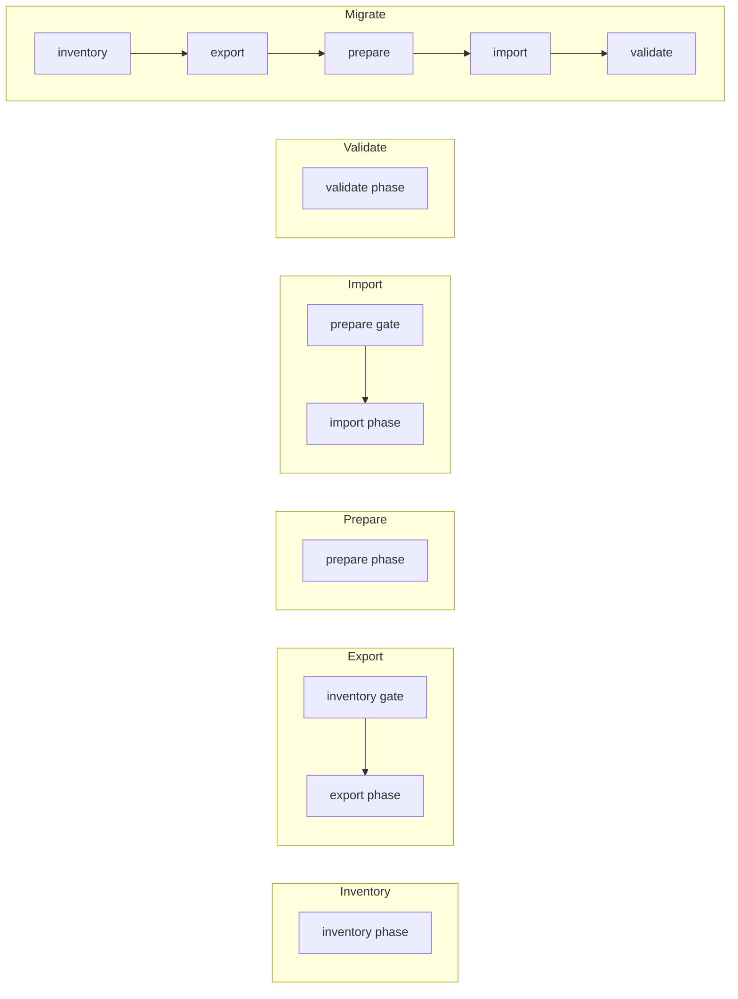
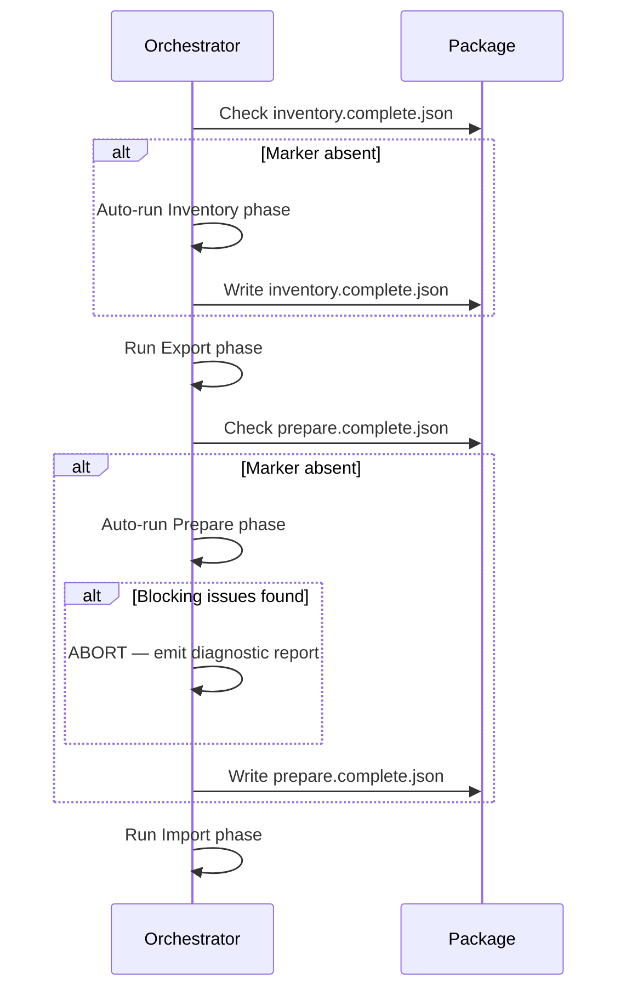

# Orchestration

## Job Engine

The **Job Engine** is the shared execution core used by Migration Agents in all hosting topologies. It receives a `Job`, resolves the execution plan, and runs modules in dependency order. It has no knowledge of the TUI, the console, or any progress renderer.

See [docs/cli-guide.md](cli-guide.md) for how the CLI routes a job to the Job Engine. See [.agents/30-context/domains/job-lifecycle.md](../.agents/30-context/domains/job-lifecycle.md) for the `Job` wire format.

### Steps

1. **Validate job** — Check `Job` schema, `configVersion` compatibility, and `kind` value.
2. **Build execution plan** — Produce a `JobTaskList` containing one `JobTask` per enabled module per applicable phase. Each task has an `Id` (e.g. `inventory.workitems`, `export.workitems`, `prepare.identities`, `import.nodes`, `validate.workitems`), a `Phase` grouping, dependency edges, and an execution `Order`. The plan is pushed to the control plane so CLI and TUI can render progress before execution begins.
3. **Validate package** — Run each module's `ValidateAsync` (pre-execution pass). Fail fast on errors.
4. **Build module dependency graph** — Topological sort of all enabled modules using `DependsOn` declarations per phase. Fail fast on circular dependencies.
5. **Execute tasks in order** — Walk the task list phase by phase. Within each phase, execute tasks in topological dependency order. Each task invokes one module method (`ExportAsync`, `PrepareAsync`, `ImportAsync`, or `ValidateAsync`) depending on the phase.
6. **Maintain state via cursors** — Each module writes cursor/meta state through `IPackageAccess` package-state intents after each unit of work.
7. **Emit progress events** — After each cursor write, emit a `ProgressEvent` to `IProgressSink`.
7a. **Record metrics** — After each work item processing step, record OTel metrics via `IMigrationMetrics` (execution counters, payload histograms, duration).
8. **Fail fast on module failure** — A non-recoverable error in any module halts the run. Cursor state allows resume.

Authoritative runtime state comes from package scope (`/.migration/`), org scope (`/{org}/.migration/`), and project scope (`/{org}/{project}/.migration/`), with read precedence project → org → package. Run folders under `.migration/runs/<runId>/` are audit-only snapshots and must never be read as authoritative phase-gate or resume state.

### Task Plan Structure

The agent emits a `JobTaskList` at job start. The plan keeps an ordered flat list of `JobTask` records for execution compatibility and also carries ordered phase summaries for presentation and inspection. The task list contains **one task per module per phase**:

| Phase | Task ID pattern | Module method | Example |
|---|---|---|---|
| **Inventory** | `inventory.{module}` | `ExportAsync` (inventory-capable modules) | `inventory.inventory`, `inventory.workitems` |
| **Export** | `export.{module}` | `ExportAsync` | `export.identities`, `export.nodes`, `export.workitems` |
| **Prepare** | `prepare.{module}` | `PrepareAsync` | `prepare.identities`, `prepare.nodes` |
| **Import** | `import.{module}` | `ImportAsync` | `import.identities`, `import.nodes`, `import.workitems` |
| **Validate** | `validate.{module}` | `ValidateAsync` | `validate.identities`, `validate.workitems` |

Which phases appear depends on the job `mode`:

| Mode | Phases included |
|---|---|
| `Inventory` | Inventory |
| `Export` | Inventory (if gate missing) + Export |
| `Prepare` | Prepare |
| `Import` | Prepare (if gate missing) + Import |
| `Validate` | Validate |
| `Migrate` | Inventory + Export + Prepare + Import + Validate |



Tasks within a phase are topologically sorted by `DependsOn`.Tasks across phases execute sequentially (all Inventory tasks complete before Export begins, etc.). Phase gates (Inventory before Export, Prepare before Import) are enforced by the plan builder — prerequisite phase tasks are injected automatically when the completion marker is absent.

Phase summaries group the same flat task list into canonical execution slices. They do not change dispatch semantics: the executor still dispatches by `TaskKind` and `DependsOn`, while CLI and TUI can consume the explicit phase metadata instead of reconstructing stages from task rows.

### Mode Behaviour

#### Inventory Mode

```
Validate job → Build graph → ExportAsync (inventory-capable modules only) → Done
```

- Only `source` connection is required.
- `target` is ignored.
- Enumerates and catalogues in-scope items (work items, revisions, artefacts) per project.
- Results written to the package as inventory artefacts.
- Writes root `.migration/inventory.complete.json` on completion.

#### Export Mode

```
Validate job → Check Inventory gate → Build graph → ExportAsync (each module) → Done
```

- Only `source` connection is required.
- `target` is ignored.
- Package is written to the URI in `artefacts.packageUri`.
- **Inventory gate**: Before building the module graph, the orchestrator checks for root `.migration/inventory.complete.json`. If the marker is absent, the orchestrator **auto-runs Inventory** (runs inventory-capable modules). This ensures export always has inventory data available.

#### Prepare Mode

```
Validate job → Validate package → Build graph → PrepareAsync (each module) → Write prepare.complete.json → Done
```

- Requires a completed Export (package must exist with `manifest.json`).
- Only `target` connection is required (reads the package, queries the target).
- `source` is ignored.
- Each module's `PrepareAsync` reads exported artefacts from the package, queries the target system, and writes validation/mapping artefacts into the module's own folder (e.g. `Identities/prepare-report.json`, `Nodes/prepare-report.json`).
- On successful completion, writes root `.migration/prepare.complete.json` as the completion marker.
- Prepare is **idempotent** — re-running overwrites Prepare output artefacts but never modifies operator-edited mapping files (e.g. `Identities/mapping.json`).
- Any unresolved issue (unmapped identity, missing node, unmapped field) is a **blocking error** unless the operator has added an explicit skip annotation to the relevant mapping file.

#### Import Mode

```
Validate job → Check Prepare gate → Build graph → ImportAsync (each module) → Done
```

- Only `target` connection is required.
- `source` is ignored.
- Package is read from the URI in `artefacts.packageUri`.
- **Prepare gate**: Before building the module graph, the orchestrator checks for root `.migration/prepare.complete.json`. If the marker is absent, the orchestrator **auto-runs Prepare** (runs `PrepareAsync` for each module). If Prepare produces any blocking issues, the orchestrator **aborts** with a diagnostic report and does not proceed to Import. The operator must resolve the issues and re-run Import (or run `prepare` explicitly).

#### Validate Mode

```
Validate job → Validate package → Build graph → ValidateAsync (each module) → Write validation-report.json → Done
```

- Only `target` connection and the package are required.
- `source` is ignored.
- Compares the import results against the exported package data.
- Runs Tier 3 post-flight checks: work item count parity, link integrity, attachment integrity, identity resolution completeness.
- Writes `.migration/Logs/validation-report.json` with comprehensive results.
- Writes `.migration/Checkpoints/validate.complete.json` on completion.
- Can be re-run independently at any time after import.

#### Migrate Mode

```
Validate job → Build graph → Inventory → ExportAsync → Validate package → PrepareAsync (each module) → Check for blocking issues → ImportAsync (each module) → ValidateAsync (each module) → Done
```

- Both `source` and `target` connections are required.
- Runs all five phases in a single orchestrated run: Inventory → Export → Prepare → Import → Validate.
- If Prepare produces any blocking issues, the orchestrator **aborts** after Prepare and does not proceed to Import. The operator must resolve the issues and re-run (with `mode: Import` to skip re-export, or `mode: Migrate` to repeat the full cycle).

### Phase Gates

Each phase can be run independently, but downstream phases auto-run their prerequisites if the prerequisite's completion marker is absent:

| Phase | Gate | Marker checked | Auto-runs |
|---|---|---|---|
| **Export** | Inventory gate | `/.migration/inventory.complete.json` | Inventory |
| **Import** | Prepare gate | `/.migration/prepare.complete.json` | Prepare (aborts on blocking issues) |

These gates ensure the pipeline is self-healing: running Export alone will also produce inventory data; running Import alone will also run Prepare first.



### Validate Step Placement

- Config validation runs **before** any module executes (fail fast on bad config).
- Inventory gate runs **before** Export in `Export` mode.
- Package validation in `Migrate` mode runs **after** all exports complete and **before** Prepare begins.
- Each module's `ValidateAsync` is called as part of the Validate phase or the pre-execution validation pass.
- Prepare gate runs **before** any import in `Import` mode and **after** all Prepare modules complete in `Migrate` mode.

### Fail-Fast Rules

- Any module that throws an unhandled exception fails the run immediately.
- Partial progress is preserved via cursors; the run is resumable.
- Retryable errors (network timeouts, rate limits) are handled within modules using the `policies.retries` configuration; they do not trigger fail-fast.
- Non-retryable errors (schema mismatch, missing required fields, auth failure) trigger fail-fast immediately.

---

## Execution Contexts

The orchestrator runs in the same way regardless of execution context. The context determines where the package lives and how progress is reported, not how modules execute.

### Local / Server Hosted

- The CLI uses embedded Aspire `DistributedApplication` APIs to start `ControlPlaneHost`, `MigrationAgent`(s), and PostgreSQL on the local machine. All components communicate over HTTP (`http://localhost:5100`).
- The package boundary is backed by the local filesystem store (`FileSystemArtefactStore` beneath `IPackageAccess`).
- Progress is consumed by all three sinks simultaneously: `ConsoleProgressSink`, `PackageProgressSink`, and `UnifiedWorkerEventWriter` (batched worker events to the control plane; enables live TUI streaming).
- Any machine with network access to the host can attach a TUI via the control plane HTTP endpoint.

See [docs/cli-guide.md](cli-guide.md) for local and server command details.

### Agent (Cloud)

- A Migration Agent calls the Job Engine after receiving a leased `Job` from the remote control plane.
- The package boundary is backed by the shared artefact store (`AzureBlobArtefactStore` or equivalent beneath `IPackageAccess`).
- Progress is consumed by `UnifiedWorkerEventWriter`, which batches events and pushes them to the control plane via `POST /workers/{workerId}/events`.
- The control plane's progress view mirrors the cursor; the cursor in the package remains authoritative for resume.

### What Does Not Change Between Contexts

- The orchestrator runner logic (steps 1–6 above).
- Module code.
- Cursor schema and resume behaviour.
- Package layout.
- Fail-fast rules.

