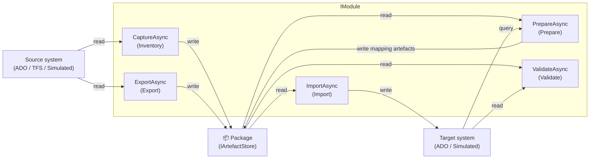
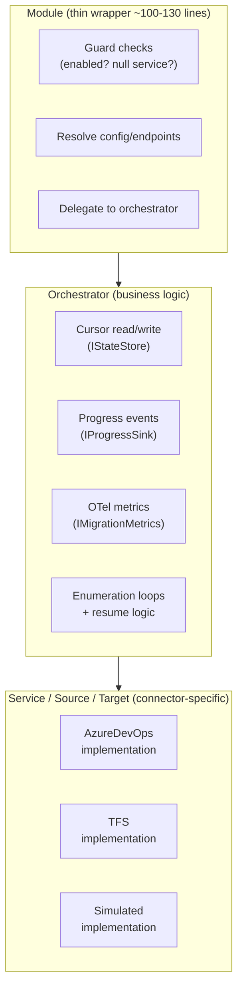

# Module Architecture

## 7. Module Architecture

Each migration concern is implemented as a module conforming to the `IModule` contract. Modules are the only extension point for adding new capabilities.

### ICapture Interface

```csharp
interface ICapture
{
    string Name { get; }
    Task CaptureAsync(InventoryContext context, CancellationToken ct);
}
```

`Name` returns the second dot-segment of the task ID (e.g., `"workitems"` for `capture.workitems.org.project`). The `JobPlanExecutor` dispatches all `capture.*` tasks through a unified `captureHandlersByName` dictionary keyed by this name.

### IModule Contract

```csharp
interface IModule : ICapture
{
    string Name { get; }
    IReadOnlyList<ModuleDependency> DependsOn { get; }

    bool SupportsInventory { get; }
    bool SupportsExport { get; }
    bool SupportsPrepare { get; }
    bool SupportsImport { get; }
    bool SupportsValidate { get; }

    Task CaptureAsync(InventoryContext context, CancellationToken ct);
    Task ExportAsync(ExportContext context, CancellationToken ct);
    Task PrepareAsync(PrepareContext context, CancellationToken ct);
    Task ImportAsync(ImportContext context, CancellationToken ct);
    Task ValidateAsync(ValidationContext context, CancellationToken ct);
}
```



### Contract Invariants

- `Name` is unique across all registered modules.
- `DependsOn` declares ordering constraints. The orchestrator resolves the dependency graph before execution; circular dependencies are a fatal configuration error.
- `ExportAsync` must access the package only via `IPackageAccess`. Reads from the source system via injected services.
- `PrepareAsync` must read from and write to the package via `IPackageAccess`, query the target system via injected services, and write validation/mapping artefacts into the module's own package folder (e.g. `Identities/prepare-report.json`). Prepare artefacts are overwritten on re-run. Operator-edited mapping files (e.g. `mapping.json`) must not be modified by `PrepareAsync`.
- `ImportAsync` must access package content and metadata via `IPackageAccess`.
- `ValidateAsync` must be side-effect free.
- Modules must never call source or target APIs directly — only through injected services.
- Package path ownership belongs to the package boundary (`IPackageAccess`). When a module/orchestrator needs to read or write authoritative package/state artefacts, use package intents first and only fall back to low-level store operations for documented FR-008 exceptions (delete/maintenance, streaming append loops, legacy-read compatibility).

### Module → Orchestrator → Service Pattern

All modules follow a mandatory three-layer architecture. This pattern separates concerns cleanly and ensures orchestrators — the business logic — are reusable across Modules, Tools, and future Extensions.

```
Module (thin wrapper)
  → Orchestrator (business logic)
    → Service / Source / Target (external calls)
```



#### Layer Responsibilities

| Layer | Responsibility | Examples |
|---|---|---|
| **Module** | Guard checks (enabled? null service?), resolve config/endpoints, delegate to orchestrator. Contains no business logic. ~100–130 lines. | `NodesModule`, `TeamsModule`, `IdentitiesModule` |
| **Orchestrator** | All cross-cutting orchestration: checkpointing (cursor read/write), progress events (`IProgressSink`), metrics (OTel), CSV/JSON writing, enumeration loops, resume logic. This is the reusable business logic layer. | `INodesOrchestrator`, `ITeamsOrchestrator`, `IIdentitiesOrchestrator` |
| **Service / Source / Target** | Connector-specific SDK/API calls. One implementation per connector (AzureDevOps, TFS, Simulated). Injected into the orchestrator via method parameters. | `ITeamSource`, `IIdentitySource`, `IClassificationTreeCapture`, `INodeEnsurer` |

#### Interface Contracts

Orchestrator interfaces are declared in `DevOpsMigrationPlatform.Abstractions.Agent` so they can be injected, mocked, and reused:

| Interface | Location | Purpose |
|---|---|---|
| `INodesOrchestrator` | `Abstractions.Agent/Modules/` | Classification-tree export, import, and validation |
| `IIdentitiesOrchestrator` | `Abstractions.Agent/Modules/` | Identity descriptor export, import (lookup/resolution), and validation |
| `ITeamsOrchestrator` | `Abstractions.Agent/Modules/` | Team export, import, and validation (net10.0 only) |
| `IDependencyOrchestrator` | `Abstractions.Agent/Modules/` | Dependency analysis orchestration (`DependencyAnalyser`) |
| `IInventoryOrchestrator` | `Abstractions.Agent/Discovery/` | Inventory collection orchestration (retained, now injected into `WorkItemsModule.CaptureAsync`) |

Orchestrator *implementations* are `internal sealed` classes in `Infrastructure.Agent`. They are registered in DI by the module's `ServiceCollectionExtensions` and constructor-injected into the module.

#### Why This Pattern

1. **Reusability** — Orchestrators are the business logic. They can be consumed by Modules today and by Tools or Extensions in the future without duplicating cross-cutting concerns.
2. **Testability** — Modules are thin and trivial. Orchestrators can be unit-tested with mocked services. Services can be tested against real APIs.
3. **Consistency** — Every module follows the same structure. New contributors can navigate any module by recognising the pattern.
4. **Separation of concerns** — Guard checks and config resolution (Module) are separate from enumeration/checkpoint/progress logic (Orchestrator), which is separate from SDK calls (Service).

#### Capability Seam Rule (Tools, Modules, Extensions)

When a concern already has a canonical seam (for example node translation, identity lookup, field transform), modules and extensions must consume that seam. They must not introduce alternate concern engines.

Extensions are policy adapters: they decide when/how to apply the seam, skip/fail behavior, and checkpoint interaction. They are not replacement translation or mapping engines.

#### Module ↔ Orchestrator Mapping

| Module | Orchestrator | Services |
|---|---|---|
| `NodesModule` | `INodesOrchestrator` | `IClassificationTreeCapture`, `INodeEnsurer` |
| `IdentitiesModule` | `IIdentitiesOrchestrator` | `IIdentitySource`, `IIdentityLookupTool` |
| `TeamsModule` | `ITeamsOrchestrator` | `ITeamSource`, `ITeamTarget`, `TeamExportOrchestrator`, `TeamImportOrchestrator` |
| `WorkItemsModule` | `WorkItemExportOrchestrator`, `WorkItemImportOrchestrator` | `IWorkItemRevisionSource`, `IAttachmentBinarySource` |
| `WorkItemsModule` (inventory phase) | `IInventoryOrchestrator` | `IInventoryService` |
| `DependencyCapture` | `IDependencyOrchestrator` | `IDependencyDiscoveryServiceFactory`, `IDependencyOrchestrator` — pure `ICapture` (not IModule) |
| `DependencyAnalyser` | `IDependencyOrchestrator` | `IDependencyDiscoveryService` |

### Dependency Graph Rules

- Dependencies are resolved topologically before execution begins.
- A module that depends on another module will not execute until the dependency completes successfully.
- Modules with no declared dependencies may execute in any order (or in parallel, if the orchestrator supports it in a future version).
- `IdentitiesModule` has no dependencies (`DependsOn` is empty) but must complete before any module that performs identity mapping. Any module that maps identities must include `"IdentitiesModule"` in its own `DependsOn` list. Failure to do so is a dependency graph error that the orchestrator must detect and reject at startup.
- `TeamsModule` should be ordered after `IdentitiesModule` and `NodesModule`, and before `WorkItemsModule`. Module execution order is controlled by the operator via configuration — there is no `DependsOn` property on TeamsModule or NodesModule. The operator must ensure prerequisite modules complete before dependent modules run.

### Module Dependencies and `DependencyPhase`

`ModuleDependency` is phase-aware. The same dependency can apply only to specific execution phases.

| `DependencyPhase` value | Meaning |
|---|---|
| `Inventory = 0` | Applies to `CaptureAsync` task ordering |
| `Export = 1` | Applies to `ExportAsync` task ordering |
| `Import = 2` | Applies to `ImportAsync` task ordering |
| `Both = 3` | Applies to both export and import ordering |
| `Prepare = 4` | Applies to `PrepareAsync` task ordering |
| `Analyse = 5` | Applies to `IAnalyser.AnalyseAsync` task ordering |

### Storage Rule

> Modules/orchestrators use `IPackageAccess` for caller-facing package intents. `IArtefactStore` and `IStateStore` are internal persistence details beneath that boundary and must not be used to bypass it. Direct filesystem access outside these interfaces is forbidden.

### Module Dependencies — Job Context and Endpoint Info

Modules declare constructor dependencies on three key interfaces to access job-level context without coupling to the full config graph:

#### `IAgentJobContext`
Provides cross-cutting scalar values about the current job. Every module that needs to branch on execution mode or access the package path **must** use this instead of navigating `IOptions<MigrationOptions>`:

```csharp
public interface IAgentJobContext
{
    string Mode { get; }          // "Inventory", "Export", "Prepare", "Import", "Validate", or "Migrate"
    string PackagePath { get; }   // Resolved absolute path to the package root
    string ConfigVersion { get; } // e.g. "2.0"
}
```

Scoped to the job lifetime. Registered by the agent worker before any module executes.

#### `ISourceEndpointInfo` / `ITargetEndpointInfo`
Provide the resolved source and target connection details. Modules that need the URL or project name for API calls **must** inject these instead of connector-specific options:

```csharp
public interface ISourceEndpointInfo
{
    string Url { get; }           // e.g. https://dev.azure.com/myorg
    string Project { get; }       // Project name
    string ConnectorType { get; } // "AzureDevOpsServices" | "TeamFoundationServer" | "Simulated"
}
```

`ITargetEndpointInfo` has the same shape. It is **not registered for TFS** (TFS is source-only). Registered by each connector's `Add*Services()` extension method.

**Why this matters**: Using these interfaces keeps modules connector-agnostic and independently testable. Injecting `AzureDevOpsEndpointOptions` directly into a module would couple it to the ADO connector and prevent unit testing without a full ADO config.

### Module Responsibilities

| Module | Responsibility |
|---|---|
| `IdentitiesModule` | Export user/group descriptors; provide identity mapping service to all other modules. **Prepare**: reads `descriptors.jsonl`, queries the target for matching identities (by UPN/display name), writes `Identities/prepare-report.json` with auto-matched and unresolved identities. Must run first — all other modules that map identities depend on it. |
| `NodesModule` | Export and import area/iteration node classification trees. **Export**: captures source tree to `Nodes/source-tree.json`. **Import**: replicates source tree and/or ensures all referenced paths exist on the target. **Prepare**: validates referenced paths against target. |
| `TeamsModule` | Export and import team membership, settings, iterations, members, and capacity. **Prepare**: verifies target teams/groups exist or can be created; writes `Teams/prepare-report.json`. |
| `WorkItemsModule` | High-fidelity work item revision export/import. **Prepare**: cross-references exported field names with configured `FieldTranslations` and reports unmapped fields; validates all referenced area/iteration paths exist on the target (via `INodeCreator.NodeExistsAsync`) and writes `Nodes/prepare-report.json`. Accepts a `wiql` scope (with `query` parameter) and one or more `filter` scopes (with `mode`, `field`, and `pattern` parameters) to include or exclude work items by field value using a case-insensitive regex. Also accepts five independently-enabled named extensions: `Revisions`, `Links`, `Attachments`, `Comments` (fetches comment versions from the ADO Comments API), and `EmbeddedImages` (downloads and rewrites inline images from HTML/Markdown fields). |
| `PermissionsModule` | _(Planned — not yet implemented)_ Export and import project and repository access control lists. |
| `BuildsModule` | _(Planned — not yet implemented)_ Export build pipeline definitions. |
| `GitModule` | _(Planned — not yet implemented)_ Export Git repository structure and optionally pack contents. |

**Execution order** (operator-controlled via config; recommended order): `IdentitiesModule` → `NodesModule` → `TeamsModule` → `WorkItemsModule`. Export plans include `InventoryModule` before `WorkItemsModule` when WorkItems is enabled, so package-level `inventory.csv`/`inventory.json` is produced prior to work item export. Any module that maps identities must declare a dependency on `IdentitiesModule` via `DependsOn`.

> **Field-projected fetching**: Inventory and dependency analysis modules use `IWorkItemFetchService` for streaming, field-projected work item retrieval. This abstraction handles WIQL windowing, batch API calls, and in-process filtering — modules should not call `GetWorkItemsAsync` directly.

### WorkItemsModule — Scopes and Filter Rules

`WorkItemsModule` supports two scope types in its `scopes` array:

| Scope type | Purpose |
|---|---|
| `wiql` | Selects work items via a WIQL query (`parameters.query`). Required. |
| `filter` | Post-fetch field-value filter. Multiple filters are AND-combined. |

**Filter scope semantics:**
- `mode: "include"` — retain only items where `field` matches `pattern` (case-insensitive regex, 2s timeout).
- `mode: "exclude"` — discard items where `field` matches `pattern`.
- Items where the filtered field is absent: pass `exclude` (does not match), fail `include`.
- Prefer short indexed fields (`System.AreaPath`, `System.WorkItemType`) to minimise API pre-fetch time.

### WorkItemsModule — Import Stages

Streaming import processes each revision folder in four ordered stages. The cursor advances after each stage completes, enabling fine-grained resume:

```
CreatedOrUpdated → AppliedFields → AppliedLinks → UploadedAttachments → Completed
```

| Stage | What happens |
|---|---|
| `CreatedOrUpdated` | Target work item is created (new ID recorded in `idmap.db`) or identified (ID already in map) |
| `AppliedFields` | All field values from `revision.json` are written to the target work item |
| `AppliedLinks` | Related links, external links, and hyperlinks are applied |
| `UploadedAttachments` | Binary attachment files are uploaded and attached to the target revision |

### WorkItemsModule — ID Resolution Strategies (Import)

When importing into a target that already has some work items (partial re-import), the `WorkItemResolutionStrategy` extension seeds `idmap.db` at startup by reading existing items from the target:

| Strategy | How target IDs are located |
|---|---|
| `TargetField` | Reads a custom field (e.g. `Custom.SourceWorkItemId`) on each target item; maps source ID → target ID |
| `TargetHyperlink` | Scans hyperlinks on each target item for URLs matching a pattern (e.g. `https://source.example.com/wi/{id}`) |

Configure in the `WorkItems` module extensions block:

```json
{
  "type": "WorkItemResolutionStrategy",
  "enabled": true,
  "parameters": {
    "strategy": "TargetField",
    "fieldName": "Custom.SourceWorkItemId"
  }
}
```

### WorkItemsModule — ADO Export

The Azure DevOps export path uses the following components:

| Component | Role |
|---|---|
| `IWorkItemRevisionSourceFactory` | Creates an `IWorkItemRevisionSource` per job from endpoint options. ADO implementation: `AzureDevOpsWorkItemRevisionSourceFactory`. |
| `AzureDevOpsWorkItemRevisionSource` | Enumerates work item revisions from the REST API using `WorkItemQueryWindowStrategy` for WIQL-windowed iteration. |
| `IAttachmentBinarySource` / `IStreamingAttachmentBinarySource` | Downloads attachment binaries. ADO implementation: `AzureDevOpsAttachmentBinarySource`. Streaming variant computes SHA-256 in-flight via `CryptoStream`. |
| `AzureDevOpsAttachmentRegistry` | Scoped registry mapping (workItemId, revisionIndex, filename) → download URL, populated during revision enumeration. |
| `WorkItemExportOrchestrator` | Drives the export loop: enumerate revisions → write `revision.json` → download attachments (with delta detection) → advance cursor. O(N) calls per revision. |

**Resilience**: Attachment downloads use a named HTTP client (`"AttachmentDownload"`) with 8 retries, exponential back-off, handling transient 5xx, 408, and 429 responses.

**Delta detection**: Adjacent revisions sharing the same attachment URL skip re-download — only new or changed URLs trigger a binary fetch.

### WorkItemsModule — TFS Export

The TFS export path runs inside `DevOpsMigrationPlatform.TfsMigrationAgent` (net481). It uses the same `WorkItemExportOrchestrator` and `IModule` dispatch as the ADO path — the only difference is the connector:

| Component | Role |
|---|---|
| `TfsWorkItemsModule` | Implements `IModule`. `ExportAsync` drives the full TFS export; `PrepareAsync`, `ImportAsync`, `ValidateAsync` return `Task.CompletedTask` (TFS is source-only; import not yet implemented). |
| `TfsWorkItemRevisionSource` | Enumerates work item revisions from the TFS Object Model (`WorkItemStore`). Uses date-windowed iteration, same chronological ordering as the ADO source. |
| `TfsAttachmentBinarySource` | Downloads attachment binaries from TFS. |
| `WorkItemExportOrchestrator` | Same orchestrator as ADO — enumerate revisions → write `revision.json` → download attachments → advance cursor. Shared from `DevOpsMigrationPlatform.Infrastructure.Agent`. |

The package output is identical to an ADO export — the same `WorkItems/yyyy-MM-dd/<ticks>-<workItemId>-<revisionIndex>/revision.json` layout. An exported TFS package can be fed directly into the standard `import` flow without modification.

### Adding a New Module

See [.agents/20-guardrails/domains/module-rules.md](../.agents/20-guardrails/domains/module-rules.md) for the full checklist.

> **Naming convention**: modules are named by *domain* (`WorkItems`, `Identities`, `Teams`, `Git`), not by operation. One module handles both export and import for its domain. `Scopes` are mandatory selection criteria (e.g. a `wiql` scope for WorkItems). The `Extensions` array controls which sub-data is collected.

### Analysers

The platform also supports analysers as first-class extension points for cross-cutting package analysis.

```csharp
interface IAnalyser
{
    string Name { get; }
    IReadOnlyList<ModuleDependency> DependsOn { get; }
    Task AnalyseAsync(AnalyseContext context, CancellationToken ct);
}
```

Analyser invariants:
- Analysers never write to source or target systems; they read/write package artefacts only.
- Analysers must declare ordering dependencies with `DependsOn`.
- Analysers must produce at least one artefact per run; zero output must emit a structured warning.

Current analyser implementation:

| Analyser | Orchestrator | Responsibility |
|---|---|---|
| `DependencyAnalyser` | `IDependencyOrchestrator` | Analyses cross-project and cross-organisation work item links; writes dependency artefacts. |

Inventory is now an intrinsic phase on each domain module (`CaptureAsync` via `ICapture`) rather than standalone `InventoryModule` / `InventoryDiscoveryModule` classes. `IProjectAnalyser` has been removed; per-project dependency capture is handled by `DependencyCapture : ICapture`.

### Tool Resolution

Tools are declared in `MigrationPlatform.Tools.*` as shared singletons at the config root. Extensions load tools by key name at startup; the effective settings equal the singleton tool config merged with any phase-level overrides declared in the extension reference. Tools are pure transformations or lookup services — they perform no I/O and carry no mutable state.

Available tools:

| Tool | Key | Purpose |
|---|---|---|
| `FieldTransformTool` | `FieldTransform` | Applies declared field transformation groups to each work item revision. Groups are applied in array order. Each group may target specific work item types (`ApplyTo`). See transform types below. |
| `NodeTranslationTool` | `NodeTranslation` | Translates and validates area/iteration classification node paths. Supports regex-based path mappings, localised root-name normalisation, source-tree replication, and auto-creation of missing nodes on the target. |

**FieldTransformTool — Transform Types:**

| Type | Description |
|---|---------|
| `CopyField` | Copy a field value from one field to another |
| `CopyFieldBatch` | Copy multiple fields in a single declaration (shorthand for multiple `CopyField` transforms) |
| `SetField` | Set a field to a literal constant value |
| `MapValue` | Translate values via a `ValueMap` dictionary |
| `MergeFields` | Concatenate multiple source fields into one target field using a format template |
| `CalculateField` | Compute a field value from an arithmetic/string expression |
| `ClearField` | Null out a field's value |
| `ExcludeField` | Remove the field from the revision entirely |
| `ConditionalTag` | Add or remove a tag when a field value matches a pattern |
| `FieldToTag` | Promote a field's value to a tag |
| `MergeToTag` | Merge multiple field values into a single tag |
| `ConditionalField` | Apply a field transformation only when a condition is met |
| `RegexField` | Apply a regex find-and-replace to a field value |
| `TreeToTag` | Flatten a hierarchical path (area/iteration) into tag values |

For the full tool schema and available options, see [docs/configuration-reference.md — Tools](configuration-reference.md#fieldtransform-tool--available-transform-types).

### IdentitiesModule

| Property | Value |
|---|---|
| **Name** | `Identities` |
| **DependsOn** | *(none — runs first)* |
| **Package folder** | `Identities/` |
| **Cursor** | `/{org}/{project}/.migration/{action}.identities.cursor.json` |

**Behaviour:**
- `ExportAsync`: streams all user and group identity descriptors from the source via `IIdentitySource`. Writes one descriptor per line to `Identities/descriptors.jsonl` (JSONL format). Emits `migration.identities.export.count` metric.
- `ImportAsync`: reads `Identities/descriptors.jsonl`. If `Identities/mapping.json` exists, loads explicit overrides. Populates `IIdentityMappingService` singleton so all downstream modules can call `Resolve()`. Writes `Identities/unresolved.json` for identities that could not be matched.
- `ValidateAsync`: checks `Identities/descriptors.jsonl` exists and is valid JSONL. Reports missing required fields as validation errors.

**Configuration section**: `MigrationPlatform:Modules:Identities`

```json
{
  "name": "Identities",
  "enabled": true,
  "defaultIdentity": "migration-service@contoso.com"
}
```

**Cross-cutting service**: `IIdentityMappingService` is a singleton populated during `ImportAsync`. All modules requiring identity resolution inject this service.

---

### NodesModule

| Property | Value |
|---|---|
| **Name** | `Nodes` |
| **DependsOn** | *(none)* |
| **Package folder** | `Nodes/` |
| **Cursor** | `/{org}/{project}/.migration/{action}.nodes.cursor.json` |

**Behaviour:**
- `ExportAsync`: delegates to `IClassificationTreeCapture.CaptureAsync()` — writes `Nodes/source-tree.json` with the full area/iteration tree from the source.
- `ImportAsync`: if `ReplicateSourceTree` is enabled, delegates to `INodeEnsurer.ReplicateSourceTreeAsync()`. If `AutoCreateNodes` is enabled, also calls `INodeEnsurer.EnsureReferencedPathsAsync()` using `Nodes/referenced-paths.json`. Writes `nodes.cursor.json` after completion.
- `ValidateAsync`: delegates to `INodeTranslationValidator.ValidateAsync()`.

**Configuration section**: `MigrationPlatform:Modules:Nodes`

```json
{
  "name": "Nodes",
  "enabled": true,
  "replicateSourceTree": true,
  "autoCreateNodes": true
}
```

---

### TeamsModule

| Property | Value |
|---|---|
| **Name** | `Teams` |
| **DependsOn** | *(none — order is operator-controlled)* |
| **Package folder** | `Teams/` |
| **Cursor** | `/{org}/{project}/.migration/{action}.teams.cursor.json` |

**Recommended execution order**: After `IdentitiesModule` and `NodesModule`, before `WorkItemsModule`.

**Scope types:**
- `"all"` (default) — exports all teams in the project.
- `"teams"` — exports only teams matching the optional `filter` pattern (case-insensitive regex on team name).

**Extensions** (all enabled by default):
| Extension | Description |
|---|---|
| `TeamSettings` | Board configuration, backlog navigation level, bugs behaviour, working days |
| `TeamIterations` | Sprint/iteration assignments including default and backlog iterations |
| `TeamMembers` | Team membership with admin flags; uses `IIdentityMappingService` for identity resolution |
| `TeamCapacity` | Per-member capacity per sprint; uses `INodeTranslationTool` for iteration path translation |
| `NodeTranslation` | Records team area/iteration paths into `IReferencedPathTracker` during export |

**Behaviour:**
- `ExportAsync`: enumerates teams via `ITeamSource`. For each team, writes `Teams/{team-slug}/team.json` (settings, iterations, members, capacity, area paths). Writes `teams.cursor.json` after each team. Supports scope/filter.
- `ImportAsync`: reads team files, creates/updates via `ITeamTarget`. Uses `INodeTranslationTool` for path translation. Uses `IIdentityMappingService` for member mapping.
- `ValidateAsync`: validates `Teams/` folder structure and JSON file integrity.

**Configuration section**: `MigrationPlatform:Modules:Teams`

```json
{
  "name": "Teams",
  "enabled": true,
  "scope": "all",
  "filter": "",
  "extensions": {
    "teamSettings": true,
    "nodeStructure": true,
    "teamIterations": true,
    "teamMembers": true,
    "teamCapacity": true
  }
}
```

**Package layout:**
```
Teams/
  {team-slug}/
    team.json   ← definition, settings, iterations, members, capacity, area paths
```

Team slugs are generated from the team display name: lowercase, spaces → hyphens, special characters stripped.

---

### Module Registration

Module and orchestrator registrations belong at the **composition root** (`ModuleServiceCollectionExtensions`, `IdentityServiceCollectionExtensions`, `TeamsServiceCollectionExtensions`), not inside connector assemblies. Connector files (e.g., `ExportServiceCollectionExtensions`) only register connector-specific services (factories, HTTP clients, SDK adapters). This ensures connectors are decoupled from module and orchestrator implementations.

Orchestrators are registered as singletons (they hold only an `ILogger` and optional metrics — all operation state is passed via method parameters):

```csharp
services.AddSingleton<INodesOrchestrator, NodesOrchestrator>();
services.AddSingleton<IIdentitiesOrchestrator, IdentitiesOrchestrator>();
services.AddSingleton<ITeamsOrchestrator, TeamsOrchestrator>();       // net10.0 only
services.AddSingleton<IDependencyOrchestrator, DependencyOrchestrator>();
services.AddSingleton<IInventoryOrchestrator, InventoryOrchestrator>();
```

### Discovery Utility Namespace

The `Infrastructure.Modules.Discovery` namespace contains **utility types** used by `DependencyDiscoveryModule` for graph analysis:

- `TransitiveDependencyWalker` — walks the transitive closure of project dependencies.
- `UnionFindComponentLabeler` — labels connected components using union-find.
- `MermaidDiagramBuilder` / `MermaidUtilities` — generates Mermaid visualisation output.
- `ProjectDependencyRecord` / `ProjectPairKey` — data records for dependency edges.

> **Important**: These are NOT `IModule` or `IDiscoveryModule` implementations. They are internal utilities consumed only by `DependencyDiscoveryModule`.

