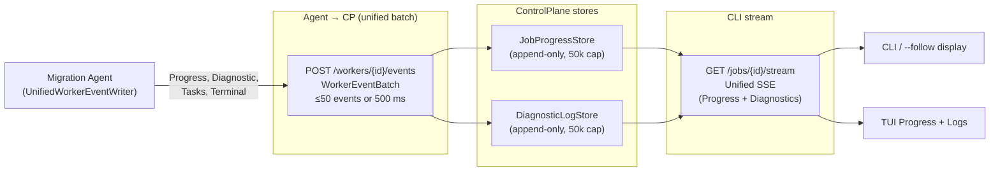
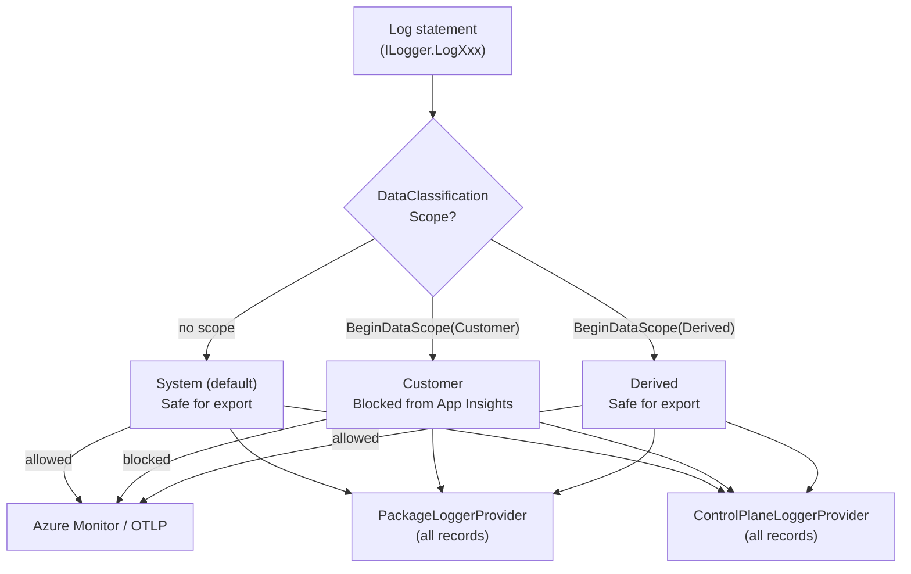

# Observability

Audience: Advanced Operators, Contributors.

This document covers how to observe, monitor, and interpret the health and progress of migrations.

## Telemetry Channels

The platform emits telemetry on three logical channels. The agent-to-CP wire transport was consolidated in 2026-06-30 (Phases A-E) — all agent telemetry now flows through `UnifiedWorkerEventWriter` into a single `POST /workers/{workerId}/events` batch endpoint, and the CLI reads from a single unified SSE stream.

### Agent → ControlPlane transport

| Kind | Writer | CP endpoint |
|---|---|---|
| Progress events | `UnifiedWorkerEventWriter` (via `IProgressSink`) | `POST /workers/{workerId}/events` (`kind: Progress`) |
| Diagnostic records | `ControlPlaneLoggerProvider` → `UnifiedWorkerEventWriter` | `POST /workers/{workerId}/events` (`kind: Diagnostic`) |
| Task list | `UnifiedWorkerEventWriter.EnqueueTasks()` | `POST /workers/{workerId}/events` (`kind: Tasks`) |
| Heartbeat | `AgentWorkerBase` periodic timer (15 s) | `POST /agents/lease/{leaseId}/heartbeat` |
| Terminal signal | `UnifiedWorkerEventWriter.EnqueueTerminal()` | `POST /workers/{workerId}/events` (`kind: Terminal`) |

### CLI → ControlPlane stream

| Channel | API | Consumer | Content |
|---|---|---|---|
| **Unified stream (primary)** | `GET /jobs/{id}/stream` | CLI (`--follow`), TUI | Progress + Diagnostics multiplexed; replays full history on reconnect |
| Progress (legacy shim) | `GET /jobs/{id}/progress?follow=true` | Older CLI builds | `ProgressEvent` objects only |
| Diagnostics (legacy shim) | `GET /jobs/{id}/diagnostics?follow=true` | Older CLI builds | Structured log events only |
| Metrics (polling) | `GET /jobs/{id}/telemetry` | TUI Metrics panel | `JobMetrics` snapshot — counts, durations |



## Traces

Distributed traces are emitted via OpenTelemetry `ActivitySource`. Each module operation creates a span tagged with `module` and relevant context. Traces can be exported to Application Insights (system data only — see [Data Classification](#data-classification)).

## Metrics

Business metrics (`IMigrationMetrics`) track per-module:

- `attempt` — operations started
- `completion` — operations completed successfully, with item count
- `error` — operations failed
- `duration` — elapsed time
- `in_flight` — currently processing

Metrics are exposed via `GET /jobs/{id}/telemetry` as aggregate counters.

## Structured Logs

All module code emits structured logs via `ILogger<T>`:

- `Information` — start and end of operations
- `Warning` — skipped items, zero-count completions
- `Debug` — per-item detail
- `Error` — failures with exception

Logs from the running agent are accessible via `GET /jobs/{id}/diagnostics?follow=true` and are written to `.migration/runs/<runId>/logs/diagnostics.ndjson` in the package.

## Progress Events

`IProgressSink` emits `ProgressEvent` objects as items are processed. These flow through Channel 1. The TUI Progress table and CLI `--follow` display read from this channel.

## Application Insights

Application Insights receives only `System` and `Derived` classification data (work item IDs, counts, durations). Field values, project names, org URLs, and display names must not appear in Application Insights exports.

## Local Logs

| Location | Contents |
|---|---|
| `.migration/runs/<runId>/logs/progress.ndjson` | Per-event structured progress log for one run |
| `.migration/runs/<runId>/logs/diagnostics.ndjson` | Structured diagnostic log for one run |
| `.migration/Logs/*.log` | Module log files |

## Data Classification

See [`security-and-data-sovereignty.md`](security-and-data-sovereignty.md#data-classification) for the full classification table.



---
# Resilience Patterns

This document describes the three retry and resilience strategies used in the platform and when to reach for each one.

---

## 1 — Polly HTTP Back-off (transient HTTP errors)

**When to use**: Retrying HTTP calls that may fail with transient `429 Too Many Requests` or `5xx` server errors.

**Used by**: `AzureDevOpsEmbeddedImageDownloader`

**Pattern**:
```csharp
Policy
    .WaitAndRetryAsync(3, retryAttempt => TimeSpan.FromSeconds(Math.Pow(2, retryAttempt)))
    .ExecuteAsync(ct => httpClient.GetAsync(url, ct));
```

**Do not use for**: TFS COM calls (synchronous, no HTTP layer), WIQL query limits (use window halving instead).

---

## 2 — WIQL Window Halving (query result overflow)

**When to use**: A WIQL query may return more than the TFS/ADO 20,000-item limit. Split the date window in half and retry instead of returning truncated results.

**Used by**:
- `WorkItemQueryWindowStrategy` (ADO REST) — three-level algorithm: unbounded probe → backward date-window scan with halving → single-day ID-range pages
- `TfsWorkItemQueryWindowStrategy` (TFS OM) — wraps `WorkItemStoreExtensions.QueryAllByDateChunk` which halves the chunk on overflow

**Pattern**: The strategy detects overflow (`count >= limit`) and halves `chunkSize`, then retries the same window without advancing the cursor.

**Do not use for**: HTTP errors (use Polly), TFS COM call failures (log and skip).

---

## 3 — Log and Continue (TFS COM errors)

**When to use**: A single TFS COM call fails (e.g., a work item or attachment can not be loaded). The failure is non-fatal — log it and continue with the next item rather than aborting the entire export.

**Used by**:
- `TfsWorkItemRevisionSource.GetRevisionsAsync` — catches per-work-item and per-revision load failures
- `TfsAttachmentBinarySource.GetBytesAsync` — returns `null` (non-fatal) on download failure

**Pattern**: `catch (Exception ex) { _logger.LogError(ex, "…"); continue; }` — never rethrow unless it is an `OperationCanceledException`.

**Do not use for**: Structural failures (authentication errors, missing project) where retrying individual items will not help.
