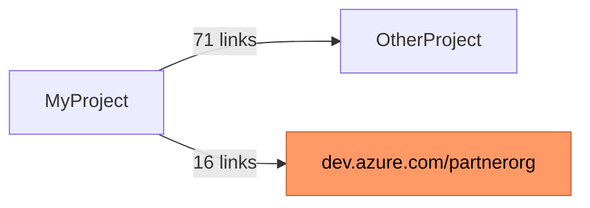

# Quickstart: Discovery Dependency Analysis

**Feature**: `012-discovery-dependencies`  
**Command**: `devopsmigration discovery dependencies`

---

## Prerequisites

- `devopsmigration` CLI built or installed
- A `DiscoveryOptions`-format configuration JSON file (same as used by `discovery inventory`)
- A valid PAT or service account with **read** access to all organisations and projects you want to analyse

---

## Configuration File Format

`discovery-config.json` (same format as `discovery inventory`):

```json
{
  "ConfigVersion": "1.0",
  "Organisations": [
    {
      "Type": "AzureDevOpsServices",
      "Url": "$ENV:AZDEVOPS_SYSTEM_TEST_ORG",
      "Projects": ["MyProject"],
      "Authentication": {
        "Type": "AccessToken",
        "AccessToken": "$ENV:AZDEVOPS_SYSTEM_TEST_PAT"
      }
    }
  ]
}
```

Set environment variables:
```powershell
$env:AZDEVOPS_SYSTEM_TEST_ORG = "https://dev.azure.com/myorg"
$env:AZDEVOPS_SYSTEM_TEST_PAT = "your-pat-here"
```

---

## Quick Run — Analyse All Work Items

```
devopsmigration discovery dependencies --config discovery-config.json
```

This analyses every work item in every configured project, inspects all outbound links, discards same-project links, and writes a report to `discovery-dependencies.csv` in the current working directory.

---

## Targeted Run — Scope by WIQL Filter

Only analyse work items in a specific area path:

```
devopsmigration discovery dependencies \
  --config discovery-config.json \
  --wiql "SELECT [System.Id] FROM WorkItems WHERE [System.AreaPath] UNDER 'MyProject\Sprint 15'" \
  --output ./reports/sprint15-dependencies.csv
```

---

## Custom Output Paths

```
devopsmigration discovery dependencies \
  --config discovery-config.json \
  --output C:\migration-reports\dependencies.csv \
  --output-projects C:\migration-reports\project-deps.csv \
  --output-diagram C:\migration-reports\project-deps.md
```

All three output files default to the same directory as `--output`. You can override each independently.

---

## Output

### Terminal (live progress during run):

```
 Analysing dependencies...

 Organisation       Project      Work Items   Ext. Links   Status
─────────────────────────────────────────────────────────────────
 dev.azure.com/myorg  MyProject      1,450         ...       ⟳
```

### Terminal (summary after completion — two tables):

**Table 1 — work-item summary:**
```
┌────────────────────────────────────────────────────────────────────────────┐
│                   Dependency Analysis Summary                              │
├──────────────────────────┤──────────────────────────────────────────────────┤
│ Work Items Analysed       │ 2,450                                          │
│ External Links Found      │ 87                                             │
│   CrossProject            │ 71                                             │
│   CrossOrganisation       │ 16  ⚠ ACTION REQUIRED — links will break      │
│ Report written to         │ ./discovery-dependencies.csv                   │
└──────────────────────────┴──────────────────────────────────────────────────┘
```

**Table 2 — project dependency summary (only when external dependencies exist):**
```
┌───────────────────────────────┬───────────────────────────────┬───────┬────────────────┐
│ Source Project               │ → Target                       │ Links │ Scope          │
├───────────────────────────────┼───────────────────────────────┼───────┼────────────────┤
│ MyProject                    │ OtherProject                   │ 71    │ CrossProject   │
│ MyProject                    │ 🌐 dev.azure.com/partnerorg  │ 16    │ CrossOrg ⚠      │
└───────────────────────────────┴───────────────────────────────┴───────┴────────────────┘
```

### Work-Item CSV (`discovery-dependencies.csv`):

```csv
SourceWorkItemId,SourceWorkItemType,SourceProject,LinkType,LinkScope,TargetWorkItemId,TargetProject,TargetOrganisation,TargetStatus
1234,User Story,MyProject,Child,CrossProject,5678,OtherProject,https://dev.azure.com/myorg,Reachable
1234,User Story,MyProject,Related,CrossProject,9012,ThirdProject,https://dev.azure.com/myorg,Deleted
3456,Bug,MyProject,Related,CrossOrganisation,7890,,https://dev.azure.com/partnerorg,Unknown
```

- One row per external link; same-project links never appear
- `TargetProject` is empty for `CrossOrganisation` links
- `TargetStatus` indicates whether the target exists and is accessible

### Project Dependency CSV (`discovery-project-dependencies.csv`):

```csv
SourceProject,TargetProject,TargetOrganisation,LinkCount,LinkScope,GroupId
MyProject,OtherProject,,71,CrossProject,1
MyProject,dev.azure.com/partnerorg,https://dev.azure.com/partnerorg,16,CrossOrganisation,1
```

- One row per directed project pair
- `GroupId` labels which projects form a connected dependency group
- Not written when zero external dependencies are found

### Mermaid Diagram (`discovery-project-dependencies.md`):

````markdown

````

- Renders natively in GitHub and Azure DevOps wiki
- Orange nodes = cross-org boundary targets (irreversible link loss on migration)
- Not written when zero external dependencies are found

---

## When Zero External Dependencies Are Found

```
No external dependencies found.
Report written to ./discovery-dependencies.csv (header row only)
```

The CSV file is still created with only the header row.

---

## Multi-Organisation Scan

Configure multiple entries in `Organisations`:

```json
{
  "ConfigVersion": "1.0",
  "MaxConcurrency": 4,
  "Organisations": [
    {
      "Type": "AzureDevOpsServices",
      "Url": "$ENV:AZDEVOPS_ORG1",
      "Projects": ["ProjectA", "ProjectB"],
      "Authentication": { "Type": "AccessToken", "AccessToken": "$ENV:PAT_ORG1" }
    },
    {
      "Type": "AzureDevOpsServices",
      "Url": "$ENV:AZDEVOPS_ORG2",
      "Projects": ["ProjectC"],
      "Authentication": { "Type": "AccessToken", "AccessToken": "$ENV:PAT_ORG2" }
    }
  ]
}
```

Each organisation is analysed in sequence. Links between the two configured organisations will appear as `CrossOrganisation` in each respective report.

---

## TFS / Azure DevOps Server

```json
{
  "ConfigVersion": "1.0",
  "Organisations": [
    {
      "Type": "TeamFoundationServer",
      "Url": "http://tfs.internal:8080/tfs/DefaultCollection",
      "Projects": ["LegacyProject"],
      "Authentication": { "Type": "AccessToken", "AccessToken": "" }
    }
  ]
}
```

Leave `AccessToken` empty for Windows-integrated authentication. The CLI delegates to `tfsmigration.exe` automatically.

---

## Interpreting the Results

| LinkScope | Meaning | Risk |
|-----------|---------|------|
| `CrossProject` | Target work item is in a different project in the same organisation | **Medium** — links survive migration only if the target project is also migrated |
| `CrossOrganisation` | Target work item is in a completely different organisation or TFS collection | **High** — these links **will always break** and cannot be re-created |

**Recommended workflow**:
1. Run `discovery dependencies` before scoping your migration.
2. Review `CrossOrganisation` links first — these represent data loss you must communicate to stakeholders.
3. For `CrossProject` links: expand migration scope to include target projects, or document accepted breakage.
4. Re-run after scope adjustments to confirm zero unexpected dependencies remain.

---

## Error Scenarios

| Scenario | Exit Code | Message |
|----------|-----------|---------|
| Config file not found | 1 | `Config file not found: {path}` |
| Invalid JSON in config | 1 | JSON parse error with file location |
| Invalid WIQL expression | 1 | Server-returned WIQL syntax error |
| Cannot reach configured org | 2 | Network/auth error with org URL |
